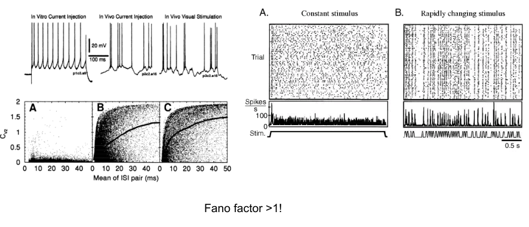

[TOC]

# 神经计算建模简介

## 计算神经科学的背景与使命

计算神经科学是**脑科学**对**类脑智能**的**桥梁**

### 两大目标

- 用计算建模的方法来阐明大脑功能的计算原理
- 发展类脑智能的模型和算法

### Prehistory

- 1907 LIF model 
  神经计算的本质
- 1950s HH model 
  电位定量化模型 最fundamental的
- 1960s Roll's cable equation 
  描述信号在轴突和树突怎么传递
- 1970s Amari, Wilson, Cowan et al.
  现今建模的基础
- 1982 Hopfield model(Amari-Hopfield model)
  引入物理学技术，吸引子模型
- 1988 Sejnowski et al. "Computational Neuroscience"(science)
  提出计算神经科学概念

**现在的计算神经科学对应于物理学的第谷-伽利略时代，对大脑工作原理还缺乏清晰的理论**

### Three levels of Brain Science


- 大脑做什么
  Computational theory 
  -> Psychology & Cognitive Science
  -> Human-like Cognitive function
- 大脑怎么做
  Representation & Algorithm 
  -> Computational Neuroscience
  -> Brain-inspired model & algorithm
- 大脑怎么实现
  Implementation
  -> Neuroscience
  -> Neuromorphic computing

### Mission of Computational Neuroscience

> What I can not build a computational model, I do not understand

## 神经计算建模的目标与挑战

### Limitation of Deep Learning

- 不擅长对抗样本
- 对图像的理解有限


### Brain is for Processing Dynamical Information

**We never "see" a static image**


### The missing link

a computational model of higher cognitive functior


现在只是做的**局部**的网络，没有一个成功的模型，能**从神经元出发构建网络，到系统层面上**

**原因**: 因为神经科学底层数据的缺失，可以考虑数据驱动、大数据的方式来加快发展

## 神经计算建模的工具

> 工欲行其事，必先利其器
> We need "PyTorch/TensorFlow" in Computational Neuroscience!

### Challenges in neural modelling

有不同的尺度

- Mutiple-scale
- Large-scale
- Multiple purposes


> The modeling targets and methods are extremely complex, and we need a general framework.

### Limitations of Existing Brain Simulators

现今的框架不能满足以上


### What are needed for a brain simulator

1. Efficiency
   High-speed simulation on parallel computing devices, etc.
2. Integration
   Integrated modeling of simulation, training, and analysis
3. Flexibility
   New models at all scales can be accommodated
4. Extensibility
   Extensible to new modeling methods(machine learning)

需要新的范式

### Our solution: BrainPy

4 levels


## 神经计算建模举例

### Image understanding: an ill-posed problem

Image Understanding = image segmentation + image object recognition

> Chicken vs. Egg dilemma
>
> - Without segmentation, how to recognize
> - Without recognition, how to segment

**The solution of brain:** Analysis-by-synthesis 猜测与验证方法

### Reverse Hierarchy Theory

人的感知是整体到局部

### Two pathways for visual information processing


### Key Computational Issues for Global-to-local Neural Information Processing

- What are global and local features
- How to rapidly extract global features
- How to generate global hypotheses
- How to implement from global to local processing
- The interplay between global and local features
- Others

#### How to extract global features

**Global first = Topology first**(大范围首先，陈霖)
视觉系统更敏感于拓扑性质的差异

> DNNs has difficulty to recognize topology

**A retina-SC network for topology detection**

视网膜到上丘的检测，Gap junction coupling ...

### A Model for Motion Pattern Recognition

Reservoir Module
Decision-making Module

### How to generate "global" hypotheses in the representation space

Attractor neural network


Levy Flight in Animal Behaviors


### How to process information from global to local

Push-pull Feedback

A hierarchical Hopfield Model

### Interplay between global and local features

A two-pathway model for object recognition


Modeling visual masking 可以用two-pathway很好解释

# Programming basics

## Python Basics

### Values

- Boolean
- String
- Integer
- Float
- ...

### Keywords

Not allowed to use keywords, they define structure and rules of a language.

```python
help("keywords")
```

### Operators

数据之间的操作

#### For Integers and Floats

```python
a=5
b=3
# addition +
print("a+b=",atb)
# subtraction -
print("a-b=",a-b)
# multiplication *
print("axb="a*b)
# division /
print("a/b=",a/b)
# power **
print("a**b=",a**b)
```

#### Booleans

```python
#Boolean experssions
# equals: ==
print("5==5",5==5) 
# do not equal: !=
print("5!-5",5!=5)
# greater than: >
print("5>5",5>5)
# greater than or equal: >=
print("5>=5”5>=5)
```

```python
# logica operators
print("True and False:", True and False)
print("True or False:", True or False)
print("not False:", not False)
```

### Modules

Not all functionality available comes automatically when starting python.

```python
import match
import numpy as np
print(math.pi)
print(np.pi)

from numpy import pi
print(pi)

from numpy import *
print(pi)
```

### Control statements

#### If

```python
a = 5
# In Python, blocks of code are defined using indentation.
if a == 5:
	print("ok")
```

> ok

#### For

```python
# range(5) means a list with integers, 0, 1, 2, 3, 4
for i in range(5):
    print(i)
```

> 0
> 1
> 2
> 3
> 4

#### While

```python
i = 1
while i <= 100:
    print(i**3)
    i += i**3 # a += b is short for a = a+b
```

> 1
> 8
> 1000

### Functions

- Functions are used to abstract components of a program.
- Much like a mathematical function, they take some input and then find the result. start a function definition with a keyword def
- Then comes the function name, with arguments in braces, and then a colon.

```python
def func(args1, args2):
    pass
```

### Data types

#### List

- Group variables together
- Specific order
- Access item with brankets: [ ]
- List can be sliced
- List can be multiplied
- List can be added
- Lists are mutable
- Copying a list

```python
myList = [0, 1, 2, 0,"name"]
print("myList[0]:", myList[0])
print("myList[1]:", myList[1])
print("myList[3]:", myList[3])
print("myList[-1]:", myList[-1])
print("myList[-2]:", myList[-2])
```

> myList[0]: 0
> myList[1]: 1
> myList[3]: name
> myList[-1]: name
> myList[-2]: 2.0

```python
myList = [0, 1.0, "hello"]
print("myList[0:2]:", mylist[0:2])
print("myList*2:", myList*2)
myList2 = [2,"yes"]
print("myList+myList2:", myList+myList2)
```

> myList[0:2]: [0，1.0]
> myList*2: [0，1.0， hello'，0，1.0， hello']
> myList+myList2: [0，1.0，'hello'，2，yes']

#### tuple

Tuples are immutable.

#### dictionary

A dictionary is a collection of key-value pairs

```python
d = {}
d[1] = 2
d["a"] = 3

print("d: ", d)

c = {1:2, "a":3}
print("c: ", c)
print("c[1]: ", c[1])
```

> d: {1: 2, 'a': 3}
> c: {1: 2, 'a': 3}
> c[1]: 2

### Class

In Python, everything is an object. Classes are objects, instances of
classes are objects, modules are objects, and functions are objects.

 	1.  a **type**
 	2.  an internal **data representation** (primitive or composite)
 	3.  a set of procedures for **interaction** with the object

**a simple example**

```python
# define class

class Linear():
    pass

# instantiate object
layer1 = Linear()

print(layer1)
```

> `<__main__.Linear object at 0x7f88ad6c61d0>`

#### Initializing an object

```python
# define class
class Linear():
    # It refers to the object (instance) itself
    def __init__(self, n_input):
        self.n_input = n_input

layer1 = Linear(100)
layer2 = Linear(1000)

print("layer1 : ", layer1.n_input)
print("layer2 : ", layer2.n_input)
```

> layer1 : 100
> layer2 : 1000

#### Class has methods (similar to functions)

```python
# define class
class Linear():
    ### It refers to the the object (instance) itself
    def __init__(self, n_input, n_output):
	    self.n_input = n_input
        self.n_output = n_output
	def compute n params(self):
        num_params = self.n_input * self.n_output
        return num_params
layerl = Linear(10,100)
print(layerl.compute_n_params())
```

> 1000

## NumPy Basic

### Numpy Introduction

- Fundamental package for scientific computing with Python
- N-dimensional array object
- Linear algebra, frontier transform, random number capacities
- Building block for other packages (e.g. Scipy)

### Array

- Arrays are mutable
- Arrays attributes
- ...

```python
A = np.zeros((2, 2))
print(A)
```

> [[0. 0.]
> 	[0. 0.]]

```python
a.ndim		# 2 dimension
a.shape		# (2, 5) shape of array
a.size		# 10 $ of elements
a.T			# transpose
a.dtype		# data type
```

#### Array broadcasting

When operating on two arrays, numpy compares shapes. Two dimensions are compatible when
1. They are of equal size
2. One of them is 1


### Vector operations

- Inner product
- Outer product
- Dot product (matrix multiplication)

```python
u = [1, 2, 3]
v = [1, 1, 1]

np.inner(u, v)
np.outer(u, v)
np.dot(u, v)
```

> 6
> array([[1, 1, 1],
> 			[2, 2, 2],
> 			[3, 3, 3]])
> 6

### Matrix operations

- `np.ones`
- `.T`
- `np.dot`
- `np.eye`
- `np.trace`
- `np.row_stack`
- `np.column_stack`

### Operations along axes

```python
a = np.ones((2, 3))
print(a)

a.sum()

a.sum(axis=0)

a.cumsum()

a.cumsum(axis=0)
```

### Slicing arrays

```python
a = np.random.random((2, 3))
print(a)

a[0,:] 	# first row, all columns
a[0:2] 	# first and second rows, al columns
a[:,1:3]# all rows, second and third columns
```

### Reshape

```python
a = np.ones((10,1))
a.reshape(2,5)
```

### Linear algebra

```python
qr				# Computes the QR decomposition
cholesky		# Computes the Cholesky decomposition
inv(A)			# Inverse
solve(A,b)		# Solves Ax = b for A full rank
lstsq(A,b)		# Solves arg minx //Ax - b//2
eig(A)			# Eigenvalue decomposition
eigvals(A)		# Computes eigenvalues
svd(A，full)		# Sinqular value decomposition
pinv(A)			# Computes pseudo-inverse of A
```

### Fourier transform

```python
import numpy.fft
fft		# 1-dimensional DFT
fft2	# 2-dimensional DFT
fftn	# N-dimensional DFT
ifft	# 1-dimensional inverse DFT (etc.)
rfft	# Real DFT (1-dim)
```

### Random sampling

```python
import numpy.random
rand(d0, d1, ..., dn)		# Random values in a given shape
randn(d0, d1, ..., dn)		# Random standard normal
randint(lo, hi, size)		# Random integers [lo hi)
choice(a, size, repl, p)	# Sample from a
shuffle(a)					# Permutation (in-place)
permutation(a)				# Permutation (new array)
```

### Distributions in random

```python
import numpy.random
beta
binomial
chisquare
exponential
dirichlet
gamma
laplace
lognormal
...
```

### Scipy

- `SciPy` is a library of algorithms and mathematical tools built to work with `NumPy ` arrays.
- `scipy.linalg linear algebra`
- `scipy.stats statistics`
- `scipy.optimize optimization`
- `scipy.sparse sparse matrices`
- `scipy.signal signal processing`
- etc.

## BrainPy introduction

### Modeling demands

- Large-scale
- Multi-scale
- Methods

### BrainPy Architecture

- Infrastructure
- Functions
- Just-in-time compilation
- Devices


### Main features

#### Dense operators

- Compatible with `NumPy`, `TensorFlow`, `PyTorch` and other dense matrix operator syntax.
- Users do not need to learn and get started programming directly.

#### Dedicated operatorsq

- Applies brain dynamics sparse connectivity properties with event-driven computational features.
- Reduce the complexity of brain dynamics simulations by several orders of magnitude.

#### Numerical Integrators

- Ordinary differential equations: brainpy.odeint
- Stochastic differential equations: brainpy.sdeint
- Fractional differential equations: brainpy.fdeint
- Delayed differential equations

#### Modular and composable

从微观到宏观

**brainpy.DynamicalSystem**


#### JIT of object-oriented

BrainPy provides object-oriented transformations:

- `brainpy.math.jit`
- `brainpy.math.grad`
- `brainpy.math.for_loop`
- `brainpy.math.ifelse`

## BrainPy Programming Basics

### Just-in-Time compilation

Just In Time Compilation (JIT, or Dynamic Translation), is compilation that is being done during the execution of a program.

JIT compilation attempts to use **the benefits of both**. While the interpreted program is being run, the JIT compiler determines the most frequently used code and compiles it to machine code.

The advantages of a JIT are due to the fact that since the compilation takes place in run time, a JIT compiler has access to dynamic runtime information enabling it to make better optimizations (such as inlining functions).

```python
def gelu(x):
    sqrt = bm.sqrt(2 / bm.pi)
    cdf = 0.5 * (1.0 + bm.tanh(sqrt * (x + 0.044715 * (x ** 3))))
    y = x *cdf
    return y

>>> gelu_jit = bm.jit(gelu) # 使用JIT
```

### Object-oriented JIT compilation

- The class object must be inherited from brainpy.BrainPyObject, the base class of BrainPy, whose methods will be automatically JIT compiled.
- All time-dependent variables must be defined as brainpy.math.Variable.

```python
class LogisticRegression(bp.BrainPyObject):
    def __init__(self, dimension):
        super(LogisticRegression, self).__init__()
        
        # parameters
        self.dimension = dimension
        
        # variables
        self.w = bm.Variable(2.0 * bm.ones(dimension) - 1.3)
        
	def __call__(self, X, Y):
        u = bm.dot(((1.0 / (1.0 + bm.exp(-Y * bm.dot(X, self.w))) - 1.0) * Y), X)
        self.w.value = self.w - u # in-place update
```

**ExampleL Run a neuron model**

```python
model = bp.neurons.HH(1000) #一共1000个神经元
runner = bp.DSRunner(target=model, inputs=('input', 10.)) # jit默认为True
runner(duration=1000, eval_time=True) #模拟 1000ms
```

禁用JIT来debug

### Data operations

#### Array

等价于`numpy`的`array`

#### BrainPy arrays & JAX arrays

```python
t1 = bm.arange(3)
print(t1)
print(t1.value)
```

> JaxArray([0, 1, 2], dtype=int32)
> DeviceArray([0, 1, 2], dtype=int32)

#### Variables

Arrays that are not marked as dynamic variables will be JIT-compiled as static arrays, and modifications to static arrays will not be valid in the JIT compilation environment.

```python
t = bm.arange(4)
v = bm.Variable(t)
print(v)

print(v.value)
```

> Variable([0, 1, 2, 3], dtype=int32)
> DeviceArray([0, 1, 2, 3], dtype=int32)

### Variables

**In-place updating** 就地更新

#### Indexing and slicing

- Indexing: `v[i] = a` or `v[(1, 3)] = c`
- Slicing: `v[i:j] = b`
- Slicing all values `v[:] = d`, `v[...] = e`

#### Augmented assignment

- add
- subtract
- divide
- multiply
- floor divide
- modulo
- power
- and
- or
- xor
- left shift
- right shift

#### Value assignment

```python
v.value = bm.arange(10)
check_no_change(v)
```

#### Update assignment

```python
v.update(bm.random.randint(0, 20, size=10))
```

### Control flows

#### If-else

`brainpy.math.where`

```python
a = 1.
bm.where(a < 0, 0., 1.)
```

> DeviceArray(1., dtype=float32, weak_type=True)

`brainpy.math.ifelse`

```python
def ifelse(condition, branches, operands):
	true_fun, false_fun = branches
    if condition:
        return true_fun(operands)
    else:
        return false_fun(operands)
```

#### For loop

```python
import brainpy.math
hist_of_out_vars = brainpy.math.for_loop(body_fun, operands)
```

#### While loop

```python
i = bm.Variable(bm.zeros(1))
counter = bm.Variable(bm.zeros(1))

def cond_f():
    return i[0] < 10

def body_f():
    i.value += 1
    counter.value += i

bm.while_loop(body_f, cond_f, operands=())

print(counter, i)
```

# Single Neuron Modeling: Conductance-Based Models

## Neuronal structure,ing potential, and equivalent circuits

### Neuronal structure

- Cell body/soma
- Axon
- Dendrites
- Synapses


### Resting potential

Transport proteins for ions in neuron cell membranes:

- Ion channels: Na + channels, K + channels, … (gated/non-gated)
- Ion pumps: the Na + -K + pump


离子浓度在胞内外的差异产生的电势差

- Ion concentration difference → chemical gradient → electrical gradient

- Nernst Equation:

  $$
  E=\dfrac{RT}{zF}\ln\dfrac{[\mathrm{ion}]_{\mathrm{out}}}{[\mathrm{ion}]_{\mathrm{in}}}
  $$
  
- Goldman-Hodgkin-Katz (GHK) Equation:

  $$
  V_m=\frac{RT}{F}\ln\left(\frac{P_{\mathrm{Na}}[\mathrm{Na}^+]_{\mathrm{out}}+P_{\mathrm{K}}[\mathrm{K}^+]_{\mathrm{out}}+P_{\mathrm{Cl}}[\mathrm{Cl}^-]_{\mathrm{in}}}{P_{\mathrm{Na}}[\mathrm{Na}^+]_{\mathrm{in}}+P_{\mathrm{K}}[\mathrm{K}^+]_{\mathrm{in}}+P_{\mathrm{Cl}}[\mathrm{Cl}^-]_{\mathrm{out}}}\right)
  $$

### Equivalent circuits

Components of an equivalent circuit:

- Battery
- Capacitor
- Resistor


Considering the potassium channel **ONLY**:

$$
\begin{gathered}
0=I_{\mathrm{cap}}+I_{K}=c_{\mathrm{M}}{\frac{\mathrm{d}V_{\mathrm{M}}}{\mathrm{d}t}}+{\frac{V_{\mathrm{M}}-E_{\mathrm{K}}}{R_{\mathrm{K}}}}, \\
c_{\mathrm{M}}{\frac{\mathrm{d}V_{\mathrm{M}}}{\mathrm{d}t}}=-{\frac{V_{\mathrm{M}}-E_{\mathrm{K}}}{R_{\mathrm{K}}}}=-g_{\mathrm{K}}(V_{\mathrm{M}}-E_{\mathrm{K}}). 
\end{gathered}
$$


**Considering the Na + , K + , and Cl - channels and the external current I(t):**


$$
\begin{aligned}
\frac{I(t)}{A} & = c_{\mathrm{M}}\frac{\mathrm{d}V_{\mathrm{M}}}{\mathrm{d}t} + i_{\mathrm{ion}} \\
\Rightarrow c_{\mathrm{M}}\frac{\mathrm{d}V_{\mathrm{M}}}{\mathrm{d}t} & = -g_{\mathrm{Cl}}(V_{\mathrm{M}}-E_{\mathrm{Cl}}) - g_{\mathrm{K}}(V_{\mathrm{M}}-E_{\mathrm{K}}) - g_{\mathrm{Na}}(V_{\mathrm{M}}-E_{\mathrm{Na}}) + \frac{I(t)}{A}
\end{aligned}
$$

Steady-state membrane potential given a constant current input I:

$$
\begin{array}{rcl}\Rightarrow&c_{M}\frac{\mathrm{d}V_{M}}{\mathrm{d}t}=-(g_{C1}+g_{K}+g_{Na})V_{M}+g_{C1}E_{C1}+g_{K}E_{K}+g_{Na}E_{Na}+\frac{I(t)}{A}\\\\V_{sS}=\frac{g_{CM}E_{C1}+g_{K}E_{K}+g_{Na}E_{Na}+I/A}{g_{C1}+g_{K}+g_{Na}}&
\xrightarrow{I=0}
&V_{sN,I=0}=E_{R}=\frac{g_{CC}E_{C1}+g_{K}E_{K}+g_{Na}E_{Na}}{g_{C1}+g_{K}+g_{Na}}\end{array}
$$

## Cable Theory & passive conduction


Considering the axon as a long cylindrical cable:

$$
I_{\mathrm{cross}}(x,t)={I_{\mathrm{cross}}(x+\Delta x,t)}+I_{\mathrm{ion}}(x,t)+I_{\mathrm{cap}}(x,t)
$$

$$
V(x+\Delta x,t)-V(x,t)=-I_{\mathrm{cross}}(x,t)R_{\mathrm{L}}=-I_{\mathrm{cross}}(x,t)\frac{\Delta x}{\pi a^{2}}\rho_{\mathrm{L}} \\
{I_{\mathrm{cross}}(x,t)} =-\frac{\pi a^{2}}{\rho_{\mathrm{L}}}\frac{\partial V(x,t)}{\partial x}  \\
{I_{\mathrm{ion}}} =(2\pi a\Delta x)i_{\mathrm{ion}}  \\
I_{\mathrm{cap}}(x,t) =(2\pi a\Delta x)c_{\mathrm{M}}\frac{\partial V(x,t)}{\partial t} 
$$

-> 

$$
(2\pi a\Delta x)c_{\mathrm{M}}\frac{\partial V(x,t)}{\partial t}+(2\pi a\Delta x)i_{\mathrm{ion}}=\frac{\pi a^{2}}{\rho_{\mathrm{L}}}\frac{\partial V(x+\Delta x,t)}{\partial x}-\frac{\pi a^{2}}{\rho_{\mathrm{L}}}\frac{\partial V(x,t)}{\partial x}
$$

**Cable Equation**

$$
c_\mathrm{M}\frac{\partial V(x,t)}{\partial t}=\frac{a}{2\rho_\mathrm{L}}\frac{\partial^2V(x,t)}{\partial x^2}-i_\mathrm{ion}
$$
电流在通过长直导体时会泄露电流，如何记录膜电位，可以使用此方程来描述

**Passive conduction:** ion currents are caused by leaky channels exclusively

$$
i_{\mathrm{ion}}=V(x,t)/r_{\mathrm{M}}
$$

->

$$
\begin{aligned}c_\mathrm{M}\frac{\partial V(x,t)}{\partial t}&=\frac{a}{2\rho_\mathrm{L}}\frac{\partial^2V(x,t)}{\partial x^2}-\frac{V(x,t)}{r_\mathrm{M}}\\\\\tau\frac{\partial V(x,t)}{\partial t}&=\lambda^2\frac{\partial^2V(x,t)}{\partial x^2}-V(x,t)\quad\lambda=\sqrt{0.5ar_\mathrm{M}/\rho_\mathrm{L}}\end{aligned}
$$
没有动作电位，单纯通过电缆传输


If a constant external current is applied to 𝑥 = 0  the steady-state membrane potential $𝑉_{ss}(𝑥)$ is

$$
\lambda^2\frac{\mathrm{d}^2V_{\mathrm{ss}}(x)}{\mathrm{d}x^2}-V_{\mathrm{ss}}(x)=0\longrightarrow V_{\mathrm{ss}}(x)=\frac{\lambda\rho_{\mathrm{L}}}{\pi a^2}I_0e^{-x/\lambda}
$$
电信号无衰减传播: 动作电位

## Action potential & active transport

Steps of an action potential:

- Depolarization
- Repolarization
- Hyperpolarization
- Resting

Characteristics:

- All-or-none
- Fixed shape
- Active electrical property


How to simulate an action potential?

$$
\begin{aligned}
\frac{I(t)}{A}& =c_{\mathrm{M}}{\frac{\mathrm{d}V_{\mathrm{M}}}{\mathrm{d}t}}+i_{\mathrm{ion}}  \\
\Rightarrow\quad c_{\mathrm{M}}\frac{\mathrm{d}V_{\mathrm{M}}}{\mathrm{d}t}& =-g_{\mathrm{Cl}}(V_{\mathrm{M}}-E_{\mathrm{Cl}})-g_{\mathrm{K}}(V_{\mathrm{M}}-E_{\mathrm{K}})-g_{\mathrm{Na}}(V_{\mathrm{M}}-E_{\mathrm{Na}})+\frac{I(t)}{A} 
\end{aligned}
$$

离子通道的开闭会随着电压而变化，电导也随着电压而变化

Mechanism: voltage-gated ion channels

**HH建模思路：通过电导**

### Nodes of Ranvier

Saltatory conduction with a much higher speed and less energy consumption

两个郎飞结之间会有离子通道，既有被动传导，也有主动的防止衰减


## The Hodgkin-Huxley Model

### Modeling of each ion channel

Modeling of each ion channel:

$$
g_m=\bar{g}_mm^x
$$

Modeling of each ion gate:

$$
\mathcal{C}\underset{}{\operatorname*{\overset{\alpha(\mathrm{V})}{\underset{\beta(\mathrm{V})}{\operatorname*{\longrightarrow}}}}\mathcal{O}}

\\
\Rightarrow
\begin{aligned}
\frac{\mathrm{d}m}{\mathrm{d}t}& =\alpha(V)(1-m)-\beta(V)m  \\
&=\frac{m_{\infty}(V)-m}{\tau_{m}(V)}
\end{aligned}

\\
\\

\begin{aligned}m_\infty(V)&=\frac{\alpha(V)}{\alpha(V)+\beta(V)}.\\\tau_m(V)&=\frac{1}{\alpha(V)+\beta(V)}\end{aligned}
$$

$$
\text{If}\ V\text{ is constant:}m(t)=m_\infty(V)+(m_0-m_\infty(V))\mathrm{e}^{-t/\tau_m(V)}
$$

### Voltage clamp

$$
\begin{aligned}
\frac{I(t)}{A}& =c_{\mathrm{M}}{\frac{\mathrm{d}V_{\mathrm{M}}}{\mathrm{d}t}}+i_{\mathrm{ion}}  \\
\Rightarrow\quad c_{\mathrm{M}}\frac{\mathrm{d}V_{\mathrm{M}}}{\mathrm{d}t}& =-g_{\mathrm{Cl}}(V_{\mathrm{M}}-E_{\mathrm{Cl}})-g_{\mathrm{K}}(V_{\mathrm{M}}-E_{\mathrm{K}})-g_{\mathrm{Na}}(V_{\mathrm{M}}-E_{\mathrm{Na}})+\frac{I(t)}{A} 
\end{aligned}
$$

- The membrane potential is kept constant
- The current from capacitors is excluded
- Currents must come from leaky/voltage-gated ion channels

$$
\begin{aligned}I_{\mathrm{cap}}&=c\frac{dV}{dt}=0\\I_{\mathrm{fb}}&=\quad i_{\mathrm{ion}}=g_{\mathrm{Na}}(V-E_{\mathrm{Na}})+g_{\mathrm{K}}(V-E_{\mathrm{K}})+g_{\mathrm{L}}(V-E_{\mathrm{L}})\end{aligned}
$$

只测量一个离子通道就可以很容易得到电导


### Leaky channel

Hyperpolarization → the sodium and potassium channels are closed

$$
I_{\mathrm{fb}}=g_{\mathrm{Na}}(V-E_{\mathrm{Na}})+g_{\mathrm{K}}(V-E_{\mathrm{K}})+g_{\mathrm{L}}(V-E_{\mathrm{L}})
$$

$$
\Rightarrow I_{\mathrm{fb}}=g_L(V-E_L)
$$

$$
g_\mathrm{L}=0.3\mathrm{mS/cm}^2,E_\mathrm{L}=-54.4\mathrm{mV}
$$

#### Potassium and sodium channels

Potassium channels: Use choline to eliminate the inward current of Na +
Na + current: $I_{fb} - I_{K}$


转化速率和电导率两个因素

Potassium channels

- Resting state (gate closed)
- Activated state (gate open)

→ Activation gate: $g_{\mathrm{K}}=\bar{g}_{K}n^{x}$

Sodium channels

- Resting state (gate closed)
- Activated state (gate open)
- Inactivated state (gate blocked)

→ Activation gate + inactivation gate: $g_{\mathrm{Na}}=\bar{g}_\text{Na}m^3h$


The gates of sodium channels

Modeling of each ion gate:

$$
\begin{aligned}
&\text{gk}&& =\bar{g}_{K}n^{x}  \\
&\text{gNa}&& =\bar{g}_{\mathrm{Na}}m^{3}h  \\
&\frac{\mathrm{d}n}{\mathrm{d}t}&& =\alpha_{n}(V)(1-n)-\beta_{n}(V)n  \\
&\frac{\mathrm{d}m}{\mathrm{d}t}&& =\alpha_{m}(V)(1-m)-\beta_{m}(V)m  \\
&\frac{\mathrm{d}h}{\mathrm{d}t}&& =\alpha_{h}(V)(1-h)-\beta_{h}(V)h 
\end{aligned}
$$

$$
\begin{aligned}
\frac{\mathrm{d}m}{\mathrm{d}t}& =\alpha(V)(1-m)-\beta(V)m  \\
&=\frac{m_{\infty}(V)-m}{\tau_{m}(V)}
\end{aligned}
$$

$$
\begin{aligned}m_\infty(V)&=\frac{\alpha(V)}{\alpha(V)+\beta(V)}\\\tau_m(V)&=\frac{1}{\alpha(V)+\beta(V)}\end{aligned}.
$$

$$
m(t)=m_\infty(V)+(m_0-m_\infty(V))\mathrm{e}^{-t/\tau_m(V)}
$$

### The Hodgkin-Huxley(HH) Model

$$
c_\mathrm{M}\frac{\mathrm{d}V_\mathrm{M}}{\mathrm{d}t}=-g_\mathrm{Cl}(V_\mathrm{M}-E_\mathrm{Cl})-g_\mathrm{K}(V_\mathrm{M}-E_\mathrm{K})-g_\mathrm{Na}(V_\mathrm{M}-E_\mathrm{Na})+\frac{I(t)}{A}
$$

本质是4个微分方程联立在一起

$$
\left\{\begin{aligned}&c\frac{\mathrm{d}V}{\mathrm{d}t}=-\bar{g}_\text{Na}m^3h(V-E_\text{Na})-\bar{g}_\text{K}n^4(V-E_\text{K})-\bar{g}_\text{L}(V-E_\text{L})+I_\text{ext},\\&\frac{\mathrm{d}n}{\mathrm{d}t}=\phi\left[\alpha_n(V)(1-n)-\beta_n(V)n\right]\\&\frac{\mathrm{d}m}{\mathrm{d}t}=\phi\left[\alpha_m(V)(1-m)-\beta_m(V)m\right],\\&\frac{\mathrm{d}h}{\mathrm{d}t}=\phi\left[\alpha_h(V)(1-h)-\beta_h(V)h\right],\end{aligned}\right.
$$

$$
\begin{aligned}\alpha_n(V)&=\frac{0.01(V+55)}{1-\exp\left(-\frac{V+55}{10}\right)},\quad\beta_n(V)&=0.125\exp\left(-\frac{V+65}{80}\right),\\\alpha_h(V)&=0.07\exp\left(-\frac{V+65}{20}\right),\quad\beta_n(V)&=\frac{1}{\left(\exp\left(-\frac{V+55}{10}\right)+1\right)},\\\alpha_m(V)&=\frac{0.1(V+40)}{1-\exp\left(-(V+40)/10\right)},\quad\beta_m(V)&=4\exp\left(-(V+65)/18\right).\end{aligned}
$$

$$
\phi=Q_{10}^{(T-T_{\mathrm{base}})/10}
$$

每一步符合生物学


#### How to fit each gating variable?

**Fitting n:** $g_{\mathbf{K}}=\bar{g}_{K}n^{x}\quad m(t)=m_{\infty}(V)+(m_{0}-\color{red}{\boxed{m_{\infty}(V)}})\mathrm{e}^{-t/\pi_{m}(V)}$

→ $g_\mathrm{K}(V,t)=\bar{g}_\mathrm{K}\left[n_\infty(V)-(n_\infty(V)-n_0(V))\mathrm{e}^{-\frac{t}{\tau_n(V)}}\right]^x$

by $g_{\mathrm{K}\infty}=\bar{g}_{\mathrm{K}}n_{\infty}^{x},g_{\mathrm{K}0}=\bar{g}_{\mathrm{K}}n_{0}^{x}$

→ $g_{\mathrm{K}}(V,t)=\left[g_{\mathrm{K}\infty}^{1/x}-(g_{\mathrm{K}\infty}^{1/x}-g_{\mathrm{K}0}^{1/x})\mathrm{e}^{-\frac{t}{\tau_{n}(V)}}\right]^{x}$


# Hodgkin-Huxley brain dynamics programming

## Dynamics Programming Basics

### Integrators

微分器


**example**

FitzHugh-Nagumo equation

$$
\begin{aligned}\tau\dot{w}&=v+a-bw,\\\dot{v}&=v-\frac{\nu^3}{3}-w+I_{\mathrm{ext}}.\end{aligned}
$$

```python
@bp.odeint(method='Euler', dt=0.01)
def integral(V, w, t, Iext, a, b, tau):
    dw = (V + a - b * w) / tau
    dV = V - V * V * V / 3 - w + Iext
    return dV, dw
```

**JointEq**

In a dynamical system, there may be multiple variables that change dynamically over time. Sometimes these variables are interrelated, and updating one variable requires other variables as inputs. For better integration accuracy, we recommend that you use `brainpy.JointEq` to jointly solve interrelated differential equations.

```python
a, b = 0.02, 0.20
dV = lambda V, t, w, Iext: 0.04 * V * V + 5 * V + 140 - w + Iext	# 第一个方程
dw = lambda w, t, V: a * (b * V - w)								# 第二个方程
joint_eq = bp.JointEq(dV, dw)										# 联合微分方程
integral2 = bp.odeint(joint_eq, method='rk2')						# 定义该联合微分方程的数值积分方法
```

```python
# 声明积分运行器
runner = bp.integrators.IntegratorRunner(
	integral,
    monitors=['V']
    inits=dict(V=0., w=0.)
    args=dict(a=a, b=b, tau=tau, Iext=Iext),
    dt=0.01
)

# 使用积分运行器来进行模拟100ms，结合步长dt=0.01
runner.run(100.)

plt.plot(runner.mon.ts, runner.mon.V)
plt.show()
```


### `DynamicalSystem`

BrainPy provides a generic `SynamicalSystem` class to define various types of dynamical models.

BrainPy supports modelings in brain simulation and brain-inspired computing.

All these supports are based on one common concept: **Dynamical System** via `brainpy.DynamicalSystem`.

#### What is `DynamicalSystem`

A `DynamicalSystem` defines the updating rule of the model at single time step.

1. For models with state, `DynamicalSystem` defines the state transition from $t$ to $t + dt$, i.e., $S(t+dt)=F(S(t),x,t,dt)$, where $S$ is the state, $x$ is input, $t$ is the time, and $dt$ is the time step. This is the case for recurrent neural networks (like GRU, LSTM), neuron models (like HH, LIF), or synapse models which are widely used in brain simulation.
2. However, for models in deep learning, like convolution and fully-connected linear layers, `DynamicalSystem` defines the input-to-output mapping, i.e., $y=F(x,t)$.


#### How to define `DynamicalSystem`

```python
class YourDynamicalSystem(bp.DynamicalSystem):
    def update(self, x):
        ...
```

Instead of input x, there are shared arguments across all nodes/layers in the network:

- the current time `t`, or
- the current running index `i`, or
- the current time step `dt`, or
- the current phase of training or testing `fit=True/False`.

Here, it is necessary to explain the usage of `bp.share`.

- `bp.share.save( )`: The function saves shared arguments in the global context. User can save shared arguments in tow ways, for example, if user want to set the current time `t=100`, the current time step `dt=0.1`,the user can use `bp.share.save("t",100,"dt",0.1)` or `bp.share.save(t=100,dt=0.1)`.
- `bp.share.load( )`: The function gets the shared data by the `key`, for example, `bp.share.load("t")`.
- `bp.share.clear_shargs( )`: The function clears the specific shared arguments in the global context, for example, `bp.share.clear_shargs("t")`.
- `bp.share.clear( )`: The function clears all shared arguments in the global context.

#### How to run `DynamicalSystem`

As we have stated above that `DynamicalSystem` only defines the updating rule at single time step, to run a `DynamicalSystem` instance over time, we need a for loop mechanism.


##### `brainpy.math.for_loop`

`for_loop` is a structural control flow API which runs a function with the looping over the inputs. Moreover, this API just-in-time compile the looping process into the machine code.

```python
inputs = bp.inputs.section_input([0., 6.0, 0.], [100., 200., 100.])
indices = np.arange(inputs.size)

def run(i, x):
    neu.step_run(i, x)
    return neu.V.value

vs = bm.for_loop(run, (indices, inputs), progress_bar=True)
```

##### `brainpy.LoopOverTime`

Different from `for_loop`, `brainpy.LoopOverTime` is used for constructing a dynamical system that automatically loops the model over time when receiving an input.

`for_loop` runs the model over time. While `brainpy.LoopOverTime` creates a model which will run the model over time when calling it.

```python
net2.reset_state(batch_size=10)
looper = bp.LoopOverTime(net2)
out = looper(currents)
```

##### `brainpy.DSRunner`

**Initializing a `DSRunner`**

Generally, we can initialize a runner for dynamical systems with the format of:

```
runner = DSRunner(target=instance_of_dynamical_system,
                  inputs=inputs_for_target_DynamicalSystem,
                  monitors=interested_variables_to_monitor,
                  dyn_vars=dynamical_changed_variables,
                  jit=enable_jit_or_not,
                  progress_bar=report_the_running_progress,
                  numpy_mon_after_run=transform_into_numpy_ndarray
                  )
```

- `target` specifies the model to be simulated. It must an instance of brainpy.DynamicalSystem.
- `inputs` is used to define the input operations for specific variables.
  - It should be the format of `[(target, value, [type, operation])]`, where `target` is the input target, `value` is the input value, `type` is the input type (such as “fix”, “iter”, “func”), `operation` is the operation for inputs (such as “+”, “-”, “*”, “/”, “=”). Also, if you want to specify multiple inputs, just give multiple `(target, value, [type, operation])`, such as `[(target1, value1), (target2, value2)]`.
  - It can also be a function, which is used to manually specify the inputs for the target variables. This input function should receive one argument `tdi` which contains the shared arguments like time `t`, time step `dt`, and index `i`.
- `monitors` is used to define target variables in the model. During the simulation, the history values of the monitored variables will be recorded. It can also to monitor variables by callable functions and it should be a `dict`. The `key` should be a string for later retrieval by `runner.mon[key]`. The `value` should be a callable function which receives an argument: `tdt`.
- `dyn_vars` is used to specify all the dynamically changed [variables](https://brainpy.readthedocs.io/en/latest/tutorial_math/variables.html) used in the `target` model.
- `jit` determines whether to use JIT compilation during the simulation.
- `progress_bar` determines whether to use progress bar to report the running progress or not.
- `numpy_mon_after_run` determines whether to transform the JAX arrays into numpy ndarray or not when the network finishes running.

**Running a `DSRunner`**

After initialization of the runner, users can call `.run()` function to run the simulation. The format of function `.run()` is showed as follows:

```python
runner.run(duration=simulation_time_length,
           inputs=input_data,
           reset_state=whether_reset_the_model_states,
           shared_args=shared_arguments_across_different_layers,
           progress_bar=report_the_running_progress,
           eval_time=evaluate_the_running_time
           )
```

- `duration` is the simulation time length.
- `inputs` is the input data. If `inputs_are_batching=True`, `inputs` must be a PyTree of data with two dimensions: `(num_sample, num_time, ...)`. Otherwise, the `inputs` should be a PyTree of data with one dimension: `(num_time, ...)`.
- `reset_state` determines whether to reset the model states.
- `shared_args` is shared arguments across different layers. All the layers can access the elements in `shared_args`.
- `progress_bar` determines whether to use progress bar to report the running progress or not.
- `eval_time` determines whether to evaluate the running time.

### Monitors

```python
# initialize monitor through a list of strings
runner1 = bp.DSRunner(target=net,
                      monitors=['E.spike', 'E.V', 'I.spike', 'I.V'],  # 4 elements in monitors
                      inputs=[('E.input', 20.), ('I.input', 20.)],
                      jit=True)
```

Once we call the runner with a given time duration, the monitor will automatically record the variable evolutions in the corresponding models. Afterwards, users can access these variable trajectories by using .mon.[variable_name]. The default history times .mon.ts will also be generated after the model finishes its running. Let’s see an example.

```python
runner1.run(100.)
bp.visualize.raster_plot(runner1.mon.ts, runner1.mon['E.spike'], show=True)
```

**Initialization with index specification**

```python
monitors=[('E.spike', [1, 2, 3]),  # monitor values of Variable at index of [1, 2, 3]
                                'E.V'],  # monitor all values of Variable 'V'

```

> The monitor shape of "E.V" is (run length, variable size) = (1000, 3200)
> The monitor shape of "E.spike" is (run length, index size) = (1000, 3)

**Explicit monitor target**

```python
monitors={'spike': net.E.spike, 'V': net.E.V},
```

> The monitor shape of "V" is = (1000, 3200)
> The monitor shape of "spike" is = (1000, 3200)

**Explicit monitor target with index specification**

```python
monitors={'E.spike': (net.E.spike, [1, 2]),  # monitor values of Variable at index of [1, 2]
                                'E.V': net.E.V},  # monitor all values of Variable 'V'
```

> The monitor shape of "E.V" is = (1000, 3200)
> The monitor shape of "E.spike" is = (1000, 2)

### Inputs

In brain dynamics simulation, various inputs are usually given to different units of the dynamical system. In BrainPy, `inputs` can be specified to runners for dynamical systems. The aim of `inputs` is to mimic the input operations in experiments like Transcranial Magnetic Stimulation (TMS) and patch clamp recording.

`inputs` should have the format like `(target, value, [type, operation])`, where

- `target` is the target variable to inject the input.
- `value` is the input value. It can be a scalar, a tensor, or a iterable object/function.
- `type` is the type of the input value. It support two types of input: `fix` and `iter`. The first one means that the data is static; the second one denotes the data can be iterable, no matter whether the input value is a tensor or a function. The `iter` type must be explicitly stated.
- `operation` is the input operation on the target variable. It should be set as one of `{ + , - , * , / , = }`, and if users do not provide this item explicitly, it will be set to ‘+’ by default, which means that the target variable will be updated as `val = val + input`.

#### Static inputs

```python
runner6 = bp.DSRunner(target=net,
                      monitors=['E.spike'],
                      inputs=[('E.input', 20.), ('I.input', 20.)],  # static inputs
                      jit=True)
runner6.run(100.)
bp.visualize.raster_plot(runner6.mon.ts, runner6.mon['E.spike'])
```

#### Iterable inputs

```python
I, length = bp.inputs.section_input(values=[0, 20., 0],
                                    durations=[100, 1000, 100],
                                    return_length=True,
                                    dt=0.1)

runner7 = bp.DSRunner(target=net,
                      monitors=['E.spike'],
                      inputs=[('E.input', I, 'iter'), ('I.input', I, 'iter')],  # iterable inputs
                      jit=True)
runner7.run(length)
bp.visualize.raster_plot(runner7.mon.ts, runner7.mon['E.spike'])
```

## Run a built-in HH model

[Using Built-in Models — BrainPy documentation](https://brainpy.readthedocs.io/en/latest/tutorial_building/overview_of_dynamic_model.html)

```python
import brainpy as bp
import brainpy.math as bm

current, length = bp.inputs.section_input(values=[0., bm.asarray([1., 2., 4., 8., 10., 15.]), 0.],
                                         durations=[10, 2, 25],
                                         return_length=True)

hh_neurons = bp.neurons.HH(current.shape[1])

runner = bp.DSRunner(hh_neurons, monitors=['V', 'm', 'h', 'n'], inputs=('input', current, 'iter'))

runner.run(length)
```


## Run a HH model from scratch

The mathematic expression of the HH model


$$
\left\{\begin{aligned}&c\frac{\mathrm{d}V}{\mathrm{d}t}=-\bar{g}_\text{Na}m^3h(V-E_\text{Na})-\bar{g}_\text{K}n^4(V-E_\text{K})-\bar{g}_\text{L}(V-E_\text{L})+I_\text{ext},\\&\frac{\mathrm{d}n}{\mathrm{d}t}=\phi\left[\alpha_n(V)(1-n)-\beta_n(V)n\right]\\&\frac{\mathrm{d}m}{\mathrm{d}t}=\phi\left[\alpha_m(V)(1-m)-\beta_m(V)m\right],\\&\frac{\mathrm{d}h}{\mathrm{d}t}=\phi\left[\alpha_h(V)(1-h)-\beta_h(V)h\right],\end{aligned}\right.
$$

$$
\begin{aligned}\alpha_n(V)&=\frac{0.01(V+55)}{1-\exp\left(-\frac{V+55}{10}\right)},\quad\beta_n(V)&=0.125\exp\left(-\frac{V+65}{80}\right),\\\alpha_h(V)&=0.07\exp\left(-\frac{V+65}{20}\right),\quad\beta_n(V)&=\frac{1}{\left(\exp\left(-\frac{V+55}{10}\right)+1\right)},\\\alpha_m(V)&=\frac{0.1(V+40)}{1-\exp\left(-(V+40)/10\right)},\quad\beta_m(V)&=4\exp\left(-(V+65)/18\right).\end{aligned}
$$

$$
\phi=Q_{10}^{(T-T_{\mathrm{base}})/10}
$$

V: the membrane potential

n: activation variable of the Kt channel

m: activation variable of the Nat channel

h; inactivation variable of the Nat channe

### Define HH model `class`

- Inherit `bp.dyn.NeuDyn`

```python
import brainpy as bp
import brainpy.math as bm

class HH(bp.dyn.NeuDyn):
    def __init__(self, size,
                ENa=50., gNa=120.,
                Ek=-77., gK=36.,
                EL=-54.387, gL=0.03,
                V_th=0., C=1.0, T=6.3):
        super(HH, self).__init__(size=size)
```

### Initialization

```python
import brainpy as bp
import brainpy.math as bm

class HH(bp.dyn.NeuDyn):
    def __init__(self, size,
                ENa=50., gNa=120.,
                Ek=-77., gK=36.,
                EL=-54.387, gL=0.03,
                V_th=0., C=1.0, T=6.3):
        super(HH, self).__init__(size=size)
        
        # parameters
        self.ENa = ENa
        self.EK = EK
        self.EL = EL
        self.gNA = gNa
        self.gK = gK
        self.gL = gL
        self.C = C
        self.V_th = V_th
        self.T_base = 6.3
        self.phi = 3.0 ** ((T - self.T_base) / 10.0)
        
        # variable
        self.V = bm.Variable(-70.68 * bm.ones(self.num))
        self.m = bm.Variable(0.0266 * bm.ones(self.num))
        self.h = bm.Variable(0.772 * bm.ones(self.num))
        self.n = bm.Variable(0.235 * bm.ones(self.num))
        self.input = bm.Variable(bm.zeros(self.num))
        self.spike = bm.Variable(bm.zeros(self.num, dtype=bool))
        self.t_last_spike = bm.Variable(bm.ones(self.num) * -1e7)
        
        # 定义积分函数
    	self.integral = bp.odeint(f=self.derivative, method='exp_auto')
```

### Define the derivative function

```python
@property
def derivative(self):
    return bp.JointEq(self.dV, self.dm, self.dh, self.dn)

def dV(self, V, t, m, h, n, Iext):
    I_Na = (self.gNa * m ** 3.0 * h) * (V - self.ENa)
    I_K = (self.gK * n ** 4.0) * (V - self.EK)
    I_leak = self.gL * (V - self.EL)
    dVdt = (- I_Na - I_K - I_leak + Iext) / self.C
    return dVdt

def dm(self, m, t, V):
    alpha = 0.1 * (V + 40) / (1 - bm.exp(-(V + 40) / 10))
    beta = 4.0 * bm.exp(-(V + 65) / 18)
    dmdt = alpha * (1 - m) - beta * m
    return self.phi * dmdt

def dh(self, h, t, V):
    alpha = 0.07 * bm.exp(-(V + 65) / 20.)
    beta = 1 / (1 + bm.exp(-(V + 35) / 10))
    dhdt = alpha * (1 - h) - beta * h
    return self.phi * dhdt

def dn(self, n, t, V):
    alpha = 0.01 * (V + 55) / (1 - bm.exp(-(V + 55) / 10))
    beta = 0.125 * bm.exp(-(V + 65) / 80)
    dndt = alpha * (1 - n) - beta * n
    return self.phi * dndt
```

### Complete the `update()` function

```python
def update(self, x=None):
    t = bp.share.load('t')
    dt = bp.share.load('dt')
    # TODO: 更新变量V, m, h, n, 暂存在V, m, h, n中
    V, m, h, n = self.integral(self.V, self.m, self.h, self.n, t, self.input, dt=dt)

    #判断是否发生动作电位
    self.spike.value = bm.logical_and(self.V < self.V_th, V >= self.V_th)
    # 更新最后一次脉冲发放时间
    self.t_last_spike.value = bm.where(self.spike, t, self.t_last_spike)

    # TODO: 更新变量V, m, h, n的值
    self.V.value = V
    self.m.value = m
    self.h.value = h
    self.n.value = n

    #重置输入
    self.input[:] = 0
```

### Simulation

```python
current, length = bp.inputs.section_input(values=[0., bm.asarray([1., 2., 4., 8., 10., 15.]), 0.],
                                          durations=[10, 2, 25],
                                          return_length=True)

hh_neurons = HH(current.shape[1])

runner = bp.DSRunner(hh_neurons, monitors=['V', 'm', 'h', 'n'], inputs=('input', current, 'iter'))

runner.run(length)
```

### Visualization

```python
import numpy as np
import matplotlib.pyplot as plt

bp.visualize.line_plot(runner.mon.ts, runner.mon.V, ylabel='V (mV)', plot_ids=np.arange(current.shape[1]))

plt.plot(runner.mon.ts, bm.where(current[:, -1]>0, 10, 0) - 90.)

plt.figure()

plt.plot(runner.mon.ts, runner.mon.m[:, -1])
plt.plot(runner.mon.ts, runner.mon.h[:, -1])
plt.plot(runner.mon.ts, runner.mon.n[:, -1])
plt.legend(['m', 'h', 'n'])
plt.xlabel('Time (ms)')
```

## Customize a conductance-based model

电路模拟，写成电导形式


$$
\begin{aligned}
\text{gK}& =\bar{g}_\text{K}n^4,  \\
\frac{\mathrm{d}n}{\mathrm{d}t}& =\phi[\alpha_n(V)(1-n)-\beta_n(V)n], 
\end{aligned}
$$

动力学形式描述，引入门框变量$n$

$$
\begin{aligned}
&\alpha_{n}(V) =\frac{0.01(V+55)}{1-\exp(-\frac{V+55}{10})},  \\
&\beta_{n}(V) =0.125\exp\left(-\frac{V+65}{80}\right). 
\end{aligned}
$$

由此式来建模钾离子通道

### Programming an ion channel

#### Three ion channel

```python
import brainpy as bp
import brainpy.math as bm

class IK(bp.dyn.IonChannel):
  def __init__(self, size, E=-77., g_max=36., phi=1., method='exp_auto'):
    super(IK, self).__init__(size)
    self.g_max = g_max
    self.E = E
    self.phi = phi

    self.n = bm.Variable(bm.zeros(size))  # variables should be packed with bm.Variable
    
    self.integral = bp.odeint(self.dn, method=method)

  def dn(self, n, t, V):
    alpha_n = 0.01 * (V + 55) / (1 - bm.exp(-(V + 55) / 10))
    beta_n = 0.125 * bm.exp(-(V + 65) / 80)
    return self.phi * (alpha_n * (1. - n) - beta_n * n)

  def update(self, V):
    t = bp.share.load('t')
    dt = bp.share.load('dt')
    self.n.value = self.integral(self.n, t, V, dt=dt)

  def current(self, V):
    return self.g_max * self.n ** 4 * (self.E - V)
```

```python
class INa(bp.dyn.IonChannel):
  def __init__(self, size, E= 50., g_max=120., phi=1., method='exp_auto'):
    super(INa, self).__init__(size)
    self.g_max = g_max
    self.E = E
    self.phi = phi

    self.m = bm.Variable(bm.zeros(size))  # variables should be packed with bm.Variable
    self.h = bm.Variable(bm.zeros(size))
    
    self.integral_m = bp.odeint(self.dm, method=method)
    self.integral_h = bp.odeint(self.dh, method=method)

  def dm(self, m, t, V):
    # TODO: 计算dm/dt
    alpha_m = 0.11 * (V + 40) / (1 - bm.exp(-(V + 40) / 10))
    beta_m = 4 * bm.exp(-(V + 65) / 18)
    return self.phi * (alpha_m * (1. - m) - beta_m * m)

  def dh(self, h, t, V):
    # TODO: 计算dh/dt
    alpha_h = 0.07 * bm.exp(-(V + 65) / 20)
    beta_h = 1. / (1 + bm.exp(-(V + 35) / 10))
    return self.phi * (alpha_h * (1. - h) - beta_h * h)

  def update(self, V):
    t = bp.share.load('t')
    dt = bp.share.load('dt')
    # TODO: 更新self.m, self.h
    self.m.value = self.integral_m(self.m, t, V, dt=dt)
    self.h.value = self.integral_h(self.h, t, V, dt=dt)

  def current(self, V):
    return self.g_max * self.m ** 3 * self.h * (self.E - V)
```

```python
class IL(bp.dyn.IonChannel):
  def __init__(self, size, E=-54.39, g_max=0.03):
    super(IL, self).__init__(size)
    self.g_max = g_max
    self.E = E

  def current(self, V):
    return self.g_max * (self.E - V)
  def update(self, V):
    pass
```

#### Build a HH model with ion channels

**Using customized ion channels**

```python
class HH(bp.dyn.CondNeuGroup):
  def __init__(self, size):
    super(HH, self).__init__(size, V_initializer=bp.init.Uniform(-80, -60.))
    # TODO: 初始化三个离子通道
    self.IK = IK(size, E=-77., g_max=36.)
    self.INa = INa(size, E=50., g_max=120.)
    self.IL = IL(size, E=-54.39, g_max=0.03)
```

**Using built-in ion channels**

```python
class HH(bp.dyn.CondNeuGroup):
    def __init__(self, size):
        super().__init__(size)
        
        self.INa = bp.channels.INa_HH1952(size)
        self.IK = bp.channels.IK_HH1952(size)
        self.IL = bp.cahnnels.IL(size, E=-54.387, g_max=0.03)
```

#### Simulation

```python
neu = HH(1)

runner = bp.DSRunner(
    neu, 
    monitors=['V', 'IK.n', 'INa.m', 'INa.h'], 
    inputs=('input', 1.698)  # near the threshold current
)

runner.run(200)  # the running time is 200 ms

import matplotlib.pyplot as plt

plt.plot(runner.mon['ts'], runner.mon['V'])
plt.xlabel('t (ms)')
plt.ylabel('V (mV)')
plt.savefig("HH.jpg")
plt.show()

plt.figure(figsize=(6, 2))
plt.plot(runner.mon['ts'], runner.mon['IK.n'], label='n')
plt.plot(runner.mon['ts'], runner.mon['INa.m'], label='m')
plt.plot(runner.mon['ts'], runner.mon['INa.h'], label='h')
plt.xlabel('t (ms)')
plt.legend()
plt.savefig("HH_channels.jpg")

plt.show()
```


# Simple Neuron Modeling: Simplified Models

## The Leaky Integrate-and-Fire(LIF) Neuron Model

### The LIF neuron model

$$
\begin{aligned}\tau\frac{\mathrm{d}V}{\mathrm{d}t}&=-(V-V_{\mathrm{rest}})+RI(t)\\\\\mathrm{if}V&>V_{\mathrm{th}},\quad V\leftarrow V_{\mathrm{reset}}\text{last}\ {t_{ref}}\end{aligned}
$$

只有一个微分方程，要加一个不应期(**t refractory period**)，膜电位不发生任何改变，认为离子通道只有泄露通道


Given a constant current input:


没有建模准确变化，只提供什么时候膜电位的变化

### The dynamic features of the LIF model

**General solution (constant input):**$V(t)=V_{\text{reset}}+RI_{\text{c}}(1-\mathrm{e}^{-\frac{t-t_0}{\tau}})$

**Firing frequency:**

$$
\begin{aligned}T&=-\tau\ln\left(1-\frac{V_{\phi h}-V_{\mathrm{rest}}}{RI_{\varsigma}}\right)\\f&=\frac{1}{T+t_{\mathrm{ref}}}=\frac{1}{t_{\mathrm{ref}}-\tau\ln\left(1-\frac{V_{0}-V_{\mathrm{rest}}}{RI_{\varsigma}}\right)}\end{aligned}
$$

**Rheobase current (minimal current):**

$$
I_{\theta}=\frac{V_{\mathrm{th}}-V_{\mathrm{reset}}}{R}
$$

基强电流，如果小于它将无法发放

### Strengths & weaknesses of the LIF model

#### Strengths

- Simple, high simulation efficiency
- Intuitive
- Fits well the subthreshold membrane potential

#### Weaknesses

- The shape of action potentials is over-simplified
- Has no memory of the spiking history
- Cannot reproduce diverse firing patterns

### Other Univariate neuron models

#### The Quadratic Integrate-and-Fire (QOF) model:

$$
\begin{aligned}\tau\frac{\mathrm{d}V}{\mathrm{d}t}&=a_{0}(V-V_{\mathrm{re}t})(V-V_{\mathrm{c}})+RI(t)\\&\text{if }V>\theta,\quad V\leftarrow V_{\mathrm{re}set}\quad\text{last}\quad t_{\mathrm{ref}}\end{aligned}
$$


膜电位仍需要手动重置

#### The Theta neuron model

$$
\frac{\mathrm{d}\theta}{\mathrm{d}t}=1-\cos\theta+(1+\cos\theta)(\beta+I(t))
$$


隐式表达，不具有物理意义，但也会进行整合发放

#### The Exponential Integrate-and-Fire (ExpIF) model

$$
\begin{aligned}\tau\frac{\mathrm{d}V}{\mathrm{d}t}&=-\left(V-V_{\mathrm{res}t}\right)+\Delta_{T}\mathrm{e}^{\frac{V-V_{T}}{3T}}+RI(t)\\\mathrm{if~}V&>\theta,\quad V\leftarrow V_{\mathrm{res}t}\mathrm{last}t_{\mathrm{ref}}\end{aligned}
$$


仍需要手动重置膜电位

## The Adaptive Exponential Integrate-and-Fire(AdEx) Neuron Model

### The AdEx neuron model

Two variables:

- 𝑉: membrane potential
- 𝑤: adaptation variable

$$
\begin{aligned}
\tau_{m}{\frac{\mathrm{d}V}{\mathrm{d}t}}& =-\left(V-V_{\mathrm{rest}}\right)+\Delta_{T}\mathrm{e}^{\frac{V-V_{T}}{S_{T}}}-Rw+RI(t)  \\
\tau_{w}{\frac{\mathrm{d}w}{\mathrm{d}t}}& =a\left(V-V_{\mathrm{rest}}\right)-w+b\tau_{\mathrm{w}}\sum_{t^{(f)}}\delta\left(t-t^{(f)}\right)  \\
\mathrm{if}V& >\theta,\quad V\leftarrow V_\mathrm{reset}\text{ last }t_\mathrm{ref} 
\end{aligned}
$$

不为零，就会衰减到$-w$


- A larger 𝑤 suppresses 𝑉 from increasing
- 𝑤 decays exponentially while having a sudden increase when the neuron fires

**Firing patterns of the AdEx model**


**Categorization of firing patterns**

According to the steady-state firing time intervals:

- Tonic/regular spiking
- Adapting
- Bursting
- Irregular spiking

According to the initial-state features:

- Tonic/classic spiking
- Initial burst
- Delayed spiking

### Other multivariate neuron models

#### The Izhikevich model


$$
\begin{aligned}
&\frac{dV}{dt} =0.04V^{2}+5V+140-u+I  \\
&\frac{\mathrm{d}u}{\mathrm{d}t} =a\left(bV-u\right)  \\
&\operatorname{if}V >\theta,\quad V\leftarrow c,u\leftarrow u+d\text{ last }t_{\mathrm{ref}} 
\end{aligned}
$$

二次整合发放多加了一个$u$


#### The FitzHugh–Nagumo (FHN) model


$$
\begin{aligned}\dot{v}&=v-\frac{v^3}3-w+RI_{\mathrm{ext}}\\\tau\dot{w}&=v+a-bw.\end{aligned}
$$

没有对膜电位进行人为的重置，可以更好的进行动力学分析，没有打破微分方程的连续性


#### The Generalized Integrate-and-Fire (GIF) model

n+2个变量

$$
\begin{aligned}
&\tau{\frac{\mathrm{d}V}{\mathrm{d}t}} =-\left(V-V_{\mathrm{rest}}\right)+R\sum_{j}I_{j}+RI  \\
&\frac{\mathrm{d}\Theta}{\mathrm{d}t} =a\left(V-V_{\mathrm{rest}}\right)-b\left(\Theta-\Theta_{\infty}\right)  \\
&\frac{\mathrm{d}l_{j}}{\mathrm{d}t} =-k_{j}I_{j},\quad j=1,2,...,n  \\
&\operatorname{if}V >\Theta,\quad I_{j}\leftarrow R_{j}I_{j}+A_{j},V\leftarrow V_{\mathrm{reset}},\Theta\leftarrow max(\Theta_{\mathrm{reset}},\Theta) 
\end{aligned}
$$

每个变量都是线性的，泛化性体现在重置条件上


## Dynamic analysis: phase-plane analysis

### Phase plane analysis

对动力学系统的行为来分析，普遍对两个变量来进行分析

Analyzes the behavior of a dynamical system with (usually two) variables described by ordinary differential equations

$$
\begin{aligned}
&\tau_{m}{\frac{\mathrm{d}V}{\mathrm{d}t}}&& =-\left(V-V_{\mathrm{rest}}\right)+\Delta_{T}\mathrm{e}^{\frac{V-V_{T}}{S_{T}}}-Rw+RI(t)  \\
&\tau_{W}{\frac{\mathrm{d}w}{\mathrm{d}t}}&& =a\left(V-V_{\mathrm{rest}}\right)-w+b\tau_{w}\sum_{t^{(f)}}\delta\left(t-t^{(f)}\right)  \\
&\mathrm{if}V&& >\theta,\quad V\leftarrow V_\mathrm{reset}\text{ last }t_\mathrm{ref} 
\end{aligned}
$$

**Elements:**

- Nullclines: $\mathrm{d}V/\mathrm{d}t=0;\mathrm{d}w/\mathrm{d}t=0$
- Fixed points: $\mathrm{d}V/\mathrm{d}t=0\mathrm{~and~}\mathrm{d}w/\mathrm{d}t=0$
- The vector field
- The trajectory of variables

假设外部电流恒定


### Phase plane analysis for the AdEx neuron model

$$
\begin{aligned}
&\tau_{m}{\frac{\mathrm{d}V}{\mathrm{d}t}}&& =-\left(V-V_{\mathrm{rest}}\right)+\Delta_{T}\mathrm{e}^{\frac{V-V_{T}}{\Lambda_{T}}}-Rw+RI(t)  \\
&\tau_{w}{\frac{\mathrm{d}w}{\mathrm{d}t}}&& =a\left(V-V_{\mathrm{rest}}\right)-w+b\tau_{w}\sum_{t^{(f)}}\delta\left(t-t^{(f)}\right)  \\
&\text{ifV}&& >\theta,\quad V\leftarrow V_\mathrm{reset}\text{ last }t_\mathrm{ref} 
\end{aligned}
$$


#### Tonic


#### Adaptation


#### Bursting


#### Transient spiking


## Dynamic analysis: bifurcation analysis

### Bifurcation analysis

Quantitative analysis of the existence and the properties of fixed points in a dynamical system with a changing parameter

某个外界条件变化时，固定点的变化

Elements:

- Lines of fixed points
- Stability properties of fixed points


### Bifurcation analysis for the AdEx Neuron model

bifurcation analysis for 2 variables
Variables: 𝑉 and 𝑤
Parameters: $I_{ext}$

$$
\begin{align}
\tau_{m} \frac{\mathrm{d}V}{\mathrm{d}t} &= -\left(V-V_{\mathrm{rest}}\right) + \Delta_{T} \mathrm{e}^{\frac{V-V_{T}}{ST}} - Rw + RI(t) \\
-\frac{\mathrm{d}w}{\mathrm{d}t} &= a(V-V_{\mathrm{rest}}) - w + b\tau_{w} \sum_{t^{(f)}} \delta(t-t^{(f)}) \\
\text{if } V > \theta, \quad V &\leftarrow V_{\mathrm{reset}}, \quad \text{last } t_{\mathrm{ref}}
\end{align}
$$


**Subjects: two variables (𝑉 and 𝑤)**


### Extended: The limit cycle

The FitzHugh–Nagumo (FHN) model

$$
\begin{aligned}\dot{v}&=v-\frac{v^3}3-w+RI_\mathrm{ext}\\\tau\dot{w}&=v+a-bw.\end{aligned}
$$

This dynamical system, in certain conditions, exhibits a cyclic pattern of variable changes which can be visualized as a closed trajectory in the phase plane.

变化锁定到环中


# Reduced Models - brain dynamics programming

## LIF neuron models programming

### Define LIF `class`

$$
\begin{aligned}&\tau\frac{\mathrm{d}V}{\mathrm{d}t}=-(V-V_{\mathrm{rest}})+RI(t)\\&\text{if }V>V_{\mathrm{th}},\quad V\leftarrow V_{\mathrm{reset}}\text{last}t_{\mathrm{ref}}\end{aligned}
$$

```python
class LIF(bp.dyn.NeuDyn):
    def __init__(self, size, V_rest=0, V_reset=-5, V_th=20, R=1, tau=10, t_ref=5., **kwargs):
        # 初始化父类
        super(LIF, self).__init__(size=size, **kwargs)
```

### Initialization

```python
class LIF(bp.dyn.NeuDyn):
    def __init__(self, size, V_rest=0, V_reset=-5, V_th=20, R=1, tau=10, t_ref=5., **kwargs):
        # 初始化父类
        super(LIF, self).__init__(size=size, **kwargs)
        
        # 初始化参数
        self.V_rest = V_rest
        self.V_reset = V_reset
        self.V_th = V_th
        self.R = R
        self.tau = tau
        self.t_ref = t_ref  # 不应期时长
        
        # 初始化变量
        self.V = bm.Variable(bm.random.randn(self.num) + V_reset)
        self.input = bm.Variable(bm.zeros(self.num))
        self.t_last_spike = bm.Variable(bm.ones(self.num) * -1e7)  # 上一次脉冲发放时间
        self.refractory = bm.Variable(bm.zeros(self.num, dtype=bool))  # 是否处于不应期
        self.spike = bm.Variable(bm.zeros(self.num, dtype=bool))  # 脉冲发放状态
        
        # 使用指数欧拉方法进行积分
        self.integral = bp.odeint(f=self.derivative, method='exponential_euler')
```

### Define the derivative function

```python
# 定义膜电位关于时间变化的微分方程
def derivative(self, V, t, Iext):
    dVdt = (-V + self.V_rest + self.R * Iext) / self.tau
    return dVdt
```

### Complete the `update()` function

```python
def update(self):
    t, dt = bp.share['t'], bp.share['dt']
    # 以数组的方式对神经元进行更新
    refractory = (t - self.t_last_spike) <= self.t_ref  # 判断神经元是否处于不应期
    V = self.integral(self.V, t, self.input, dt=dt)  # 根据时间步长更新膜电位
    V = bm.where(refractory, self.V, V)  # 若处于不应期，则返回原始膜电位self.V，否则返回更新后的膜电位V
    spike = V > self.V_th  # 将大于阈值的神经元标记为发放了脉冲
    self.spike[:] = spike  # 更新神经元脉冲发放状态
    self.t_last_spike[:] = bm.where(spike, t, self.t_last_spike)  # 更新最后一次脉冲发放时间
    self.V[:] = bm.where(spike, self.V_reset, V)  # 将发放了脉冲的神经元膜电位置为V_reset，其余不变
    self.refractory[:] = bm.logical_or(refractory, spike)  # 更新神经元是否处于不应期
    self.input[:] = 0.  # 重置外界输入
```

### Simulation

```python
def run_LIF():
  # 运行LIF模型

  group = LIF(1)
  runner = bp.DSRunner(group, monitors=['V'], inputs=('input', 22.))
  runner(200)  # 运行时长为200ms

  # 结果可视化
  fig, gs = bp.visualize.get_figure(1, 1, 4.5, 6)
  ax = fig.add_subplot(gs[0, 0])
  plt.plot(runner.mon.ts, runner.mon.V)
  plt.xlabel(r'$t$ (ms)')
  plt.ylabel(r'$V$ (mV)')
  ax.spines['top'].set_visible(False)
  ax.spines['right'].set_visible(False)
  plt.show()
```


### Input current & firing frequency

$$
\begin{gathered}
V(t)=V_{\mathrm{reset}}+RI_{\mathrm{c}}(1-\mathrm{e}^{-\frac{t-t_{0}}{\tau}}). \\
T=-\tau\ln\left[1-\frac{V_{\mathrm{th}}-V_{\mathrm{rest}}}{RI_{\mathrm{c}}}\right] \\
f={\frac{1}{T+t_{\mathrm{ref}}}}={\frac{1}{t_{\mathrm{ref}}-\tau\ln\left[1-{\frac{V_{\mathrm{th}}-V_{\mathrm{rest}}}{RI_{c}}}\right]}} 
\end{gathered}
$$

```python
# 输入与频率的关系

current = bm.arange(0, 600, 2)
duration = 1000

LIF_neuron = LIF(current.shape[0])
runner_2 = bp.dyn.DSRunner(LIF_neurons, monitors=['spike'], inputs={'input', current}, dt=0.01)

runner_2.run(duration)

freqs = runner_2.mon.spike.sum(axis=0) / (duration/1000)

plt.figure()
plt.plot(current, freqs)
plt.xlabel('inputs')
plt.ylabel('frequencies')
```


### Other Univariate neuron models

**The Quadratic Integrate-and-Fire (QIF) model**

$$
\begin{aligned}\tau\frac{\mathrm{d}V}{\mathrm{d}t}&=a_{0}(V-V_{\mathrm{res}t})(V-V_{c})+RI(t)\\\mathrm{if~}V&>\theta,\quad V\leftarrow V_{\mathrm{reset~last~}t_{\mathrm{ref}}}\end{aligned}
$$

```python
def derivative(self, V, t, I):
    dVdt = (self.c * (V - self.V_reset) * (V - self.V_c) + self.R * I) / self.tau
    return dVdt
```

**The Exponential Integrate-and-Fire (ExpIF) model**

$$
\begin{aligned}\tau\frac{\mathrm{d}V}{\mathrm{d}t}&=-\left(V-V_{\mathrm{rest}}\right)+\Delta_{T}\mathrm{e}^{\frac{V-V_{T}}{\delta_{T}}}+RI(t)\\&\mathrm{if~}V>\theta,\quad V\leftarrow V_{\mathrm{reset}}\mathrm{last}t_{\mathrm{ref}}\end{aligned}
$$

```python
def derivative(self, V, t, I):
    exp_v = self.delta_T * bm.exp((V - self.V_T) / self.delta_T)
    dvdt = (- (V - self.V_rest) + exp_v + self.R * I) / self.tau
    return dvdt
```


## AdEx neuron models programming

$$
\begin{gather}
\tau_{m} \frac{\mathrm{d}V}{\mathrm{d}t} = -(V-V_{\mathrm{rest}}) + \Delta_{T} \mathrm{e}^{\frac{V-V_{T}}{\Delta T}} - Rw + RI(t), \\
\tau_{w} \frac{\mathrm{d}w}{\mathrm{d}t} = a(V-V_{\mathrm{rest}}) - w + b\tau_{w} \sum_{t^{(f)}} \delta(t-t^{(f)}), \\
\text{if } V > V_{\mathrm{th}}, \quad V \leftarrow V_{\mathrm{reset}}, \quad \text{last } t_{\mathrm{ref}}. 
\end{gather}
$$

### Define AdEx `class`

```python
class AdEx(bp.dyn.NeuDyn):
    def __init__(self, size,
                V_rest=-65, V_reset=-68, V_th=-30, V_T=-59.9, delta_T=3.48
                a=1., b=1., R=1., tau=10., tau_w=30., tau_ref=0.,
                **kwargs):
        # 初始化父类
        super(AdEx, self).__init__(size=size, **kwargs)
```

### Initialization

```python
class AdEx(bp.dyn.NeuDyn):
    def __init__(self, size,
                V_rest=-65, V_reset=-68, V_th=-30, V_T=-59.9, delta_T=3.48
                a=1., b=1., R=1., tau=10., tau_w=30., tau_ref=0.,
                **kwargs):
        # 初始化父类
        super(AdEx, self).__init__(size=size, **kwargs)
        
        # 初始化参数
        self.V_rest = V_rest
        self.V_reset = V_reset
        self.V_th = V_th
        self.V_T = V_T
        self.delta_T = delta_T
        self.a = a
        self.b = b
        self.R = R
        self.tau = tau
        self.tau_w = tau_w
        
        self.tau_ref = tau_ref
        
        # 初始化变量
        self.V = bm.Variable(bm.random.randn(self.num) - 65.)
        self.w = bm.Variable(bm.zeros(self.num))
        self.input = bm.Variable(bm.zeros(self.num))
        self.t_last_spike = bm.Variable(bm.ones(self.num) * -1e7)  # 上一次脉冲发放时间
        self.refractory = bm.Variable(bm.zeros(self.num, dtype=bool))  # 是否处于不应期
        self.spike = bm.Variable(bm.zeros(self.num, dtype=bool))  # 脉冲发放状态
        
        # 定义积分器
        self.integral = bp.odeint(f=self.derivative, method='exp_auto')
```

### Define the derivative function

```python
def dV(self, V, t, w, I):
	exp = self.delta_T * bm.exp((V - self.V_T) / self.delta_T)
    dVdt = (-V + self.V_rest + exp - self.R * w + self.R * I) / self.tau
    return dVdt

def dw(self, w, t, V):
    dwdt = (self.a * (V - self.V_rest) - w) / self.tau_w
    return dwdt

@property
def derivative(self):
    return bp.JointEq([self.dV, self.dw])
```

### Complete the `update()` function

```python
def update(self):
    t, dt = bp.share['t'], bp.share['dt']
    V, w = self.integral(self.V.value, self.w.value, t, self.input, dt=dt)
    # 以数组的方式对神经元进行更新
    refractory = (t - self.t_last_spike) <= self.t_ref  # 判断神经元是否处于不应期
    V = bm.where(refractory, self.V, V)  # 若处于不应期，则返回原始膜电位self.V，否则返回更新后的膜电位V
    spike = V > self.V_th  # 将大于阈值的神经元标记为发放了脉冲
    self.spike[:] = spike  # 更新神经元脉冲发放状态
    self.t_last_spike[:] = bm.where(spike, t, self.t_last_spike)  # 更新最后一次脉冲发放时间
    self.V[:] = bm.where(spike, self.V_reset, V)  # 将发放了脉冲的神经元膜电位置为V_reset，其余不变
    self.w[:] = bm.where(spike, w + self.b, w)  #更新自适应电流
    self.refractory[:] = bm.logical_or(refractory, spike)  # 更新神经元是否处于不应期
    self.input[:] = 0.  # 重置外界输入
```

### Simulation


### Other multivariate neuron models

**The Izhikevich model**

$$
\begin{aligned}
&\frac{dV}{dt} =0.04V^{2}+5V+140-u+I  \\
&\frac{\mathrm{d}u}{\mathrm{d}t} =a\left(bV-u\right)  \\
&\operatorname{if}V >\theta,\quad V\leftarrow c,u\leftarrow u+d\mathrm{last}t_{\mathrm{ref}} 
\end{aligned}
$$

```python
def dV(self, V, t, u, I):
    dVdt = 0.04 * V * V + 5 * V + 140 - u + I
    return dVdt

def du(self, u, t, V):
    dudt = self.a * (self.b * V - u)
    return dudt
```

**The Generalized Integrate-and-Fire (GIF) model**

$$
\begin{aligned}
&\tau{\frac{\mathrm{d}V}{\mathrm{d}t}} =-\left(V-V_{\mathrm{rest}}\right)+R\sum_{j}I_{j}+RI  \\
&\frac{\mathrm{d}\Theta}{\mathrm{d}t} =a\left(V-V_{\mathrm{est}}\right)-b\left(\Theta-\Theta_{\infty}\right)  \\
&\frac{\mathrm{d}I_j}{\mathrm{d}r} =-k_jI_j,\quad j=1,2,\ldots,n  \\
&\text{if V} >\Theta,\quad I_{j}\leftarrow R_{j}I_{j}+A_{j},V\leftarrow V_{\mathrm{reset}},\Theta\leftarrow max\left(\Theta_{\mathrm{reset}},\Theta\right) 
\end{aligned}
$$

```python
def dI1(self, I1, t):
    return - self.k1 * I1

def dI2(self, I2, t):
    return - self.k2 * I2

def dVth(self, V_th, t, V):
    return self.a * (V - self.v_rest) - self.b * (V_th - self.V_th_inf)

def dV(self, V, t, I1, I2, I):
    return (- (V - self.V_rest) + self.R * (I + I1 + I2)) / self.tau
```

**Built-in reduced neuron models**


## Dynamic analysis: phase-plane analysis

### Simple case

$$
\frac{dx}{dt}=\sin(x)+I,
$$

```python
@bp.odeint
def int_x(x, t, Iext):
	return bp.math.sin(x) + Iext
```

```python
pp = bp.analysis.PhasePlane1D(
	model=int_x,
	target_vars={'x': [-10, 10]},
	pars_update={'Iext': 0.},
    resolutions={'x': 0.01}
)
pp.plot_vector_field()
pp.plot_fixed_point(show=True)
```


- Nullcline: The zero-growth isoclines, such as $f(x,y) = 0$ and $g(x,y) = 0$
- Fixed points: The equilibrium points of the system, which are located at all the nullclines intersect.
- Vector field: The vector field of the system.
- Limit cycles: The limit cycles.
- Trajectories: A simulation trajectory with the given initial values

### Phase plane analysis for AdEx

```python
def ppa_AdEx(group):
    bm.enable_x64()
    
    v_range = [-70., -40.]
    w_range = [-10., 50.]
    
    phase_plane_analyzer = bp.analysis.PhasePlane2D(
        model=group,
        target_vars={'V': v_range, 'w': w_range, },  # 待分析变量
        pars_update={'I': Iext},  # 需要更新的变量
        resolutions=0.05
    )

    # 画出V, w的零增长曲线
    phase_plane_analyzer.plot_nullcline()
    # 画出奇点
    phase_plane_analyzer.plot_fixed_point()
    # 画出向量场
    phase_plane_analyzer.plot_vector_field()
    
    # 分段画出V, w的变化轨迹
    group.V[:], group.w[:] = group.V_reset, 0
    runner = bp.DSRunner(group, monitors=['V', 'w', 'spike'], inputs=('input', Iext))
    runner(500)
    spike = runner.mon.spike.squeeze()
    s_idx = np.where(spike)[0]  # 找到所有发放动作电位对应的index
    s_idx = np.concatenate(([0], s_idx, [len(spike) - 1]))  # 加上起始点和终止点的index
    for i in range(len(s_idx) - 1):
        vs = runner.mon.V[s_idx[i]: s_idx[i + 1]]
        ws = runner.mon.w[s_idx[i]: s_idx[i + 1]]
        plt.plot(vs, ws, color='darkslateblue')
        
    # 画出虚线 x = V_reset
    plt.plot([group.V_reset, group.V_reset], w_range, '--', color='grey', zorder=-1)
    
    plt.show()
```


## Dynamic analysis: bifurcation analysis

### Simple case

$$
\frac{dx}{dt}=\sin(x)+I,
$$

```python
bif = bp.analysis.Bifurcation1D(
	model=int_x,
	target_vars={'x': [-10, 10]},
	target_pars={'Iext': [0., 1.5]},
	resolutions={'Iext': 0.005, 'x': 0.05}
)
bif.plot_bifurcation(show=True)
```


# Synapse models and their programming

## The biology of synapses

### Neurotransmitter & Synapse

When the action potential invades the axon terminals, it causes voltage-gated 𝐶𝐶𝑎𝑎 2+ channels to open (1), which triggers vesicles to bind to the presynaptic membrane (2). Neurotransmitter is released into the synaptic cleft by exocytosis and diffuses across the cleft (3). Binding of the neurotransmitter to receptor molecules in the postsynaptic membrane completes the process of transmission (4).

去极化时钙离子内流，与囊泡相结合，...，与受体结合，打开离子通道，超极化、去极化现象


**Neurotransmitter leading to postsynaptic potential.**

The binding of neurotransmitter to the postsynaptic membrane receptors changes the membrane potential ($V_m$). These postsynaptic potentials can be either excitatory (depolarizing the membrane), as shown here, or inhibitory (hyperpolarizing the membrane).


### Neurotransmitters

兴奋性神经递质：

- 乙酰胆碱 (ACh)
- 儿茶酚胺 (catecholamines)
- 谷氨酸 (glutamate)
- 组胺 (histamine)
- 5-羟色胺 (serotonin)
- 某些神经肽类 (some of neuropeptides)

抑制性神经递质：

- GABA
- 甘氨酸 (glycine)
- 某些神经肽类 (some of peptides)


### The postsynaptic response

The aim of a synapse model is to describe accurately the postsynaptic response generated by the arrival of an action potential at a presynaptic terminal.

1. The fundamental quantity to be modelled is the time course of the postsynaptic receptor conductance
2. The models:
- Simple phenomenological waveforms
- More complex kinetic schemes that are analogous to the models of membrane- bound ion channels


建模这种响应模式，打开关闭的概率...

## Phenomenological synapse models

### Exponential Model


**Assumption**:

- The release of neurotransmitter, its diffusion across the cleft, the receptor binding, and channel opening all happen very quickly, so that the channels instantaneously jump from the closed to the open state. channel会瞬间增加然后逐渐关闭

$$
g_{\mathrm{syn}}(t)=\bar{g}_{\mathrm{syn}}e^{-(t-t_{0})/\tau}
\\
\begin{matrix}\bullet&\tau \ \text{is the time constant}\\\bullet&t_0 \ \text{is the time of the pre-synaptic spike}\\\bullet&\bar{g_{syn}}\ \text{is the maximal conductance}\end{matrix}
$$

-> corresponding differential equation
$$
\tau\frac{dg_{\mathrm{syn}}(t)}{dt}=-g_{\mathrm{syn}}(t)+\bar{g}_{\mathrm{syn}}\delta\left(t_{0}-t\right)
$$

- Can fit with experimental data.
- A good approximation for GABA A and AMPA, because the rising phase is much shorter than their decay phase.

### Dual Exponential Model


exponential model上升的太快，不太符合某些synapse

Dual exponential synapse provides a general way to describe the synaptic conductance with different rising and decay time constants.

$$
g_{\mathrm{syn}}(t)=\bar{g}_{\mathrm{syn}}\frac{\tau_{1}\tau_{2}}{\tau_{1}-\tau_{2}}\left(\exp\left(-\frac{t-t_{0}}{\tau_{1}}\right)-\exp\left(-\frac{t-t_{0}}{\tau_{2}}\right)\right)
\\
\begin{matrix}
\bullet &t_1\ \text{is the decay synaptic time constant} \\
\bullet &\tau_2\ \text{is the rise synaptic time constant} \\
\bullet &t_0\ \text{is the time of the pre-synaptic spike} \\
\bullet &\bar{g}_{syn}\ \text{is the maximal conductance}
\end{matrix}
$$

->corresponding differential equation

$$
\begin{aligned}
&g_{\mathrm{syn}}(t)=\bar{g}_{\mathrm{syn}}g \\
&\frac{dg}{dt}=-\frac{g}{\tau_{\mathrm{decay}}}+h \\
&\frac{dh}{dt}& =-\frac{h}{\tau_{\mathrm{rise}}}+\delta\left(t_{0}-t\right), 
\end{aligned}
$$

The time course of most synaptic conductance can be well described by this sum of two exponentials.

### Synaptic time constants


http://compneuro.uwaterloo.ca/research/constants-constraints/neurotransmitter-time-constants-pscs.html

#### AMPA synapse

- $t_{decay}$ = 0.18 ms in the auditory system of the chick nucleus magnocellularis (Trussell, 1999).
- $t_{rise}$ 25 ms and $\tau_{decay}$ =0.77 ms in dentate gyrus basket cells (Geiger et al., 1997).
- $t_{rise}$ = 0.2 ms and $\tau_{decay}$ =1.7 ms in in neocortical layer 5 pyramidal neurons (Hausser and Roth, 1997b).
- Reversal potential is nearly 0 mV.

#### NMDA synapse

- The decay time constants (at near-physiological temperature):
  - 19 ms in dentate gyrus basket cells (Geiger et al., 1997),
  - 26 ms in neocortical layer 2/3 pyramidal neurons (Feldmeyer et al., 2002),
  - 89 ms in CA1 pyramidal cells (Diamond, 2001).
- The rise time constants are about 2 ms (Feldmeyer et al., 2002).
- Reversal potential is nearly 0 mV.

#### GABA$_A$ synapse

- GABAergic synapses from dentate gyrus basket cells onto other basket cells are faster: $t_{rise}$ = 0.3 ms and $t_{decay}$ = 2.5 ms (Bartos et al., 2001) than synapses from basket cells to granule cells: $t_{rise}$ = 0.26 ms and $t_{decay}$ = 6.5 ms (Kraushaar and Jonas, 2000).
- Reversal potential is nearly -80 mV.

#### GABA$_B$ synapse

- Common models use models with a rise time of about 25-50 ms, a fast decay time in the range of 100-300ms and a slow decay time of 500-1000 ms.
- Reversal potential is nearly -90 mV.

### General property of synaptic time constants

- The time constants of synaptic conductance vary widely among synapse types.
- The synaptic kinetics tends to accelerate during development (T. Takahashi, Neuroscience Research, 2005) .
- The synaptic kinetics becomes substantially faster with increasing temperature.


### Current- and Conductance-based Response


#### Conductance-based Response

Most synaptic ion channels, such as AMPA and GABA, display an approximately linear current-voltage relationship when they open.


**For example**:
The synapse is located on a thin dendrite, because the local membrane potential V changes considerably when the synapse is activated.

#### Current-based Response

In some case, we can also approximate the synapses as sources of current and not a conductance.


**For example**:

The excitatory synapse on a large compartment, because the depolarization of the membrane is small.

## Programming of phenomenological synapse models

### `ProjAlignPostMg2`

  

```python
brainpy.dyn.ProjAlignPostMg2(  
   pre,  
   delay,  
   comm,  
   syn,  
   out,  
   post  
)  
```

- ``pre (JointType[DynamicalSystem, AutoDelaySupp])``: The pre-synaptic neuron group.  
- ``delay (Union[None, int, float])``: The synaptic delay.  
- ``comm (DynamicalSystem)``: The synaptic communication.  
- ``syn (ParamDescInit)``: The synaptic dynamics.  
- ``out (ParamDescInit)``: The synaptic output.  
- ``post (DynamicalSystem)`` The post-synaptic neuron group.

只需要建模所有post的neurons

### CSR matrix

  

### Exponential Model

The single exponential decay synapse model assumes the release of neurotransmitter, its diffusion across the cleft, the receptor binding, and channel opening all happen very quickly, so that the channels instantaneously jump from the closed to the open state. Therefore, its expression is given by 

$$
g_{\mathrm{syn}}(t)=\bar{g}_{\mathrm{syn}} e^{-\left(t-t_{0}\right) / \tau}
$$

where $\tau$ is the time constant, $t_0$ is the time of the pre-synaptic spike, $\bar{g}_{\mathrm{syn}}$ is the maximal conductance.

The corresponding differential equation:  

$$
\frac{d g}{d t} = -\frac{g}{\tau_{decay}}+\sum_{k} \delta(t-t_{j}^{k}).
$$

#### COBA

Given the synaptic conductance, the COBA model outputs the post-synaptic current with  

$$
I_{syn}(t) = g_{\mathrm{syn}}(t) (E - V(t))
$$

```python
class ExponSparseCOBA(bp.Projection):
  def __init__(self, pre, post, delay, prob, g_max, tau, E):
    super().__init__()
    
    self.proj = bp.dyn.ProjAlignPostMg2(
      pre=pre, 
      delay=delay, 
      comm=bp.dnn.EventCSRLinear(bp.conn.FixedProb(prob, pre=pre.num, post=post.num), g_max),
      syn=bp.dyn.Expon.desc(post.num, tau=tau),
      out=bp.dyn.COBA.desc(E=E),
      post=post, 
    )
```

```python
class SimpleNet(bp.DynSysGroup):
  def __init__(self, E=0.):
    super().__init__()
    self.pre = bp.dyn.SpikeTimeGroup(1, indices=(0, 0, 0, 0), times=(10., 30., 50., 70.))
    self.post = bp.dyn.LifRef(1, V_rest=-60., V_th=-50., V_reset=-60., tau=20., tau_ref=5.,
                              V_initializer=bp.init.Constant(-60.))
    self.syn = ExponSparseCOBA(self.pre, self.post, delay=None, prob=1., g_max=1., tau=5., E=E)
    
  def update(self):
    self.pre()
    self.syn()
    self.post()
    
    # monitor the following variables
    conductance = self.syn.proj.refs['syn'].g
    current = self.post.sum_inputs(self.post.V)
    return conductance, current, self.post.V
```

```python
def run_a_net(net):
  indices = np.arange(1000)  # 100 ms
  conductances, currents, potentials = bm.for_loop(net.step_run, indices, progress_bar=True)
  ts = indices * bm.get_dt()
  
  # --- similar to: 
  # runner = bp.DSRunner(net)
  # conductances, currents, potentials = runner.run(100.)
  
  fig, gs = bp.visualize.get_figure(1, 3, 3.5, 4)
  fig.add_subplot(gs[0, 0])
  plt.plot(ts, conductances)
  plt.title('Syn conductance')
  fig.add_subplot(gs[0, 1])
  plt.plot(ts, currents)
  plt.title('Syn current')
  fig.add_subplot(gs[0, 2])
  plt.plot(ts, potentials)
  plt.title('Post V')
  plt.show()
```

#### CUBA

Given the conductance, this model outputs the post-synaptic current with a identity function:  

$$
I_{\mathrm{syn}}(t) = g_{\mathrm{syn}}(t)  
$$

```python
class ExponSparseCUBA(bp.Projection):
  def __init__(self, pre, post, delay, prob, g_max, tau):
    super().__init__()
    
    self.proj = bp.dyn.ProjAlignPostMg2(
      pre=pre, 
      delay=delay, 
      comm=bp.dnn.EventCSRLinear(bp.conn.FixedProb(prob, pre=pre.num, post=post.num), g_max),
      syn=bp.dyn.Expon.desc(post.num, tau=tau),
      out=bp.dyn.CUBA.desc(),
      post=post, 
    )
```

```python
class SimpleNet2(bp.DynSysGroup):
  def __init__(self, g_max=1.):
    super().__init__()
    
    self.pre = bp.dyn.SpikeTimeGroup(1, indices=(0, 0, 0, 0), times=(10., 30., 50., 70.))
    self.post = bp.dyn.LifRef(1, V_rest=-60., V_th=-50., V_reset=-60., tau=20., tau_ref=5.,
                              V_initializer=bp.init.Constant(-60.))
    self.syn = ExponSparseCUBA(self.pre, self.post, delay=None, prob=1., g_max=g_max, tau=5.)
    
  def update(self):
    self.pre()
    self.syn()
    self.post()
    
    # monitor the following variables
    conductance = self.syn.proj.refs['syn'].g
    current = self.post.sum_inputs(self.post.V)
    return conductance, current, self.post.V
```

#### Dense connections

Exponential synapse model with the conductance-based (COBA) output current and dense connections. 

```python
class ExponDenseCOBA(bp.Projection):
  def __init__(self, pre, post, delay, prob, g_max, tau, E):
    super().__init__()
    
    self.proj = bp.dyn.ProjAlignPostMg2(
      pre=pre, 
      delay=delay, 
      comm=bp.dnn.MaskedLinear(bp.conn.FixedProb(prob, pre=pre.num, post=post.num), g_max),
      syn=bp.dyn.Expon.desc(post.num, tau=tau),
      out=bp.dyn.COBA.desc(E=E),
      post=post, 
    )
```

  

Exponential synapse model with the current-based (COBA) output current and dense connections. 

```python
class ExponDenseCUBA(bp.Projection):
  def __init__(self, pre, post, delay, prob, g_max, tau, E):
    super().__init__()
    
    self.proj = bp.dyn.ProjAlignPostMg2(
      pre=pre, 
      delay=delay, 
      comm=bp.dnn.MaskedLinear(bp.conn.FixedProb(prob, pre=pre.num, post=post.num), g_max),
      syn=bp.dyn.Expon.desc(post.num, tau=tau),
      out=bp.dyn.CUBA.desc(),
      post=post, 
    )
```

### `ProjAlignPreMg2`

Synaptic projection which defines the synaptic computation with the dimension of presynaptic neuron group. 

  

```python
brainpy.dyn.ProjAlignPreMg2(  
   pre,  
   delay,  
   syn,  
   comm,  
   out,  
   post  
)  
```

- ``pre (JointType[DynamicalSystem, AutoDelaySupp])``: The pre-synaptic neuron group.  
- ``delay (Union[None, int, float])``: The synaptic delay.  
- ``syn (ParamDescInit)``: The synaptic dynamics.  
- ``comm (DynamicalSystem)``: The synaptic communication.  
- ``out (ParamDescInit)``: The synaptic output.  
- ``post (DynamicalSystem)`` The post-synaptic neuron group.  

### Dual Exponential Model

The dual exponential synapse model, also named as **difference of two exponentials model**, is given by: 

$$
g_{\mathrm{syn}}(t)=\bar{g}_{\mathrm{syn}} \frac{\tau_{1} \tau_{2}}{\tau_{1}-\tau_{2}}\left(\exp \left(-\frac{t-t_{0}}{\tau_{1}}\right)-\exp \left(-\frac{t-t_{0}}{\tau_{2}}\right)\right)  
$$

where $\tau_1$ is the time constant of the decay phase, $\tau_2$ is the time constant of the rise phase, $t_0$ is the time of the pre-synaptic spike, $\bar{g}_{\mathrm{syn}}$ is the maximal conductance.

The corresponding differential equation:  

$$
\begin{aligned}  
&g_{\mathrm{syn}}(t)=\bar{g}_{\mathrm{syn}} g \\  
&\frac{d g}{d t}=-\frac{g}{\tau_{\mathrm{decay}}}+h \\  
&\frac{d h}{d t}=-\frac{h}{\tau_{\text {rise }}}+ \delta\left(t_{0}-t\right),  
\end{aligned}
$$

The alpha function is retrieved in the limit when both time constants are equal.

```python
class DualExpSparseCOBA(bp.Projection):
  def __init__(self, pre, post, delay, prob, g_max, tau_decay, tau_rise, E):
    super().__init__()
    
    self.proj = bp.dyn.ProjAlignPreMg2(
      pre=pre, 
      delay=delay, 
      syn=bp.dyn.DualExpon.desc(pre.num, tau_decay=tau_decay, tau_rise=tau_rise),
      comm=bp.dnn.CSRLinear(bp.conn.FixedProb(prob, pre=pre.num, post=post.num), g_max),
      out=bp.dyn.COBA(E=E),
      post=post, 
    )
```

```python
class SimpleNet4(bp.DynSysGroup):
  def __init__(self, E=0.):
    super().__init__()
    
    self.pre = bp.dyn.SpikeTimeGroup(1, indices=(0, 0, 0, 0), times=(10., 30., 50., 70.))
    self.post = bp.dyn.LifRef(1, V_rest=-60., V_th=-50., V_reset=-60., tau=20., tau_ref=5.,
                              V_initializer=bp.init.Constant(-60.))
    self.syn = DualExpSparseCOBA(self.pre, self.post, delay=None, prob=1., g_max=1., 
                                 tau_decay=5., tau_rise=1., E=E)
    
  def update(self):
    self.pre()
    self.syn()
    self.post()
    
    # monitor the following variables
    conductance = self.syn.proj.refs['syn'].g
    current = self.post.sum_inputs(self.post.V)
    return conductance, current, self.post.V
```

## Biophysical synapse models

### Limitations of phenomenological models

打开的数量是有限的，而且有饱和期

1. Saturation of postsynaptic receptors by previously released transmitter.
2. Certain receptor types also exhibit desensitization that prevents them (re)opening for a period after transmitter-binding, like sodium channels underlying action potential.


### Linetic/Markov models


- The simplest kinetic model is a two-state scheme in which receptors can be either closed, 𝐶, or open, 𝑂, and the transition between states depends on transmitter concentration, [𝑇], in the synaptic cleft:
- 𝛼 and 𝛽 are voltage-independent forward and backward rate constants.
- 𝐶 and 𝑂 can range from 0 to 1, and describe the fraction of receptors in the closed and open states, respectively.
- The synaptic conductance is: $g_{syn}(t)=\bar{g}_{max}g(t)$

### AMPA/GABA$_A$ synapse model


$$
\begin{aligned}\frac{ds}{dt}&=\alpha[T](1-s)-\beta s\\I&=\tilde{g}s(V-E)\end{aligned}
$$

- 𝛼[𝑇] denotes the transition probability from state (1−𝑠) to state (𝑠)
- 𝛽 represents the transition probability of the other direction
- 𝐸 is a reverse potential, which can determine whether the direction of 𝐼 is inhibition or excitation.
- 𝐸 = 0 𝑚𝑚𝑉𝑉 => Excitatory synapse [AMPA]
- 𝐸 = −80 𝑚𝑚𝑉𝑉 => Inhibitory synapse [GABA A ]

### Comparison


### NMDA synapse model


$$
\begin{aligned}
&\frac{ds}{dt} =\alpha[T](1-s)-\beta s  \\
&I=\tilde{g}sB(V)(V-E) \\
&B(V )=\frac{1}{1+\exp(-0.062V)[Mg^{2+}]_{o}/3.57} 
\end{aligned}
$$

The magnesium block of the NMDA receptor channel is an extremely fast process compared to the other kinetics of the receptor (Jahr and Stevens 1990a, 1990b). The block can therefore be accurately modeled as an instantaneous function of voltage(Jahr and Stevens 1990b).

where $[Mg^{2+}]$ is the external magnesium concentration (1 to 2mM inphysiological conditions)

## Programming of biophysical synapse models

### AMPA synapse model

```python
class AMPA(bp.Projection):
    def __init__(self, pre, post, delay, prob, g_max, E=0.):
        super().__init__()
        self.proj = bp.dyn.ProjAlignPreMg2(
          pre=pre, 
          delay=delay, 
          syn=bp.dyn.AMPA.desc(pre.num, alpha=0.98, beta=0.18, T=0.5, T_dur=0.5),
          comm=bp.dnn.CSRLinear(bp.conn.FixedProb(prob, pre=pre.num, post=post.num), g_max),
          out=bp.dyn.COBA(E=E),
          post=post, 
        )
```

```python
class SimpleNet(bp.DynSysGroup):
  def __init__(self, syn_cls):
    super().__init__()
    self.pre = bp.dyn.SpikeTimeGroup(1, indices=(0, 0, 0, 0), times=(10., 30., 50., 70.))
    self.post = bp.dyn.LifRef(1, V_rest=-60., V_th=-50., V_reset=-60., tau=20., tau_ref=5.,
                              V_initializer=bp.init.Constant(-60.))
    self.syn = syn_cls(self.pre, self.post, delay=None, prob=1., g_max=1.)
    
  def update(self):
    self.pre()
    self.syn()
    self.post()
    
    # monitor the following variables
    conductance = self.syn.proj.refs['syn'].g
    current = self.post.sum_inputs(self.post.V)
    return conductance, current, self.post.V
```

```python
def run_a_net(net, duration=100):
  indices = np.arange(int(duration/bm.get_dt()))  # duration ms
  conductances, currents, potentials = bm.for_loop(net.step_run, indices, progress_bar=True)
  ts = indices * bm.get_dt()
  
  # --- similar to: 
  # runner = bp.DSRunner(net)
  # conductances, currents, potentials = runner.run(100.)
  
  fig, gs = bp.visualize.get_figure(1, 3, 3.5, 4)
  fig.add_subplot(gs[0, 0])
  plt.plot(ts, conductances)
  plt.title('Syn conductance')
  fig.add_subplot(gs[0, 1])
  plt.plot(ts, currents)
  plt.title('Syn current')
  fig.add_subplot(gs[0, 2])
  plt.plot(ts, potentials)
  plt.title('Post V')
  plt.show()
```

### $\text{GABA}_A$ synapse model

```python
class GABAa(bp.Projection):
    def __init__(self, pre, post, delay, prob, g_max, E=-80.):
        super().__init__()
        self.proj = bp.dyn.ProjAlignPreMg2(
          pre=pre, 
          delay=delay, 
          syn=bp.dyn.GABAa.desc(pre.num, alpha=0.53, beta=0.18, T=1.0, T_dur=1.0),
          comm=bp.dnn.CSRLinear(bp.conn.FixedProb(prob, pre=pre.num, post=post.num), g_max),
          out=bp.dyn.COBA(E=E),
          post=post, 
        )
```

```python
run_a_net(SimpleNet(syn_cls=GABAa))
```

### NMDA synapse model 

```python
class NMDA(bp.Projection):
    def __init__(self, pre, post, delay, prob, g_max, E=0.0):
        super().__init__()
        self.proj = bp.dyn.ProjAlignPreMg2(
          pre=pre, 
          delay=delay, 
          syn=bp.dyn.NMDA.desc(pre.num, a=0.5, tau_decay=100., tau_rise=2.), 
          comm=bp.dnn.CSRLinear(bp.conn.FixedProb(prob, pre=pre.num, post=post.num), g_max), 
          out=bp.dyn.MgBlock(E=E), 
          post=post, 
        )
```

```python
run_a_net(SimpleNet(NMDA))
```

### Kinetic synapse models are more realistic

```python
class SimpleNet5(bp.DynSysGroup):
  def __init__(self, freqs=10.):
    super().__init__()
    
    self.pre = bp.dyn.PoissonGroup(1, freqs=freqs)
    self.post = bp.dyn.LifRef(1,  V_rest=-60., V_th=-50., V_reset=-60., tau=20., tau_ref=5.,
                              V_initializer=bp.init.Constant(-60.))
    self.syn = NMDA(self.pre, self.post, delay=None, prob=1., g_max=1., E=0.)
    
  def update(self):
    self.pre()
    self.syn()
    self.post()
    
    # monitor the following variables
    return self.syn.proj.refs['syn'].g, self.post.V
```

```python
def compare_freqs(freqs):
  fig, _ = bp.visualize.get_figure(1, 1, 4.5, 6.)
  for freq in freqs:
      net = SimpleNet5(freqs=freq)
      indices = np.arange(1000)  # 100 ms
      conductances, potentials = bm.for_loop(net.step_run, indices, progress_bar=True)
      ts = indices * bm.get_dt()
      plt.plot(ts, conductances, label=f'{freq} Hz')
  plt.legend()
  plt.ylabel('g')
  plt.show()
```

```python
compare_freqs([10., 100., 1000., 10000.])
```

### How to customize a synapse

#### Preparations

`ProjAlignPostMg2` and `ProjAlignPreMg2`

#### Exponential Model

```python
class Exponen(bp.dyn.SynDyn, bp.mixin.AlignPost):
  def __init__(self, size, tau):
    super().__init__(size)
    
    # parameters
    self.tau = tau
    
    # variables
    self.g = bm.Variable(bm.zeros(self.num))
    
    # integral
    self.integral = bp.odeint(lambda g, t: -g/tau, method='exp_auto')  
  
  def update(self, pre_spike=None):
    self.g.value = self.integral(g=self.g.value, t=bp.share['t'], dt=bp.share['dt'])
    if pre_spike is not None:
      self.add_current(pre_spike)
    return self.g.value
      
  def add_current(self, x):  # specical for bp.mixin.AlignPost
    self.g += x
    
  def return_info(self):
    return self.g
```

#### AMPA Model

```python
class AMPA(bp.dyn.SynDyn):
  def __init__(self, size, alpha= 0.98, beta=0.18, T=0.5, T_dur=0.5):
    super().__init__(size=size)

    # parameters
    self.alpha = alpha
    self.beta = beta
    self.T = T
    self.T_duration = T_dur

    # functions
    self.integral = bp.odeint(method='exp_auto', f=self.dg)
    
    # variables
    self.g = bm.Variable(bm.zeros(self.num))
    self.spike_arrival_time = bm.Variable(bm.ones(self.num) * -1e7)

  def dg(self, g, t, TT):
    return self.alpha * TT * (1 - g) - self.beta * g
  
  def update(self, pre_spike):
    self.spike_arrival_time.value = bm.where(pre_spike, bp.share['t'], self.spike_arrival_time)
    TT = ((bp.share['t'] - self.spike_arrival_time) < self.T_duration) * self.T
    self.g.value = self.integral(self.g, bp.share['t'], TT, bp.share['dt'])
    return self.g.value

  def return_info(self):
    return self.g
```

#### Synapse outputs

**COBA**

```python
class COBA(bp.dyn.SynOut):
  def __init__(self, E):
    super().__init__()
    self.E = E

  def update(self, conductance, potential):
    return conductance * (self.E - potential)
```

**CUBA**

```python
class CUBA(bp.dyn.SynOut):
  def __init__(self, E):
    super().__init__()
    self.E = E

  def update(self, conductance, potential):
    return conductance
```

#### Mg Blocking

The voltage dependence is due to the blocking of the pore of the NMDA receptor from the outside by a positively charged magnesium ion. The channel is nearly completely blocked at resting potential, but the magnesium block is relieved if the cell is depolarized. The fraction of channels $B(V)$ that are not blocked by magnesium can be fitted to  

$$
B(V) = {1 \over 1 + \exp(-0.062V) [Mg^{2+}]_o/3.57}  
$$

Here, $[{Mg}^{2+}]_{o}$ is the extracellular magnesium concentration, usually 1 mM.  

If we make the approximation that the magnesium block changes instantaneously with voltage and is independent of the gating of the channel, the net NMDA receptor-mediated synaptic current is given by  

$$
I=\bar{g}sB(V)(V-E)  
$$

where $V(t)$ is the post-synaptic neuron potential, $E$ is the reversal potential.

```python
class MgBlock(bp.dyn.SynOut):
  def __init__(self, E= 0., cc_Mg= 1.2, alpha= 0.062, beta= 3.57):
    super().__init__()
    self.E = E
    self.cc_Mg = cc_Mg
    self.alpha = alpha
    self.beta = beta

  def update(self, conductance, potential):
    return conductance * (self.E - potential) / (1 + self.cc_Mg / self.beta * bm.exp(-self.alpha * potential))
```

#### Masked matrix

  

```python
class MaskedLinear(bp.dnn.Layer):
  def __init__(self, conn, weight):
    super().__init__()
    
    # connection and weight
    weight = bp.init.parameter(weight, (conn.pre_num, conn.post_num))
    if isinstance(self.mode, bm.TrainingMode):
      weight = bm.TrainVar(weight)
    self.weight = weight

    # connection
    self.conn = conn
    self.mask = bm.sharding.partition(self.conn.require('conn_mat'))

  def update(self, x):
    return x @ (self.weight * self.mask)
```

# Short-term Synaptic Plasticity

## Synaptic transmission and plasticity

### Process of Chemical synaptic transmission


### EPSP and EPSC

EPSP: Excitatory Post Synaptic Potential
EPSC: Excitatory Post Synaptic Current

Post synaptic current: $I(t)=g(t)\bigl[V_{\mathrm{post}}(\mathrm{t})-E_{reversal}\bigr]$

Dynamics of post-synaptic conductance (exponential model): $\frac{dg(t)}{dt}=-\frac{g(t)}{\tau_{S}}+A\delta(t-t_{sp})$

The synaptic strength is characterized as EPSC, which refers to the post synaptic current increment at each spike, $EPSC_{n}=A(V_{\mathrm{rest}}-E_{reversal})$


### Synaptic plasticity

实际上突触强度会一直变换


## Phenomenological model of STP

### Short-term depression observed between pyramidal cells


膜片前技术，记录膜电位变化


### Modeling neuro-transmitter consumption

Dynamics of three-factor STD:

$$
\begin{gathered}
\frac{dx(t)}{dt}=\frac{z(t)}{\tau_{rec}}-U_{SE}x(t)\delta\big(t-t_{sp}\big), \\
\frac{dy(t)}{dt}=-\frac{y(t)}{\tau_{in}}+U_{SE}x(t)\delta\big(t-t_{sp}\big), \\
x(t)+y(t)+z(t)=1, \\
\frac{dg(t)}{dt}=-\frac{g(t)}{\tau_{s}}+g_{max}y(t), 
\end{gathered}
$$

$x$: Fraction of available neuro-transmitter
$y$: Fraction of active neuro-transmitter
$z$: Fraction of inactive neuro-transmitter
$U_{se}$: Release probability of active neuro-transmitter
$t_{sp}$: Pre-synaptic spike time
$g(t)$:  Post-synaptic conductance
$A$: total amount of neuro-transmitter
$\tau_{in}$ & $\tau_{rec}$ & $\tau_s$: Time constants

### Simulate the three-factor STD

$$
\begin{gathered}
\frac{dx(t)}{dt}=\frac{z(t)}{\tau_{rec}}-U_{SE}x(t)\delta\big(t-t_{sp}\big), \\
\frac{dy(t)}{dt}=-\frac{y(t)}{\tau_{in}}+U_{SE}x(t)\delta\big(t-t_{sp}\big), \\
x(t)+y(t)+z(t)=1, \\
\frac{dg(t)}{dt}=-\frac{g(t)}{\tau_{s}}+Ay(t), 
\end{gathered}
$$

$$
\tau_{rec}=500ms,\quad\tau_{in}=3ms,\quad fr=20hz
$$


### Simplify the dynamics of neuro-transmitter consumption

变量太多了，模型复杂

In general, the inactivation time constants is much shorter (3ms) than the spike time interval, i.e., 𝜏 2- ≪ Δ𝑡, so the formulation can be approximately simplified,

$$
\begin{aligned}\frac{dy(t)}{dt}&=-\frac{y(t)}{\tau_{in}}+U_{SE}x(t)\delta\big(t-t_{sp}\big)\\&\Longrightarrow\color{red}{\left\{\begin{array}{c}y(t)=U_{SE}x^-\delta_1(t-t_{sp}),\\x^-=\lim_{t-t_{sp}\to0^-}x(t)\end{array}\right.}\end{aligned}
$$


Simplified model:

$$
\begin{gathered}
\frac{dx(t)}{dt} =\frac{1-x(t)}{\tau_{rec}}-U_{SE}x^{-}\delta\big(t-t_{sp}\big), \\
\frac{dg(t)}{dt} =-\frac{g(t)}{\tau_{s}}+AU_{SE}x^{-}\delta\big(t-t_{sp}\big), \\
EPSC=AU_{SE}x^{-}, 
\end{gathered}
$$


### Infer model parameters from experimental data

推断超参，EPSC的理论解

Short term depression model:

$$
\begin{aligned}\frac{dx(t)}{dt}&=\frac{1-x(t)}{\tau_{rec}}-U_{SE}x^{-}\delta(t-t_{sp}),\\EPSC&=AU_{SE}x^{-},\end{aligned}
$$

Iterative expression for EPSCs:

$$
x_{1}^{-}=1, EPSC_{1}=AU_{SE},  \\
x_{n+1}^{-}=1-x_{n}^{-}(1-U_{SE})\mathrm{e}^{-\frac{\Delta t}{\tau_{rec}}} \\
EPSC_{n+1}=AU_{SE}-EPSC_{n}(1-U_{SE})e^{-\frac{\Delta t}{\tau_{rec}}}
$$

#### Short-term facilitation observed between pyramidal cells and interneurons


短时程增强

### Modeling neuro-transmitter release probability

先前漏掉释放概率的建模

The release probability can also be modelled as a dynamical variable 𝑢(𝑡),

$$
\begin{gathered}
\frac{du(t)}{dt}=\frac{-u(t)}{\tau_{f}}+U_{SE}(1-u^{-})\delta\big(t-t_{sp}\big), \\
\frac{dx(t)}{dt}=\frac{1-x(t)}{\tau_{d}}-u(t)x^{-}\delta\big(t-t_{sp}+\delta t\big), \\
\frac{dg(t)}{dt}=-\frac{g(t)}{\tau_{S}}+Au(t)x^{-}\delta\big(t-t_{sp}+\delta t\big), \\
EPSC=Au(t)x^{-}, 
\end{gathered}
$$

$U_{SE}$ might reflect the concentration of $Ca^{2+}$

The release probability can also be modelled as a dynamical variable 𝑢(𝑡),

$$
\begin{gathered}
\frac{du(t)}{dt}=\frac{-u(t)}{\tau_{f}}+U_{SE}(1-u^{-})\delta\big(t-t_{sp}\big), \\
\frac{dx(t)}{dt}=\frac{1-x(t)}{\tau_{d}}-u^{+}x^{-}\delta\big(t-t_{sp}\big), \\
\frac{dg(t)}{dt}=-\frac{g(t)}{\tau_{s}}+Au^{+}x^{-}\delta\big(t-t_{sp}\big), \\
{EPSC=Au^{+}x^{-},\quad u^{+}=\lim_{t-t_{sp}\to0^{+}}u(t),} 
\end{gathered}
$$

### STD and STF under different parameter regime


### Derivation of iterative expressions for EPSCs

$$
\begin{gathered}
\mathrm{Iterative~expression~for~}x_{n},u_{n},EPSC_{n}; \\
u_{1}^{+}=U_{SE},\quad x_{1}^{-}=1, \\
x_{n+1}^{-}=1-x_{n}^{-}(1-u_{n}^{+})\mathrm{e}^{-\frac{\Delta t}{\tau_{rec}}}, \\
u_{n+1}^{+}=u_{n}^{+}e^{-\frac{\Delta t}{\tau_{f}}}+U_{SE}\left(1-u_{n}^{+}e^{-\frac{\Delta t}{\tau_{f}}}\right), \\
EPSC_{n+1}=Au_{n}^{+}x_{n}^{-}, 
\end{gathered}
$$


$$
\begin{gathered}
\mathrm{Steady~state~of~}x_{n},u_{n},EPSC_{n}; \\
u_{st}^{+}=\frac{U_{SE}}{1-(1-U_{SE})e^{-\frac{\Delta t}{\tau_{f}}}}\geq U_{SE}=u_{1}^{+}, \\
x_{st}^{-}=\frac{1}{1+(1-u_{st}^{+})\mathrm{e}^{-\frac{\Delta t}{\tau_{rec}}}}\leq1=x_{1}^{-}, \\
EPSC_{st}=Au_{st}^{+}x_{st}^{-} 
\end{gathered}
$$


### Prediction for complex post-synaptic patterns

Infer model parameters by fitting experiments:

$$
EPSC_{n+1} = Au_nx_n
$$


Simulate with complex pre-synaptic spike trains and compare with vitro experimental results (patch-clamp)


## Effects on information transmission

### Mean-field Analysis of STP model

STP based on spiking time 

$$
\begin{gathered}
\frac{du(t)}{dt}=\frac{-u(t)}{\tau_{f}}+U_{sE}(1-u^{-})\delta\big(t-t_{sp}\big), \\
\frac{dx(t)}{dt}=\frac{1-x(t)}{\tau_{d}}-u^{+}x^{-}\delta\big(t-t_{sp}\big), \\
\frac{dg(t)}{dt}=-\frac{g(t)}{\tau_{s}}+Au^{+}x^{-}\delta\big(t-t_{sp}\big), \\
u^{+}=\lim_{t-t_{sp\rightarrow0^{+}}}u(t), 
\end{gathered}
$$

->做时间平均

STP based on firing rate

$$
\begin{gathered}
\frac{du(t)}{dt}=\frac{-u(t)}{\tau_{f}}+U_{sE}(1-u^{-})\delta\big(t-t_{sp}\big), \\
\frac{dx(t)}{dt}=\frac{1-x(t)}{\tau_{d}}-u^{+}x^{-}\delta\big(t-t_{sp}\big), \\
\frac{dg(t)}{dt}=-\frac{g(t)}{\tau_{s}}+Au^{+}x^{-}\delta\big(t-t_{sp}\big), \\
u^{+}=\lim_{t-t_{sp\rightarrow0^{+}}}u(t), 
\end{gathered}
$$


丢掉时间变化的具体细节，抓住了重要趋势

### Theoretical analysis of the rate model

Suppose the pre-synaptic firing rate keeps as constant, we can calculate the stationary response

$$
u_{st}=\frac{U_{SE}R_{0}\tau_{f}}{1+U_{SE}R_{0}\tau_{f}},\quad u_{st}^{+}=U_{SE}\frac{1+R_{0}\tau_{f}}{1+U_{SE}R_{0}\tau_{f}},\quad x_{st}=\frac{1}{1+u_{st}^{+}\tau_{d}R_{0}},
$$

$$
EPSC_{st}=Au_{st}^{+}x_{st}=A\frac{u_{st}^{+}}{1+u_{st}^{+}\tau_{d}R_{0}},\quad PSV_{st}\propto g_{st}=\tau_{s}Au_{st}^{+}x_{st}R_{0}=A\frac{u_{st}^{+}R_{0}}{1+u_{st}^{+}\tau_{d}R_{0}},
$$


### Frequency-dependent Gain control of spike information

$$
\begin{gathered}
u_{st}^{+}=U_{SE}\frac{1+R_{0}\tau_{f}}{1+U_{SE}R_{0}\tau_{f}}, \\
x_{st}=\frac{1}{1+u_{st}^{+}\tau_{d}R_{0}}, \\
EPSC_{st}=Au_{st}^{+}x_{st}=A\frac{u_{st}^{+}}{1+u_{st}^{+}\tau_{d}R_{0}}, 
\end{gathered}
$$

Peak frequency: $\theta\sim\frac{1}{\sqrt{U\tau_{f}\tau_{d}}}$

### Simulation of Frequency-dependent Gain control


## Effects on network dynamics

### STP modeling Working memory


# E-I Balanced Neural Network

## Irregular Spiking of Neurons

### Signal process of single neuron

External Stimulus ->

Single neuron model

$$
\begin{aligned}\tau&\frac{\mathrm{d}V}{\mathrm{d}t}=-(V-V_\text{rest })+RI(t)\\\\&\text{if}V>V_\text{th},\quad V\leftarrow V_\text{reset }\text{last}t_\text{ref}\end{aligned}
$$

-> ... -> Perception or action

真正的神经元并不是LIF model的输出


Simulation


Neuron recorded in vivo

### Irregular Spiking of Neurons


#### Statistical Description of Spikes

用以下的变量来进行统计描述

- Firing Rate
  Rate = average over time(single neuron, single run)
  Spike count $v=\frac{n_{sp}}{T}$
- ISI(Interspike interval distributions)
  average ISI $\overline{\Delta t}=\frac{1}{n_{sp}-1}\sum_{i=1}^{n_{sp}-1}\Delta t_{i}$
  standard deviation ISI: $\sigma_{\Delta t}^{2}=\frac{1}{n_{sp}-1}\sum_{i=1}^{n_{sp}-1}(\Delta t_{i}-\overline{\Delta t})^{2}$
- $C_V$(Coefficient of variation, Fano factor) **窄还是宽的分布** 信息表征有多强的不稳定性
  $C_{V}=\sigma_{\Delta t}^{2}/\overline{\Delta t}$

#### Poisson Process

In probability theory and statistics, the Poisson distribution is a discrete probability distribution that expresses the probability of a given number of events occurring in a fixed interval of time or space if these events occur with a known **constant mean rate** and **independently** of the time since the last event。

$$
\begin{aligned}
&P(X=k\mathrm{~events~in~interval~}t)=e^{-rt}\frac{(rt)^{k}}{k!} \\
&\mathrm{mean:}\quad\overline{X}=rt \\
&\mathrm{variance}:\quad\sigma^{2}=rt\\
&\mathrm{Fano factor:}\quad\frac{\sigma^{2}}{X}=1
\end{aligned}
$$

Fano factor -> noise-to-signal ratio

#### Irregular Spiking of Neurons

LIF在单个神经元的情况下是基本没有太大问题的，在整个网络中会受网络信息调控



#### Why Irregular?

- 不完全是input影响的
- 不能简单来衡量

On average, a cortical neuron receives inputs from 1000~10000 connected neurons. -> averaged noise ~ 0

## E-I Balanced Network

$$
\begin{gathered}
\tau\frac{du_{i}^{E}}{dt}=-u_{i}^{E}+\sum_{j=1}^{K_{E}}J_{EE}r_{j}^{E}+\sum_{j=1}^{K_{I}}J_{EI}r_{j}^{I}+I_{i}^{E} \\
\tau\frac{du_{i}^{I}}{dt}=-u_{i}^{I}+\sum_{j=1}^{K_{I}}J_{II}r_{j}^{I}+\sum_{j=1}^{K_{E}}J_{IE}r_{j}^{E}+I_{i}^{I} 
\end{gathered}
$$


Sparse & random connections:$1\ll K_{\mathrm{E}},K_{1}\ll N_{\mathrm{E}},N_{\mathrm{I}}$ . Neurons fire largely independently to each other.
$$
\begin{gathered}
\text{Single neuron fires irregularly } r_j^E, r_j^{\prime} \text{with mean rate } \mu \text{and variance } \sigma^2.\\
\text{The mean of recurrent input received by E neuron:} \\
\sim K_{E}J_{EE}\mu-K_{I}J_{EI}\mu  \\
\text{The variance of recurrent input received by E neuron:} \\
\sim K_{E}(J_{EE})^{2}\sigma^{2}+K_{I}(J_{EI})^{2}\sigma^{2} \\
\begin{gathered} \\
\text{The balanced condition:} \\
K_{E}J_{EE}-K_{l}J_{El}{\sim}0(1) \\
J_{EE}=\frac{1}{\sqrt{K_{E}}},J_{EI}=\frac{1}{\sqrt{K_{I}}},K_{E}(J_{EE})^{2}\sigma^{2}+K_{I}(J_{EI})^{2}\sigma^{2}\sim O(1) 
\end{gathered}
\end{gathered}
$$


$$
\begin{aligned}\frac{I_E}{I_I}&>\frac{J_E}{J_I}&>1\\\\J_E&>1\\\\\text{r not too big}\end{aligned}
$$

$$
\overline{I_a}=\overline{F_a}+\overline{R_a}=\sqrt{N}(f_a\mu_0+w_{aE}r_E+w_{aI}r_I),\quad a=E,I,\\
\begin{gathered}
w_{ab}~=~p_{ab}j_{ab}q_{b} \\
J_{ij}^{ab}~=~j_{ab}/\sqrt{N}; \\
\frac{f_{E}}{f_{I}}>\frac{w_{EI}}{w_{II}}>\frac{w_{EE}}{w_{IE}}. 
\end{gathered}
$$


## BrainPy Simulation

### Simulation

LIF neuron 4000 (E/I=4/1, P=0.02)
𝜏 = 20 ms
𝑉𝑟𝑒𝑠𝑡 = -60 mV
Spiking threshold: -50 mV
Refractory period: 5 ms

$$
\begin{gathered}
\tau\frac{dV}{dt}=(V_{\mathrm{rest}}-V)+I \\
I=g_{exc}(E_{exc}-V)+g_{inh}(E_{inh}-V)+I_{\mathrm{ext}} 
\end{gathered} \ \ \ \ \ \
\begin{aligned}\tau_{exc}&\frac{dg_{exc}}{dt}=-g_{exc}\\\tau_{inh}&\frac{dg_{inh}}{dt}=-g_{inh}\end{aligned}
$$

$$
\begin{array}{l}E_\mathrm{exc}=0\text{mV}\mathrm{and}E_\mathrm{inh}=-80\text{mV},I_\mathrm{ext}=20.\\\tau_\mathrm{exc}=5\text{ ms},\tau_\mathrm{inh}=10\text{ ms},\Delta g_\mathrm{exc}=0.6\text{ and}\Delta g_\mathrm{inh}=6.7.\end{array}
$$


### Synaptic Computation

```python
# 基于 align post Exponential synaptic computation
class Exponential(bp.Projection):
    def __init__(self, pre, post, delay, prob, g_max, tau, E, label=None):
        super().__init__()
        self.pron = bp.dyn.ProjAlignPost2(
        	pre=pre,
            delay=delay,
            comm=bp.dnn.EventCSRLinear(bp.conn.FixedProb(prob, pre=pre.num, post=post.num), g_max), # 随机连接
            syn=bp.dyn.Expon(size=post.num, tau=tau), # Exponential synapse
            out=bp.dyn.COBA(E=E), # COBA network
            post=post,
            out_label=label
        )
```

### E-I Balanced Network

```python
# 构建 E-I Balanced Network

class EINet(bp.DynamicalSystem):
    def __init__(self, ne=3200, ni=800):
        super().__init__()
        
        # bp.neurons.LIF()
        self.E = bp.dyn.LifRef(ne, V_rest=-60., V_th=-50., V_reset=-60., tau=20., tau_ref=5.,
                              V_initializer=bp.init.Normal(-55., 2.))
        self.I = bp.dyn.LifRef(ni, V_rest=-60., V_th=-50., V_reset=-60., tau=20., tau_ref=5.,
                              V_initializer=bp.init.Normal(-55., 2.))
    	#### E2E, E2I, I2E, I2I Exponential synaptic computation
        # delay=0, prob=0.02, g_max_E=0.6, g_max_I=6.7, tau_E=5, tau_I=10,
        # reversal potentials E_E=0, E_E=-80, label=EE,EI,IE,II
        self.E2E = Exponential(self.E, self.E, 0., 0.02, 0.6, 5., 0., 'EE')
        self.E2I = Exponential(self.E, self.I, 0., 0.02, 0.6, 5., 0., 'EI')
        self.I2E = Exponential(self.I, self.E, 0., 0.02, 6.7, 5., -80., 'IE')
        self.I2I = Exponential(self.I, self.I, 0., 0.02, 6.7, 5., -80., 'II')
```

```python
def update(self, inp=0.):
    # 更新突触传入电流
    self.E2E()
    self.E2I()
    self.I2E()
    self.I2I()
    
    # 更新神经元群体
    self.E(inp)
    self.I(inp)
    
    # 记录需要 monitor的变量
    E_E_inp = self.E.sum_inputs(self.E.V, label='EE') #E2E的输入
    I_E_inp = self.E.sum_inputs(self.E.V, label='IE') # I2E的输入
    return self.E.spike, self.I.spike, E_E_inp, I_E_inp
```


## Properties of E-I Balanced Network

- Linear encoding
  External input strength is “linearly” encoded by the mean firing rate of the neural population
- Fast Response
  The network responds rapidly to abrupt changes of the input

### Noise speeds up computation

快速相应的原理，均匀分布在阈值下面的空间

- A neural ensemble jointly encodes stimulus information;
- Noise randomizes the distribution of neuronal membrane potentials;
- Those neurons (red circle) whose potentials are close to the threshold will fire rapidly;
- If the noisy environment is proper, even for a small input, a certain number of neurons will fire instantly to report the presence of a stimulus.


# Continuous Attractor Neural Network

## Attractor Models

### The concept of attractor dynamics

Different types of attractors:
Point attractors, Line attractors, Ring attractors, Plane attractors, Cyclic attractors, Chaotic attractors


稳态，能量梯度吸引到attractor

### Discrete attractor Network Model: Hopfield Model

$S_i=\pm1$: the neuronal state
$W_{ij}$ : the neuronal connection

The network dynamics:

$$
S_{i}=\mathrm{sign}\bigg(\sum_{j}w_{ij}S_{j}-\theta\bigg),\quad\mathrm{sign}(x)=1,\mathrm{for}x>0;-1,\mathrm{otherwise}
$$

Updating rule: synchronous or asynchronous
Consider the network stores $p$ pattern, $\xi_{i}^{\mu},\mathrm{for}\mu=1,\ldots p;i=1,\ldots N$
Setting $w_{ij}=\frac{1}{N}\sum_{\mu=1}^{p}\xi_{i}^{\mu}\xi_{j}^{\mu}$


#### Energy space of Hopfield network

$$
\begin{aligned}
&\text{Energy function: }E=-\frac{1}{2}\sum_{i,j}w_{ij}S_{i}S_{j}+\theta\sum_{i}S_{i} \\
&\mathrm{Consider}S_{i}\mathrm{~is~updated},S_{i}(t+1)=sign[\sum_{j}w_{ij}S_{j}(t)-\theta] \\
&\Delta E=E(t+1)-E(t)\\
&=-[S_{i}(t+1)-S_{i}(t)]\sum_{j}w_{ij}S_{j}(t)+\theta\left[S_{i}(t+1)-S_{i}(t)\right] \\
&=-[S_{i}(t+1)-S_{i}(t)][\sum_{j}w_{ij}S_{j}(t)-\theta] \\
&\leq0
\end{aligned}
$$

同样激活同样pattern的神经元，~吸引子

#### Auto-associative memory in Hopfield Network

A partial/noisy input can retrieve the related memory pattern


#### Persistent activity in working memory

After the removal of external input, the neurons in the network encoding the stimulus continue to fire persistently.


## Continuous Attractor Neural Network

### Neural coding

#### Low-dimensional continuous feature


#### Continuous Attractor neural network


### CANN: A rate-based recurrent circuit model


$$
\begin{aligned}\tau\frac{\partial U(x,t)}{\partial t}&=-U(x,t)+\rho\int f(x,x')r(x',t)dx'+l^{ext}(1)\\r(x,t)&=\frac{U^2(x,t)}{1+k\rho\int U^2(x,t)dx}\quad(2)\\J(x,x')&=\frac{J_0}{\sqrt{2\pi}a}\exp\left[-\frac{(x-x')^2}{2a^2}\right](3)\end{aligned}
$$

r频率，J强度，U decay


#### A Continuous family of attractor states

做平移的改变，变化会被保留，line attractor，受到编码连续刺激


#### Stability analysis derive continuous attractor dynamics

只需要看在原始状态加入一个小量项，再代入回

Consider small fluctuations around a stationary state at z:

Projecting $\delta U$ on the $i$th right eigenvector of $F(\delta U)_i(t)=(\delta U)_i(0)e^{-(1-\lambda _i)t/\tau}$

Two cases:

- If $\lambda _i < 1$, the projection decays exponentially
- If $\lambda _i$ = 1, the projection is sustained

#### Spectra of the kernel F

$$
\begin{aligned}\bullet&\lambda_0=1-2k\rho A\sqrt{2\pi}a<1,\quad&\mathbf{u}_0(x\mid z)=\overline{\mathbf{U}}(x\mid z);\\\bullet&\lambda_1=1,\quad&\mathbf{u}_1(x\mid z)=\frac{d\overline{\mathbf{U}}(x\mid z)}{dz},\text{the tangent of the valley}\\\bullet&\lambda_n=\frac1{2^{n-2}},\quad&\mathbf{u}_n(z)=\text{Combination of }\mathbf{v}_n(z)\end{aligned}
$$

$\mathbf{v}_{n}(z)\sim e^{-(c-z)^{2}/4a^{2}}(\frac{d}{dc})^{n}e^{-(c-z)^{2}/2a^{2}},$ the wave functions of quantumn harmonic osscilator

Note the decay time constant is: $\frac{\tau}{1-\lambda _n}$

#### Only bump position shift survives


Ring attractor network for head-direction cell in fruit fly


## Computation with CANN

### Persistent activity for working memory

When the global inhibition is not too strong, the network spontaneously hold bump activity:

$$
k<\frac{\rho J_{0}^{2}}{8\sqrt{2\pi}a}
$$

$$
\begin{aligned}
&\tilde{U}(x|z) =\quad U_{0}\exp\left[-\frac{(x-z)^{2}}{4a^{2}}\right],  \\
&\tilde{r}(x|z) =\quad r_{0}\exp\left[-\frac{(x-z)^{2}}{2a^{2}}\right],  \\
&U_{0}=[1+(1-k/k_{c})^{1/2}]A/(4\sqrt{\pi}ak) \\
&r_0=[1+(1-k/k_{c})^{1/2}]/(2\sqrt{2\pi}ak\rho).
\end{aligned}
$$

### Smooth tracking by CANN


Project the network dynamics on $v_1(t)$
$\tau{\frac{\partial\mathbf{U}*\mathbf{v}_{1}}{\partial t}}=-\mathbf{U}*\mathbf{v}_{1}+(\mathbf{J}*\mathbf{r})*\mathbf{v}_{1}+\mathbf{I}^{ext}*\mathbf{v}_{1}$

Consider

$$
\begin{aligned}&I^{ext}(t)=\alpha\overline{U}(x\mid z_0)+\sigma\xi_c(t)\\&\mathbf{U}*\mathbf{v}_1\equiv\int dxU(x\mid z)\nu_1(x\mid z)\\\\&\tau\frac{dz}{dt}=-\alpha(z-z_0)e^{-(z-z_0)^2/8a^2}+\beta\xi(t)\end{aligned}
$$

1st term: the force of the signal that pulls the bump back to the stimulus position
2nd term: random shift

### Population decoding via template matching

$$
\hat{x}=\max_{z}\sum_{i}r_{i}f_{i}(z)
$$

- The noisy bump is the population activity when the stimulus $x=0$
- Among three positions, the red one($z=0$) has the maximum overlap with the observed data.


## Computation and Dynamics of Adaptive CANN

### Adaptive Continuous Attractor neural network

$$
\begin{aligned}
&\tau{\frac{dU(x,t)}{dt}} =-U(x,t)+\rho\int dx'J(x-x^{\prime})r(x',t)-V(x,t)+I^{ext}(x,t)  \\
&\tau_{_{\nu}}\frac{dV(x,t)}{dt} =-V(x,t)+mU(x,t) 
\end{aligned}
$$

$V(x,t)$ represents the SFA effect,

$V(x,t)=\frac{m}{\tau_{\nu}}\int_{-\infty}^{'}e^{-\frac{t-t'}{\tau_{\nu}}}U(x,t')dt'$


SFA(Spike frequency Adaptation):

- Neuronal response attenuates after experiencing prolonged firing.
- Slow negative feedback modulation to neuronal response.

### Intrinsic mobility of A-CANN

Traveling Wave: a moving bump in the network without relying on external drive

The mechanism: SFA suppresses localized neural activity and triggers

$m>\frac{\tau}{\tau _v}$, Travelling wave


#### Levy flights vs. Brownian motion


#### Lévy flights in ecology and human cogniDve behaviors

生物学大多运动服从levy flights

### Noisy adaptation generates Levy flight in CANN


### Time Delay in Neural Signal Transmission


### Anticipatory Head Direction Signals in Anterior Thalamus

有预测策略，实现抵消信息传递的delay

CANN加入负反馈机制是可以实现预测的


### CANN with STP

$$
\begin{gathered}
\tau{\frac{\mathrm{d}U(x,t)}{\mathrm{d}t}} {\cal O}=-U(x,t)+\rho\int g^{+}(x)h(x^{\prime},t)J(x,x^{\prime})r(x^{\prime},t)dx^{\prime}+I^{ext}(x,t)(1) \\
\frac{dg(x,t)}{dt}=-\frac{g(x,t)}{\tau_{f}}+G(1-g^{-}(x))r(x^{\prime},t)\quad(2) \\
\frac{dh(x,t)}{dt}=\frac{1-h(x,t)}{\tau_{d}}-g^{+}(x)h(x,t)r(x^{\prime},t)\quad(3) \\
r(x,t)={\frac{U^{2}(x,t)}{1+k\rho\int U^{2}(x,t)dx}}\quad(4) 
\end{gathered}
$$

## Programming in BrainPy

### Customize a ring CANN in brainpy

In simulations, we can not simulate a CANN encoding features ranging $(-\inf, \inf)$. Instead, we simulate a ring attractor network which encodes features ranging $(-\pi, \pi)$. Note that the distance on a ring should be:  

$$
dist_{ring}(x,x') = min(|x-x'|,2\pi-|x-x'|)  
$$

  

```python
class CANN1D(bp.NeuGroupNS):
  def __init__(self, num, tau=1., k=8.1, a=0.5, A=10., J0=4.,
               z_min=-bm.pi, z_max=bm.pi, **kwargs):
    super(CANN1D, self).__init__(size=num, **kwargs)

    # 初始化参数
    self.tau = tau
    self.k = k
    self.a = a
    self.A = A
    self.J0 = J0

    # 初始化特征空间相关参数
    self.z_min = z_min
    self.z_max = z_max
    self.z_range = z_max - z_min
    self.x = bm.linspace(z_min, z_max, num)
    self.rho = num / self.z_range
    self.dx = self.z_range / num

    # 初始化变量
    self.u = bm.Variable(bm.zeros(num))
    self.input = bm.Variable(bm.zeros(num))
    self.conn_mat = self.make_conn(self.x)  # 连接矩阵

    # 定义积分函数
    self.integral = bp.odeint(self.derivative)

  # 微分方程
  @property
  def derivative(self):
    du = lambda u, t, Irec, Iext: (-u + Irec + Iext) / self.tau
    return du

  # 将距离转换到[-z_range/2, z_range/2)之间
  def dist(self, d):
    d = bm.remainder(d, self.z_range)
    d = bm.where(d > 0.5 * self.z_range, d - self.z_range, d)
    return d

  # 计算连接矩阵
  def make_conn(self, x):
    assert bm.ndim(x) == 1
    d = self.dist(x - x[:, None])  # 距离矩阵
    Jxx = self.J0 * bm.exp(
      -0.5 * bm.square(d / self.a)) / (bm.sqrt(2 * bm.pi) * self.a) 
    return Jxx

  # 获取各个神经元到pos处神经元的输入
  def get_stimulus_by_pos(self, pos):
    return self.A * bm.exp(-0.25 * bm.square(self.dist(self.x - pos) / self.a))

  def update(self, x=None):
    _t = bp.share['t']
    u2 = bm.square(self.u)
    r = u2 / (1.0 + self.k * bm.sum(u2))
    Irec = bm.dot(self.conn_mat, r)
    self.u[:] = self.integral(self.u, _t,Irec, self.input)
    self.input[:] = 0.  # 重置外部电流
```

### Simulate the persistent activity of CANN after the removal of external input  

```python
def Persistent_Activity(k=0.1,J0=1.):
    # 生成CANN
    cann = CANN1D(num=512, k=k,J0=J0)

    # 生成外部刺激，从第2到12ms，持续10ms
    dur1, dur2, dur3 = 2., 10., 10.
    I1 = cann.get_stimulus_by_pos(0.)
    Iext, duration = bp.inputs.section_input(values=[0., I1, 0.],
                                             durations=[dur1, dur2, dur3],
                                             return_length=True)
    noise_level = 0.1
    noise = bm.random.normal(0., noise_level, (int(duration / bm.get_dt()), len(I1)))
    Iext += noise
    # 运行数值模拟
    runner = bp.DSRunner(cann, inputs=['input', Iext, 'iter'], monitors=['u'])
    runner.run(duration)

    # 可视化
    def plot_response(t):
        fig, gs = bp.visualize.get_figure(1, 1, 4.5, 6)
        ax = fig.add_subplot(gs[0, 0])
        ts = int(t / bm.get_dt())
        I, u = Iext[ts], runner.mon.u[ts]
        ax.plot(cann.x, I, label='Iext')
        ax.plot(cann.x, u, linestyle='dashed', label='U')
        ax.set_title(r'$t$' + ' = {} ms'.format(t))
        ax.set_xlabel(r'$x$')
        ax.spines['top'].set_visible(False)
        ax.spines['right'].set_visible(False)
        ax.legend()
        # plt.savefig(f'CANN_t={t}.pdf', transparent=True, dpi=500)

    plot_response(t=10.)
    plot_response(t=20.)

    bp.visualize.animate_1D(
        dynamical_vars=[{'ys': runner.mon.u, 'xs': cann.x, 'legend': 'u'},
                        {'ys': Iext, 'xs': cann.x, 'legend': 'Iext'}],
        frame_step=1,
        frame_delay=40,
        show=True,
    )
    plt.show()
Persistent_Activity(k=0.1)
```

### Simulate the tracking behavior of CANN  

```python
def smooth_tracking():
    cann = CANN1D(num=512, k=8.1)

    # 定义随时间变化的外部刺激
    v_ext = 1e-3
    dur1, dur2, dur3 = 10., 10., 20
    num1 = int(dur1 / bm.get_dt())
    num2 = int(dur2 / bm.get_dt())
    num3 = int(dur3 / bm.get_dt())
    position = bm.zeros(num1 + num2 + num3)
    position[num1: num1 + num2] = bm.linspace(0., 1.5 * bm.pi, num2)
    position[num1 + num2: ] = 1.5 * bm.pi
    position = position.reshape((-1, 1))
    Iext = cann.get_stimulus_by_pos(position)

    # 运行模拟
    runner = bp.DSRunner(cann,
                         inputs=['input', Iext, 'iter'],
                         monitors=['u'])
    runner.run(dur1 + dur2 + dur3)

    # 可视化
    def plot_response(t, extra_fun=None):
        fig, gs = bp.visualize.get_figure(1, 1, 4.5, 6)
        ax = fig.add_subplot(gs[0, 0])
        ts = int(t / bm.get_dt())
        I, u = Iext[ts], runner.mon.u[ts]
        ax.plot(cann.x, I, label='Iext')
        ax.plot(cann.x, u, linestyle='dashed', label='U')
        ax.set_title(r'$t$' + ' = {} ms'.format(t))
        ax.set_xlabel(r'$x$')
        ax.spines['top'].set_visible(False)
        ax.spines['right'].set_visible(False)
        ax.legend()
        if extra_fun: extra_fun()
        # plt.savefig(f'CANN_tracking_t={t}.pdf', transparent=True, dpi=500)

    plot_response(t=10.)

    def f():
        plt.annotate('', xy=(1.5, 10), xytext=(0.5, 10), arrowprops=dict(arrowstyle="->"))

    plot_response(t=15., extra_fun=f)

    def f():
        plt.annotate('', xy=(-2, 10), xytext=(-3, 10), arrowprops=dict(arrowstyle="->"))

    plot_response(t=20., extra_fun=f)
    plot_response(t=30.)

    bp.visualize.animate_1D(
        dynamical_vars=[{'ys': runner.mon.u, 'xs': cann.x, 'legend': 'u'},
                        {'ys': Iext, 'xs': cann.x, 'legend': 'Iext'}],
        frame_step=5,
        frame_delay=50,
        show=True,
    )
    plt.show()
smooth_tracking()
```

### Customize a CANN with SFASimulate the spontaneous traveling wave  

```python
class CANN1D_SFA(bp.NeuGroupNS):
  def __init__(self, num, m = 0.1, tau=1., tau_v=10., k=8.1, a=0.5, A=10., J0=4.,
               z_min=-bm.pi, z_max=bm.pi, **kwargs):
    super(CANN1D_SFA, self).__init__(size=num, **kwargs)

    # 初始化参数
    self.tau = tau
    self.tau_v = tau_v #time constant of SFA
    self.k = k
    self.a = a
    self.A = A
    self.J0 = J0
    self.m = m #SFA strength
      
    # 初始化特征空间相关参数
    self.z_min = z_min
    self.z_max = z_max
    self.z_range = z_max - z_min
    self.x = bm.linspace(z_min, z_max, num)
    self.rho = num / self.z_range
    self.dx = self.z_range / num

    # 初始化变量
    self.u = bm.Variable(bm.zeros(num))
    self.v = bm.Variable(bm.zeros(num)) #SFA current
    self.input = bm.Variable(bm.zeros(num))
    self.conn_mat = self.make_conn(self.x)  # 连接矩阵

    # 定义积分函数
    self.integral = bp.odeint(self.derivative)

  # 微分方程
  @property
  def derivative(self):
    du = lambda u, t, v, Irec, Iext: (-u + Irec + Iext-v) / self.tau
    dv = lambda v, t, u: (-v + self.m*u) / self.tau_v
    return bp.JointEq([du, dv])

  # 将距离转换到[-z_range/2, z_range/2)之间
  def dist(self, d):
    d = bm.remainder(d, self.z_range)
    d = bm.where(d > 0.5 * self.z_range, d - self.z_range, d)
    return d

  # 计算连接矩阵
  def make_conn(self, x):
    assert bm.ndim(x) == 1
    d = self.dist(x - x[:, None])  # 距离矩阵
    Jxx = self.J0 * bm.exp(
      -0.5 * bm.square(d / self.a)) / (bm.sqrt(2 * bm.pi) * self.a) 
    return Jxx

  # 获取各个神经元到pos处神经元的输入
  def get_stimulus_by_pos(self, pos):
    return self.A * bm.exp(-0.25 * bm.square(self.dist(self.x - pos) / self.a))

  def update(self, x=None):
    u2 = bm.square(self.u)
    r = u2 / (1.0 + self.k * bm.sum(u2))
    Irec = bm.dot(self.conn_mat, r)
    u, v = self.integral(self.u, self.v, bp.share['t'],Irec, self.input)
    self.u[:] = bm.where(u>0,u,0)
    self.v[:] = v
    self.input[:] = 0.  # 重置外部电流
```

### Simulate the spontaneous traveling wave  

```python
def traveling_wave(num=512,m=0.1,k=0.1):
    # 生成CANN
    cann_sfa = CANN1D_SFA(num=num, m=m,k=k)

    # 生成外部刺激
    dur = 1000.
    noise_level = 0.1
    Iext = bm.random.normal(0., noise_level, (int(dur / bm.get_dt()), num))
    duration = dur
    # 运行数值模拟
    runner = bp.DSRunner(cann_sfa, inputs=['input', Iext, 'iter'], monitors=['u'])
    runner.run(duration)

    # 可视化
    def plot_response(t):
        fig, gs = bp.visualize.get_figure(1, 1, 4.5, 6)
        ax = fig.add_subplot(gs[0, 0])
        ts = int(t / bm.get_dt())
        I, u = Iext[ts], runner.mon.u[ts]
        ax.plot(cann_sfa.x, I, label='Iext')
        ax.plot(cann_sfa.x, u, linestyle='dashed', label='U')
        ax.set_title(r'$t$' + ' = {} ms'.format(t))
        ax.set_xlabel(r'$x$')
        ax.spines['top'].set_visible(False)
        ax.spines['right'].set_visible(False)
        ax.legend()
        # plt.savefig(f'CANN_t={t}.pdf', transparent=True, dpi=500)

    plot_response(t=100.)
    plot_response(t=150.)
    plot_response(t=200.)

    bp.visualize.animate_1D(
        dynamical_vars=[{'ys': runner.mon.u, 'xs': cann_sfa.x, 'legend': 'u'},
                        {'ys': Iext, 'xs': cann_sfa.x, 'legend': 'Iext'}],
        frame_step=1,
        frame_delay=40,
        show=True,
    )
    plt.show()
    
traveling_wave(num=512,m=0.5,k=0.1)
```

### Simulate the anticipative tracking  

```python
def anticipative_tracking(m=10,v_ext=6*1e-3):
    cann_sfa = CANN1D_SFA(num=512, m=m)
    
    # 定义随时间变化的外部刺激
    v_ext = v_ext
    dur1, dur2, = 10., 1000.
    num1 = int(dur1 / bm.get_dt())
    num2 = int(dur2 / bm.get_dt())
    position = np.zeros(num1 + num2)
    for i in range(num2):
        pos = position[i+num1-1]+v_ext*bm.dt
        # the periodical boundary
        pos = np.where(pos>np.pi, pos-2*np.pi, pos)
        pos = np.where(pos<-np.pi, pos+2*np.pi, pos)
        # update
        position[i+num1] = pos
    position = position.reshape((-1, 1))
    Iext = cann_sfa.get_stimulus_by_pos(position)

    # 运行模拟
    runner = bp.DSRunner(cann_sfa,
                         inputs=['input', Iext, 'iter'],
                         monitors=['u'],
                         dyn_vars=cann_sfa.vars())
    runner.run(dur1 + dur2)

    # 可视化
    def plot_response(t, extra_fun=None):
        fig, gs = bp.visualize.get_figure(1, 1, 4.5, 6)
        ax = fig.add_subplot(gs[0, 0])
        ts = int(t / bm.get_dt())
        I, u = Iext[ts], runner.mon.u[ts]
        ax.plot(cann_sfa.x, I, label='Iext')
        ax.plot(cann_sfa.x, 10*u, linestyle='dashed', label='U')
        ax.set_title(r'$t$' + ' = {} ms'.format(t))
        ax.set_xlabel(r'$x$')
        ax.spines['top'].set_visible(False)
        ax.spines['right'].set_visible(False)
        ax.legend()

    plot_response(t=10.)
    plot_response(t=200.)
    plot_response(t=400.)
    bp.visualize.animate_1D(
        dynamical_vars=[{'ys': runner.mon.u, 'xs': cann_sfa.x, 'legend': 'u'},
                        {'ys': Iext, 'xs': cann_sfa.x, 'legend': 'Iext'}],
        frame_step=5,
        frame_delay=50,
        show=True,
    )
    plt.show()
anticipative_tracking()
```

### Customize a CANN with STP

```python
class CANN1D_STP(bp.NeuGroupNS):
  def __init__(self, num, tau=1., tau_f=1., tau_d=30., G=0.2, k=8.1, a=0.5, A=10., J0=12.,
               z_min=-bm.pi, z_max=bm.pi, **kwargs):
    super(CANN1D_STP, self).__init__(size=num, **kwargs)

    # 初始化参数
    self.tau = tau
    self.tau_f = tau_f #time constant of u
    self.tau_d = tau_d #time constant of h
    self.G = G
    self.k = k
    self.a = a
    self.A = A
    self.J0 = J0
      
    # 初始化特征空间相关参数
    self.z_min = z_min
    self.z_max = z_max
    self.z_range = z_max - z_min
    self.x = bm.linspace(z_min, z_max, num)
    self.rho = num / self.z_range
    self.dx = self.z_range / num

    # 初始化变量
    self.u = bm.Variable(bm.zeros(num))
    self.g = bm.Variable(bm.zeros(num)) #neuro-transmitter release probability
    self.h = bm.Variable(bm.ones(num)) #neuro-transmitter available fraction
    self.input = bm.Variable(bm.zeros(num))
    self.conn_mat = self.make_conn(self.x)  # 连接矩阵

    # 定义积分函数
    self.integral = bp.odeint(self.derivative)

  # 微分方程
  @property
  def derivative(self):
    du = lambda u, t, Irec, Iext: (-u + Irec + Iext) / self.tau
    dg = lambda g, t, r: -g / self.tau_f + self.G * (1 - g) * r 
    dh = lambda h, t, g, r:  (1 - h) / self.tau_d - (g + self.G * (1 - g)) * h *r
    return bp.JointEq([du, dg, dh])

  # 将距离转换到[-z_range/2, z_range/2)之间
  def dist(self, d):
    d = bm.remainder(d, self.z_range)
    d = bm.where(d > 0.5 * self.z_range, d - self.z_range, d)
    return d

  # 计算连接矩阵
  def make_conn(self, x):
    assert bm.ndim(x) == 1
    d = self.dist(x - x[:, None])  # 距离矩阵
    Jxx = self.J0 * bm.exp(
      -0.5 * bm.square(d / self.a)) / (bm.sqrt(2 * bm.pi) * self.a) 
    return Jxx

  # 获取各个神经元到pos处神经元的输入
  def get_stimulus_by_pos(self, pos):
    return self.A * bm.exp(-0.25 * bm.square(self.dist(self.x - pos) / self.a))

  def update(self, x=None):
    u2 = bm.square(self.u)
    r = u2 / (1.0 + self.k * bm.sum(u2)) 
    Irec = bm.dot(self.conn_mat, (self.g + self.G * (1 - self.g))*self.h*r)
    u, g, h = self.integral(u=self.u, g=self.g, h=self.h, t=bp.share['t'], Irec=Irec, Iext=self.input, r=r, dt=bm.dt)
    self.u[:] = bm.where(u>0,u,0)
    self.g.value = g
    self.h.value = h
    self.input[:] = 0.  # 重置外部电流
```

### Simulate traveling wave in CANN with STP

```python
def traveling_wave_STP(num=512,k=0.1,J0=12.,tau_d=1000,tau_f=1.,G=0.9):
    # 生成CANN
    cann_stp = CANN1D_STP(num=num, k=k,tau_d=tau_d,tau_f=tau_f,G=G, J0=J0)

    # 生成外部刺激
    dur = 1000.
    noise_level = 0.1
    Iext = bm.random.normal(0., noise_level, (int(dur / bm.get_dt()), num))
    duration = dur
    # 运行数值模拟
    runner = bp.DSRunner(cann_stp, inputs=['input', Iext, 'iter'], monitors=['u','g','h'])
    runner.run(duration)
    fig,ax = plt.subplots(figsize=(3,3))
    u = bm.as_numpy(runner.mon.u)
    max_index = np.argmax(u[1000,:])
    print(max_index)
    ax.plot(runner.mon.g[:,max_index],label='g')
    ax.plot(runner.mon.h[:,max_index],label='h')
    ax.legend()
    # 可视化
    def plot_response(t):
        fig, gs = bp.visualize.get_figure(1, 1, 3, 3)
        ax = fig.add_subplot(gs[0, 0])
        ts = int(t / bm.get_dt())
        I, u = Iext[ts], runner.mon.u[ts]
        ax.plot(cann_stp.x, I, label='Iext')
        ax.plot(cann_stp.x, u, linestyle='dashed', label='U')
        ax.set_title(r'$t$' + ' = {} ms'.format(t))
        ax.set_xlabel(r'$x$')
        ax.spines['top'].set_visible(False)
        ax.spines['right'].set_visible(False)
        ax.legend()
    plot_response(t=100.)
    plot_response(t=200.)
    plot_response(t=300.)

    bp.visualize.animate_1D(
        dynamical_vars=[{'ys': runner.mon.u, 'xs': cann_stp.x, 'legend': 'u'},
                        {'ys': Iext, 'xs': cann_stp.x, 'legend': 'Iext'}],
        frame_step=1,
        frame_delay=40,
        show=True,
    )
    plt.show()
    
traveling_wave_STP(G=0.5,tau_d=50)
```

# Decision-Making Network

## LIP -> Decision-Making

### Coherent motion task

判断随机点(大部分点)的运动朝向


coherence影响任务的难度
0%难，100%简单


编码决策的响应，不是运动

### Reaction Time vs. Fixed Duration

coherence越高，反应时间越短

Fixed Duration多了Delay time


实验设计纯粹把decision-making给提取出来

#### Effect of Difficulty

coherence越大，反应时间是越短，single neuron很难做到这么短的decision-making，考虑要建模的因素


#### Response of MT Neurons

记录MT的神经元，对这种运动的朝向刺激进行编码

线性编码coherence运动强度的方向

做决策在它的下游


#### Response of LIP Neurons

MT的下游找到LIP的神经元

爬升到一定高度再做选择

coherence与爬升的斜率也会有影响，任务越难，爬升斜率越小


### Ramping-to-threshold(perfect integrator) Model


$$
\begin{aligned}\frac{dR}{dt}=I_A-I_B+\text{noise},\quad R(t)&=(I_A-I_B)t+\int_0^tdt\text{noise}.\\\tau_\text{network}&=\infty!\end{aligned}
$$

两种选择积分求和做积累，等到阈值做决策

Accumulates information (evidence) -> Ramping

直接保存信息，没有特别好的生物对应

## A Spiking Network of DM

### A cortical microcircuit model


A=Upward motion B=Downward motion

2-population excitatory neurons (integrate-and-fire neurons driven by Poisson input)
Slow reverberatory excitation mediated by the NMDA receptors at recurrent synapses
AMPA receptors ($\tau _{syn}=$1 - 3 ms)
NMDA receptors ($\tau _{syn}=$ 50 - 100 ms).

两群神经元分别做不同的选择，与自己对方都有连接
NMDA 缓慢的信号使得有慢慢增长的ramping的过程
interneurons的backward有抑制作用

#### Coherence-Dependent Input

线性编码运动朝向的信息，coherence强度影响firing rate，一系列泊松过程，同时还有noise。

本身两种信息还是有差异


#### Duality of this model

不同coherence的神经元响应


两个group会竞争，当有一个group达到20%，进入这个窗口，就会直接发放上去

Spontaneous symmetry breaking and stochastic decision making


## Simulation of Spiking DM

### A Cortical Microcircuit Model

用两个coherence生成出来的序列


$$
\begin{gathered}C_m\frac{dV(t)}{dt}=-g_L(V(t)-V_L)-I_{syn}(t)\\I_{syn}(t)=I_{\mathrm{ext},\mathrm{AMPA}}\left(t\right)+I_{\mathrm{rec},AMPA}(t)+I_{\mathrm{rec},NMDA}(t)+I_{\mathrm{rec},\mathrm{GABA}}(t)\end{gathered}
$$

$$
\begin{gathered}
I_{\mathrm{ext},\mathrm{AMPA}}\left(t\right)=g_{\mathrm{ext},\mathrm{AMPA}}\left(V(t)-V_{E}\right)s^{\mathrm{ext},\mathrm{AMPA}}\left(t\right) \\
I_{\mathrm{rec},\mathrm{AMP}\Lambda}\left(t\right)=g_{\mathrm{rec},\mathrm{AMP}\Lambda}\left(V(t)-V_{E}\right)\sum_{j=1}^{Ce}w_{j}s_{j}^{AMPA}(t) \\
I_{\mathrm{rec},\mathrm{NMDA}}\left(t\right)=\frac{g_{\mathrm{NMDA}}(V(t)-V_{E})}{\left(1+\left[\mathrm{Mg}^{2+}\right]\exp(-0.062V(t))/3.57\right)}\sum_{j=1}^{\mathrm{C_E}}w_{j}s_{j}^{\mathrm{NMDA}}\left(t\right) \\
I_\mathrm{rec,GABA}(t)=g_\mathrm{GABA}(V(t)-V_l)\sum_{j=1}^{C_1}s_j^\mathrm{GABA}(t) 
\end{gathered}
$$

$$
w_j=\left\{\begin{matrix}w_+>1,\\w_-<1,\\others=1.\end{matrix}\right.
$$

四类神经元，三类信号

外界输入的信号，recurrent信号，其它神经元的信号，抑制神经元的信号
都有AMPA和NMDA这两个synapse，还有抑制的GABA

```python
class AMPA(bp.Projection):
  def __init__(self, pre, post, conn, delay, g_max, tau, E):
    super().__init__()
    if conn == 'all2all':
      comm = bp.dnn.AllToAll(pre.num, post.num, g_max)
    elif conn == 'one2one':
      comm = bp.dnn.OneToOne(pre.num, g_max)
    else:
      raise ValueError
    syn = bp.dyn.Expon.desc(post.num, tau=tau)
    out = bp.dyn.COBA.desc(E=E)
    self.proj = bp.dyn.ProjAlignPostMg2(
      pre=pre, delay=delay, comm=comm,
      syn=syn, out=out, post=post
    )


class NMDA(bp.Projection):
  def __init__(self, pre, post, conn, delay, g_max):
    super().__init__()
    if conn == 'all2all':
      comm = bp.dnn.AllToAll(pre.num, post.num, g_max)
    elif conn == 'one2one':
      comm = bp.dnn.OneToOne(pre.num, g_max)
    else:
      raise ValueError
    syn = bp.dyn.NMDA.desc(pre.num, a=0.5, tau_decay=100., tau_rise=2.)
    out = bp.dyn.MgBlock(E=0., cc_Mg=1.0)
    self.proj = bp.dyn.ProjAlignPreMg2(
      pre=pre, delay=delay, syn=syn,
      comm=comm, out=out, post=post
    )
```

```python
class DecisionMakingNet(bp.DynSysGroup):
  def __init__(self, scale=1., f=0.15):
    super().__init__()
    # 网络中各组神经元的数目
    num_exc = int(1600 * scale)
    num_I, num_A, num_B = int(400 * scale), int(f * num_exc), int(f * num_exc)
    num_N = num_exc - num_A - num_B
    self.num_A, self.num_B, self.num_N, self.num_I = num_A, num_B, num_N, num_I

    poisson_freq = 2400.  # Hz
    w_pos = 1.7
    w_neg = 1. - f * (w_pos - 1.) / (1. - f)
    g_ext2E_AMPA = 2.1  # nS
    g_ext2I_AMPA = 1.62  # nS
    g_E2E_AMPA = 0.05 / scale  # nS
    g_E2I_AMPA = 0.04 / scale  # nS
    g_E2E_NMDA = 0.165 / scale  # nS
    g_E2I_NMDA = 0.13 / scale  # nS
    g_I2E_GABAa = 1.3 / scale  # nS
    g_I2I_GABAa = 1.0 / scale  # nS

    neu_par = dict(V_rest=-70., V_reset=-55., V_th=-50., V_initializer=bp.init.OneInit(-70.))

    # E neurons/pyramid neurons
    self.A = bp.dyn.LifRef(num_A, tau=20., R=0.04, tau_ref=2., **neu_par)
    self.B = bp.dyn.LifRef(num_B, tau=20., R=0.04, tau_ref=2., **neu_par)
    self.N = bp.dyn.LifRef(num_N, tau=20., R=0.04, tau_ref=2., **neu_par)

    # I neurons/interneurons
    self.I = bp.dyn.LifRef(num_I, tau=10., R=0.05, tau_ref=1., **neu_par)

    # poisson stimulus  # 'freqs' as bm.Variable
    self.IA = bp.dyn.PoissonGroup(num_A, freqs=bm.Variable(bm.zeros(1)))
    self.IB = bp.dyn.PoissonGroup(num_B, freqs=bm.Variable(bm.zeros(1)))

    # noise neurons
    self.noise_B = bp.dyn.PoissonGroup(num_B, freqs=poisson_freq)
    self.noise_A = bp.dyn.PoissonGroup(num_A, freqs=poisson_freq)
    self.noise_N = bp.dyn.PoissonGroup(num_N, freqs=poisson_freq)
    self.noise_I = bp.dyn.PoissonGroup(num_I, freqs=poisson_freq)

    # define external inputs
    self.IA2A = AMPA(self.IA, self.A, 'one2one', None, g_ext2E_AMPA, tau=2., E=0.)
    self.IB2B = AMPA(self.IB, self.B, 'one2one', None, g_ext2E_AMPA, tau=2., E=0.)

    # define AMPA projections from N
    self.N2B_AMPA = AMPA(self.N, self.B, 'all2all', 0.5, g_E2E_AMPA * w_neg, tau=2., E=0.)
    self.N2A_AMPA = AMPA(self.N, self.A, 'all2all', 0.5, g_E2E_AMPA * w_neg, tau=2., E=0.)
    self.N2N_AMPA = AMPA(self.N, self.N, 'all2all', 0.5, g_E2E_AMPA, tau=2., E=0.)
    self.N2I_AMPA = AMPA(self.N, self.I, 'all2all', 0.5, g_E2I_AMPA, tau=2., E=0.)

    # define NMDA projections from N
    self.N2B_NMDA = NMDA(self.N, self.B, 'all2all', 0.5, g_E2E_NMDA * w_neg)
    self.N2A_NMDA = NMDA(self.N, self.A, 'all2all', 0.5, g_E2E_NMDA * w_neg)
    self.N2N_NMDA = NMDA(self.N, self.N, 'all2all', 0.5, g_E2E_NMDA)
    self.N2I_NMDA = NMDA(self.N, self.I, 'all2all', 0.5, g_E2I_NMDA)

    # define AMPA projections from B
    self.B2B_AMPA = AMPA(self.B, self.B, 'all2all', 0.5, g_E2E_AMPA * w_pos, tau=2., E=0.)
    self.B2A_AMPA = AMPA(self.B, self.A, 'all2all', 0.5, g_E2E_AMPA * w_neg, tau=2., E=0.)
    self.B2N_AMPA = AMPA(self.B, self.N, 'all2all', 0.5, g_E2E_AMPA, tau=2., E=0.)
    self.B2I_AMPA = AMPA(self.B, self.I, 'all2all', 0.5, g_E2I_AMPA, tau=2., E=0.)

    # define NMDA projections from B
    self.B2B_NMDA = NMDA(self.B, self.B, 'all2all', 0.5, g_E2E_NMDA * w_pos)
    self.B2A_NMDA = NMDA(self.B, self.A, 'all2all', 0.5, g_E2E_NMDA * w_neg)
    self.B2N_NMDA = NMDA(self.B, self.N, 'all2all', 0.5, g_E2E_NMDA)
    self.B2I_NMDA = NMDA(self.B, self.I, 'all2all', 0.5, g_E2I_NMDA)

    # define AMPA projections from A
    self.A2B_AMPA = AMPA(self.A, self.B, 'all2all', 0.5, g_E2E_AMPA * w_neg, tau=2., E=0.)
    self.A2A_AMPA = AMPA(self.A, self.A, 'all2all', 0.5, g_E2E_AMPA * w_pos, tau=2., E=0.)
    self.A2N_AMPA = AMPA(self.A, self.N, 'all2all', 0.5, g_E2E_AMPA, tau=2., E=0.)
    self.A2I_AMPA = AMPA(self.A, self.I, 'all2all', 0.5, g_E2I_AMPA, tau=2., E=0.)

    # define NMDA projections from A
    self.A2B_NMDA = NMDA(self.A, self.B, 'all2all', 0.5, g_E2E_NMDA * w_neg)
    self.A2A_NMDA = NMDA(self.A, self.A, 'all2all', 0.5, g_E2E_NMDA * w_pos)
    self.A2N_NMDA = NMDA(self.A, self.N, 'all2all', 0.5, g_E2E_NMDA)
    self.A2I_NMDA = NMDA(self.A, self.I, 'all2all', 0.5, g_E2I_NMDA)

    # define I->E/I conn
    self.I2B = AMPA(self.I, self.B, 'all2all', 0.5, g_I2E_GABAa, tau=5., E=-70.)
    self.I2A = AMPA(self.I, self.A, 'all2all', 0.5, g_I2E_GABAa, tau=5., E=-70.)
    self.I2N = AMPA(self.I, self.N, 'all2all', 0.5, g_I2E_GABAa, tau=5., E=-70.)
    self.I2I = AMPA(self.I, self.I, 'all2all', 0.5, g_I2I_GABAa, tau=5., E=-70.)

    # define external projections
    #### TO DO!!!!
    self.noise2B = AMPA(self.noise_B, self.B, 'one2one', None, g_ext2E_AMPA, tau=2., E=0.)
    self.noise2A = AMPA(self.noise_A, self.A, 'one2one', None, g_ext2E_AMPA, tau=2., E=0.)
    self.noise2N = AMPA(self.noise_N, self.N, 'one2one', None, g_ext2E_AMPA, tau=2., E=0.)
    self.noise2I = AMPA(self.noise_I, self.I, 'one2one', None, g_ext2I_AMPA, tau=2., E=0.)
```

```python
class Tool:
  def __init__(self, pre_stimulus_period=100., stimulus_period=1000., delay_period=500.):
    self.pre_stimulus_period = pre_stimulus_period
    self.stimulus_period = stimulus_period
    self.delay_period = delay_period
    self.freq_variance = 10.
    self.freq_interval = 50.
    self.total_period = pre_stimulus_period + stimulus_period + delay_period

  def generate_freqs(self, mean):
    # stimulus period
    n_stim = int(self.stimulus_period / self.freq_interval)
    n_interval = int(self.freq_interval / bm.get_dt())
    freqs_stim = np.random.normal(mean, self.freq_variance, (n_stim, 1))
    freqs_stim = np.tile(freqs_stim, (1, n_interval)).flatten()
    # pre stimulus period
    freqs_pre = np.zeros(int(self.pre_stimulus_period / bm.get_dt()))
    # post stimulus period
    freqs_delay = np.zeros(int(self.delay_period / bm.get_dt()))
    all_freqs = np.concatenate([freqs_pre, freqs_stim, freqs_delay], axis=0)
    return bm.asarray(all_freqs)

  def visualize_results(self, mon, IA_freqs, IB_freqs, t_start=0., title=None):
    fig, gs = bp.visualize.get_figure(4, 1, 3, 10)
    axes = [fig.add_subplot(gs[i, 0]) for i in range(4)]

    ax = axes[0]
    bp.visualize.raster_plot(mon['ts'], mon['A.spike'], markersize=1, ax=ax)
    if title: ax.set_title(title)
    ax.set_ylabel("Group A")
    ax.set_xlim(t_start, self.total_period + 1)
    ax.axvline(self.pre_stimulus_period, linestyle='dashed')
    ax.axvline(self.pre_stimulus_period + self.stimulus_period, linestyle='dashed')
    ax.axvline(self.pre_stimulus_period + self.stimulus_period + self.delay_period, linestyle='dashed')

    ax = axes[1]
    bp.visualize.raster_plot(mon['ts'], mon['B.spike'], markersize=1, ax=ax)
    ax.set_ylabel("Group B")
    ax.set_xlim(t_start, self.total_period + 1)
    ax.axvline(self.pre_stimulus_period, linestyle='dashed')
    ax.axvline(self.pre_stimulus_period + self.stimulus_period, linestyle='dashed')
    ax.axvline(self.pre_stimulus_period + self.stimulus_period + self.delay_period, linestyle='dashed')

    ax = axes[2]
    rateA = bp.measure.firing_rate(mon['A.spike'], width=10.)
    rateB = bp.measure.firing_rate(mon['B.spike'], width=10.)
    ax.plot(mon['ts'], rateA, label="Group A")
    ax.plot(mon['ts'], rateB, label="Group B")
    ax.set_ylabel('Population activity [Hz]')
    ax.set_xlim(t_start, self.total_period + 1)
    ax.axvline(self.pre_stimulus_period, linestyle='dashed')
    ax.axvline(self.pre_stimulus_period + self.stimulus_period, linestyle='dashed')
    ax.axvline(self.pre_stimulus_period + self.stimulus_period + self.delay_period, linestyle='dashed')
    ax.legend()

    ax = axes[3]
    ax.plot(mon['ts'], IA_freqs, label="group A")
    ax.plot(mon['ts'], IB_freqs, label="group B")
    ax.set_ylabel("Input activity [Hz]")
    ax.set_xlim(t_start, self.total_period + 1)
    ax.axvline(self.pre_stimulus_period, linestyle='dashed')
    ax.axvline(self.pre_stimulus_period + self.stimulus_period, linestyle='dashed')
    ax.axvline(self.pre_stimulus_period + self.stimulus_period + self.delay_period, linestyle='dashed')
    ax.legend()
    ax.set_xlabel("Time [ms]")

    plt.show()
```

```python
tool = Tool()
net = DecisionMakingNet()

mu0 = 40.
coherence = 25.6
IA_freqs = tool.generate_freqs(mu0 + mu0 / 100. * coherence)
IB_freqs = tool.generate_freqs(mu0 - mu0 / 100. * coherence)

def give_input():
    i = bp.share['i']
    net.IA.freqs[0] = IA_freqs[i]
    net.IB.freqs[0] = IB_freqs[i]

runner = bp.DSRunner(net, inputs=give_input, monitors=['A.spike', 'B.spike'])
runner.run(tool.total_period)
tool.visualize_results(runner.mon, IA_freqs, IB_freqs)
```

### Results


#### Stochastic Decision Making


## A Rate Network of DM

### Reduced Model

化简到只有两群神经元，只接受外界输入信号，互相影响对方


Synaptic variables

$$
\begin{gathered}
\frac{dS_{1}}{dt} =F(x_1)\gamma(1-S_1)-S_1/\tau_s \\
\frac{dS_2}{dt} =F(x_2)\gamma(1-S_2)-S_2/\tau_s 
\end{gathered}
$$

Input current to each population

$$
\begin{gathered}
x_{1} =J_{E}S_{1}+J_{I}S_{2}+I_{0}+I_{noise1}+J_{\text{ext }\mu_{1}} \\
x_{2} =J_{E}S_{2}+J_{I}S_{1}+I_{0}+I_{noise2}+J_{\mathrm{ext}}\mu_{2} 
\end{gathered}
$$

Background input

$$
I_0+I_{noise}\\
\begin{gathered}
dI_{noise1} =-I_{noise1}\frac{dt}{\tau_{0}}+\sigma dW \\
dI_{noise2} =-I_{noise2}\frac{dt}{\tau_{0}}+\sigma dW 
\end{gathered}
$$

Firing rates

$$
r_i=F(x_i)=\frac{ax_i-b}{1-\exp(-d(ax_i-b))}
$$

Coherence-dependent inputs

$$
\begin{array}{l}\mu_1=\mu_0\big(1+c'/100\big)\\\mu_2=\mu_0\big(1-c'/100\big)\end{array}
$$

$$
\begin{aligned}&\gamma,a,b,d,J_E,J_I,J_{\mathrm{ext}},I_0,\mu_0,\tau_{\mathrm{AMPA}},\sigma_{\mathrm{noise}}\\&\text{are fixed parameters.}\end{aligned}
$$

```python
class DecisionMakingRateModel(bp.dyn.NeuGroup):
    def __init__(self, size, coherence, JE=0.2609, JI=0.0497, Jext=5.2e-4, I0=0.3255,
                 gamma=6.41e-4, tau=100., tau_n=2., sigma_n=0.02, a=270., b=108., d=0.154,
                 noise_freq=2400., method='exp_auto', **kwargs):
        super(DecisionMakingRateModel, self).__init__(size, **kwargs)
        
        # 初始化参数
        self.coherence = coherence
        self.JE = JE
        self.JI = JI
        self.Jext = Jext
        self.I0 = I0
        self.gamma = gamma
        self.tau = tau
        self.tau_n = tau_n
        self.sigma_n = sigma_n
        self.a = a
        self.b = b
        self.d = d
        
        # 初始化变量
        self.s1 = bm.Variable(bm.zeros(self.num) + 0.15)
        self.s2 = bm.Variable(bm.zeros(self.num) + 0.15)
        self.r1 = bm.Variable(bm.zeros(self.num))
        self.r2 = bm.Variable(bm.zeros(self.num))
        self.mu0 = bm.Variable(bm.zeros(self.num))
        self.I1_noise = bm.Variable(bm.zeros(self.num))
        self.I2_noise = bm.Variable(bm.zeros(self.num))
        
        # 噪声输入的神经元
        self.noise1 = bp.dyn.PoissonGroup(self.num, freqs=noise_freq)
        self.noise2 = bp.dyn.PoissonGroup(self.num, freqs=noise_freq)
        
        # 定义积分函数
        self.integral = bp.odeint(self.derivative, method=method)
        
    @property
    def derivative(self):
        return bp.JointEq([self.ds1, self.ds2, self.dI1noise, self.dI2noise])
        
    def ds1(self, s1, t, s2, mu0):
        I1 = self.Jext * mu0 * (1. + self.coherence / 100.)
        x1 = self.JE * s1 - self.JI * s2 + self.I0 + I1 + self.I1_noise
        r1 = (self.a * x1 - self.b) / (1. - bm.exp(-self.d * (self.a * x1 - self.b)))
        return - s1 / self.tau + (1. - s1) * self.gamma * r1
    
    def ds2(self, s2, t, s1, mu0):
        I2=self.Jext*mu0*(1.- self.coherence / 100.)
        x2 = self.JE * s2 - self.JI * s1 + self.I0 + I2 + self.I2_noise
        r2 = (self.a * x2 - self.b) / (1. - bm.exp(-self.d * (self.a * x2 - self.b))) 
        return - s2 / self.tau + (1. - s2) * self.gamma * r2

    def dI1noise(self, I1_noise, t, noise1):
        return (- I1_noise + noise1.spike * bm.sqrt(self.tau_n * self.sigma_n * self.sigma_n)) / self.tau_n
    
    def dI2noise(self, I2_noise, t, noise2):
        return (- I2_noise + noise2.spike * bm.sqrt(self.tau_n * self.sigma_n * self.sigma_n)) / self.tau_n
    
    
    def update(self, tdi):
        # 更新噪声神经元以产生新的随机发放 self.noise1.update(tdi) self.noise2.update(tdi)
        # 更新s1、s2、I1_noise、I2_noise
        integral = self.integral(self.s1, self.s2, self.I1_noise, self.I2_noise, tdi.t, mu0=self.mu0,
                             noise1=self.noise1, noise2=self.noise2, dt=tdi.dt)
        self.s1.value, self.s2.value, self.I1_noise.value, self.I2_noise.value = integral
        
        # 用更新后的s1、s2计算r1、r2
        I1 = self.Jext * self.mu0 * (1. + self.coherence / 100.)
        x1 = self.JE * self.s1 + self.JI * self.s2 + self.I0 + I1 + self.I1_noise
        self.r1.value = (self.a * x1 - self.b) / (1. - bm.exp(-self.d * (self.a * x1 - self.b)))
        I2 = self.Jext * self.mu0 * (1. - self.coherence / 100.)
        x2 = self.JE * self.s2 + self.JI * self.s1 + self.I0 + I2 + self.I2_noise
        self.r2.value = (self.a * x2 - self.b) / (1. - bm.exp(-self.d * (self.a * x2 - self.b)))
        
        # 重置外部输入 
        self.mu0[:] = 0.
```

```python
# 定义各个阶段的时长
pre_stimulus_period, stimulus_period, delay_period = 100., 2000., 500.

# 生成模型
dmnet = DecisionMakingRateModel(1, coherence=25.6, noise_freq=2400.)

# 定义电流随时间的变化
inputs, total_period = bp.inputs.constant_input([(0., pre_stimulus_period),
                                                 (20., stimulus_period),
                                                 (0., delay_period)])
# 运行数值模拟
runner = bp.DSRunner(dmnet,
                     monitors=['s1', 's2', 'r1', 'r2'],
                     inputs=('mu0', inputs, 'iter'))
runner.run(total_period)

# 可视化
fig, gs = plt.subplots(2, 1, figsize=(6, 6), sharex='all')
gs[0].plot(runner.mon.ts, runner.mon.s1, label='s1')
gs[0].plot(runner.mon.ts, runner.mon.s2, label='s2')
gs[0].axvline(pre_stimulus_period, 0., 1., linestyle='dashed', color=u'#444444')
gs[0].axvline(pre_stimulus_period + stimulus_period, 0., 1., linestyle='dashed', color=u'#444444')
gs[0].set_ylabel('gating variable $s$')
gs[0].legend()

gs[1].plot(runner.mon.ts, runner.mon.r1, label='r1')
gs[1].plot(runner.mon.ts, runner.mon.r2, label='r2')
gs[1].axvline(pre_stimulus_period, 0., 1., linestyle='dashed', color=u'#444444')
gs[1].axvline(pre_stimulus_period + stimulus_period, 0., 1., linestyle='dashed', color=u'#444444')
gs[1].set_xlabel('t (ms)')
gs[1].set_ylabel('firing rate $r$')
gs[1].legend()

plt.subplots_adjust(hspace=0.1)
plt.show()
```

### Results


## Phase Plane Analysis

因为只有两个variable

### Model implementation

```python
@bp.odeint
def int_s1(s1, t, s2, coh=0.5, mu=20.):
    x1 = JE * s1 + JI * s2 + Ib + JAext * mu * (1. + coh/100)
    r1 = (a * x1 - b) / (1. - bm.exp(-d * (a * x1 - b)))
    return - s1 / tau + (1. - s1) * gamma * r1

@bp.odeint
def int_s2(s2, t, s1, coh=0.5, mu=20.):
    x2 = JE * s2 + JI * s1 + Ib + JAext * mu * (1. - coh/100)
    r2 = (a * x2 - b) / (1. - bm.exp(-d * (a * x2 - b)))
    return - s2 / tau + (1. - s2) * gamma * r2
```

### Without / with input


只受扰动影响，有input后中间变得不稳定，但如果已经选择，网络仍维持之前选择的结果


### Coherence

稳定点对网络的拉伸更强


# Reservoir Computing

引入训练

倾向于使用RNN 


Connecting different units

$$
\begin{aligned}
&\textsf{Input to unit i from unit j:} \\
&&&I_{j\rightarrow i}=J_{ij}r_{j}(t) \\
&\textsf{Total input to unit i:} \\
&&&I_{i}^{(tot)}=\sum_{j=1}^{N}J_{ij}r_{j}(t)+I_{i}^{(ext)} 
\end{aligned}
$$

$$
\textsf{Activation of unit i:}
\\
\tau\frac{dx_{i}}{dt}=-x_{i}+\sum_{j=1}^{N}J_{ij}\frac{\phi(x_{j})}{1}+I_{i}^{(ext)}(t)
$$

训练范式


## Echo state machine

### Echo state machine

类似人工神经网络RNN，可以处理temporal信息


$$
\begin{aligned}
&\mathbf{x}(n+1) =f(\mathbf{W}^{\mathrm{in}}\mathbf{u}(n+1)+\mathbf{W}\mathbf{x}(n)+\mathbf{W}^{\mathrm{back}}\mathbf{y}(n))  \\
&\mathbf{y}(n+1) =\mathbf{W}^{\mathrm{out}}(\mathbf{u}(n+1),\mathbf{x}(n+1),\mathbf{y}(n)) 
\end{aligned}
$$

For an RNN, the state of its internal neurons reflects the historical information of the external inputs.

反映的echo的历史信息，唯一依赖历史信息

Assuming that the updates of the network are discrete, the external input at the 𝑛th moment is u(𝑛) and the neuron state is x(𝑛), then x(𝑛) should be determined by u(𝑛), u(𝑛 - 1), ... uniquely determined. At this point, x(𝑛) can be regarded as an "echo" of the historical input signals.

不需要训练connection

### Echo state machine with leaky integrator

有一个leaky项，引入decay

### 

$$
\begin{aligned}\hat{h}(n)=\tanh(W^{in}x(n)+W^{rec}h(n-1)+W^{fb}y(n-1)+b^{rec})\\h(n)=(1-\alpha)x(n-1)+\alpha\hat{h}(n)\end{aligned}
$$

where $h(n)$ is a vector of reservoir neuron activations, $W^{in}$ and $W^{rec}$ are the input and recurrent weight matrices respectively, and $\alpha\in(0,1]$ is the leaking rate. The model is also sometimes used without the leaky integration, which is a special case of $\alpha=1$

The linear readout layer is defined as 

$$
y(n)=W^{out}h(n)+b^{out}
$$

where $y(n)$ is network output, $W^{out}$ the output weight matrix, and $b^out$ is the output bias

## Constraints of echo state machine

### Echo state property

#### Theorem 1

For the echo state network defined above, the network will be echoey as long as the maximum singular value  $\sigma_{max}<1$ of the recurrent connectivity matrix W .

> Provement:
> $$
> \begin{aligned}
> d(\mathbf{x}(n+1),\mathbf{x}^{\prime}(n+1))& =d(T(\mathbf{x}(n),\mathbf{u}(n+1)),T(\mathbf{x}'(n),\mathbf{u}(n+1)))  \\
> &=d(f(\mathbf{W}^\mathrm{in}\mathbf{u}(n+1)+\mathbf{W}\mathbf{x}(n)),f(\mathbf{W}^\mathrm{in}\mathbf{u}(n+1)+\mathbf{W}\mathbf{x}'(n))) \\
> &\leq d(\mathbf{W}^\mathrm{in}\mathbf{u}(n+1)+\mathbf{W}\mathbf{x}(n),\mathbf{W}^\mathrm{in}\mathbf{u}(n+1)+\mathbf{W}\mathbf{x}^{\prime}(n)) \\
> &=d(\mathbf{W}\mathbf{x}(n),\mathbf{W}\mathbf{x}'(n)) \\
> &=||\mathbf{W}(\mathbf{x}(n)-\mathbf{x}^{\prime}(n))|| \\
> &\leq\sigma_{\max}(\mathbf{W})d(\mathbf{x}(n),\mathbf{x}'(n))
> \end{aligned}
> $$

#### Theorem 2

For the echo state network defined above, as long as the spectral radius $|\lambda_{max}|$ of the recurrent connection matrix W > 1, then the network must not be echogenic. The spectral radius of the matrix is the absolute value of the largest eigenvalue $\lambda_{max}$.

#### How to initialize

Using these two theorems, how should we initialize W so that the network has an echo property?
If we scale W, i.e., multiply it by a scaling factor $\alpha$, then $\sigma_{max}<1$ and $\lambda_{max}$ will also be scaled $\alpha$.

$$
\text{For any square matrix, we have}\sigma_{max}\geq|\lambda_{max}|.\\
\text{Therefore we set}\alpha_{min}=1/\sigma_{max}(W),\alpha_{max}=1/|\lambda_{max}|(W).\mathrm{Then},
\\
\begin{array}{ll}\bullet&\text{if}\alpha<\alpha_{min}\text{,the network must have the echo state.}\\\bullet&\text{if}\alpha>\alpha_{max}\text{,the network will not have the echo state.}\\\bullet&\text{if}\alpha_{min}\le\alpha\le\alpha_{max}\text{,the network may have the echo state.}\end{array}
$$

**$\alpha$设的略小于1**


### Global parameters of reservoir

这些超参会影响reservoir network的性能，需要手动调参，很难自动去调整

- The size $N_x$
  - General wisdom: the bigger the reservoir, the better the obtainable performance 
  - Select global parameters with smaller reservoirs, then scale to bigger ones.
- Sparsity 
- Distribution of nonzero elements:
  - Normal distribution
  - Uniform distribution
  - The width of the distributions does not matter
- spectral radius of $W$
  - scales the width of the distribution of its nonzero elements
  - determines how fast the influence of an input dies out in a reservoir with time, and how stable the reservoir activations are
  - The spectral radius should be larger in tasks requiring longer memory of the input
- Scaling(-s) to $W^{in}$:
  - For uniform distributed $W^{in}$, $\alpha$ in the range of the interval $[-a;a]$.
  - For normal distributed $W^{in}$, one may take the standard deviation as a scaling measure.

The leaking rate $\alpha$

## Training of echo state machine

### Offline learning

The advantage of the echo state network is that it does not train recurrent connections within the reservoir, but only the readout layer from the reservoir to the output.

线性层的优化方法是简单的

**Ridge regression**

$$
\begin{aligned}\epsilon_{\mathrm{train}}(n)&=\mathbf{y}(n)-\mathbf{\hat{y}}(n)
\\&=\mathbf{y}(n)-\mathbf{W}^{\mathrm{out}}\mathbf{x}(n)
\\&L_{\mathrm{ridge}}=\frac{1}{N}\sum_{i=1}^{N}\epsilon_{\mathrm{train}}^{2}(i)+\alpha||\mathbf{W^{out}}||^{2}
\\\\W^{out}&=Y^{target}X^T(XX^T+\beta I)^{-1}\end{aligned}
$$

```python
trainer = bp.OfflineTrainer(model, fit_method=bp.algorithms.RidgeRegression(1e-7), dt=dt)
```


### Online learning

来一个sample，进行一次training，对训练资源可以避免瓶颈

The training data is passed to the trainer in a certain sequence (e.g., time series), and the trainer continuously learns based on the new incoming data.

**Recursive Least Squares (RLS) algorithm**

$$
E(\mathbf{y},\mathbf{y}^\mathrm{target},n)=\frac{1}{N_\mathrm{y}}\sum_{i=1}^{N_\mathrm{y}}\sum_{j=1}^{n}\lambda^{n-j}\left(y_i(j)-y_i^\mathrm{target}(j)\right)^2,
$$

```python
trainer = bp.OnlineTrainer(model, fit_method=bp.algorithms.RLS(), dt=dt)
```

### Dataset

给定time sequence，可以让网络去预测regression


用到BrainPy集成的`Neuromorphic and Cognitive Datasets`

### Other tasks

`MNIST dataset` or `Fashion MNIST`

Two aspect:

- Running time
- Memory Usage

## Echo state machine programming

```python
import brainpy as bp
import brainpy.math as bm
import brainpy_datasets as bd
import matplotlib.pyplot as plt

# enable x64 computation
bm.set_environment(x64=True, mode=bm.batching_mode)
bm.set_platform('cpu')
```

### Dataset

```python
def plot_mackey_glass_series(ts, x_series, x_tau_series, num_sample):
  plt.figure(figsize=(13, 5))

  plt.subplot(121)
  plt.title(f"Timeserie - {num_sample} timesteps")
  plt.plot(ts[:num_sample], x_series[:num_sample], lw=2, color="lightgrey", zorder=0)
  plt.scatter(ts[:num_sample], x_series[:num_sample], c=ts[:num_sample], cmap="viridis", s=6)
  plt.xlabel("$t$")
  plt.ylabel("$P(t)$")

  ax = plt.subplot(122)
  ax.margins(0.05)
  plt.title(f"Phase diagram: $P(t) = f(P(t-\\tau))$")
  plt.plot(x_tau_series[: num_sample], x_series[: num_sample], lw=1, color="lightgrey", zorder=0)
  plt.scatter(x_tau_series[:num_sample], x_series[: num_sample], lw=0.5, c=ts[:num_sample], cmap="viridis", s=6)
  plt.xlabel("$P(t-\\tau)$")
  plt.ylabel("$P(t)$")
  cbar = plt.colorbar()
  cbar.ax.set_ylabel('$t$')

  plt.tight_layout()
  plt.show()
```

```python
dt = 0.1
mg_data = bd.chaos.MackeyGlassEq(25000, dt=dt, tau=17, beta=0.2, gamma=0.1, n=10)
ts = mg_data.ts
xs = mg_data.xs
ys = mg_data.ys

plot_mackey_glass_series(ts, xs, ys, num_sample=int(1000 / dt))
```


### Prediction of Mackey-Glass timeseries

#### Prepare the data

```python
def get_data(t_warm, t_forcast, t_train, sample_rate=1):
    warmup = int(t_warm / dt)  # warmup the reservoir
    forecast = int(t_forcast / dt)  # predict 10 ms ahead
    train_length = int(t_train / dt)

    X_warm = xs[:warmup:sample_rate]
    X_warm = bm.expand_dims(X_warm, 0)

    X_train = xs[warmup: warmup+train_length: sample_rate]
    X_train = bm.expand_dims(X_train, 0)

    Y_train = xs[warmup+forecast: warmup+train_length+forecast: sample_rate]
    Y_train = bm.expand_dims(Y_train, 0)

    X_test = xs[warmup + train_length: -forecast: sample_rate]
    X_test = bm.expand_dims(X_test, 0)

    Y_test = xs[warmup + train_length + forecast::sample_rate]
    Y_test = bm.expand_dims(Y_test, 0)

    return X_warm, X_train, Y_train, X_test, Y_test
```

```python
# First warmup the reservoir using the first 100 ms
# Then, train the network in 20000 ms to predict 1 ms chaotic series ahead
x_warm, x_train, y_train, x_test, y_test = get_data(100, 1, 20000)
```

```python
sample = 3000
fig = plt.figure(figsize=(15, 5))
plt.plot(x_train[0, :sample], label="Training data")
plt.plot(y_train[0, :sample], label="True prediction")
plt.legend()
plt.show()
```


#### Prepare the ESN

```python
class ESN(bp.DynamicalSystemNS):
  def __init__(self, num_in, num_hidden, num_out, sr=1., leaky_rate=0.3,
               Win_initializer=bp.init.Uniform(0, 0.2)):
    super(ESN, self).__init__()
    self.r = bp.layers.Reservoir(
        num_in, num_hidden,
        Win_initializer=Win_initializer,
        spectral_radius=sr,
        leaky_rate=leaky_rate,
    )
    self.o = bp.layers.Dense(num_hidden, num_out, mode=bm.training_mode)

  def update(self, x):
    return x >> self.r >> self.o
```

#### Train and test

```python
model = ESN(1, 100, 1)
model.reset_state(1)
trainer = bp.RidgeTrainer(model, alpha=1e-6)
```

```python
# warmup
_ = trainer.predict(x_warm)
```

```python
# train
_ = trainer.fit([x_train, y_train])
```

#### Test the training data

```python
ys_predict = trainer.predict(x_train)
```

```python
start, end = 1000, 6000
plt.figure(figsize=(15, 7))
plt.subplot(211)
plt.plot(bm.as_numpy(ys_predict)[0, start:end, 0],
         lw=3, label="ESN prediction")
plt.plot(bm.as_numpy(y_train)[0, start:end, 0], linestyle="--",
         lw=2, label="True value")
plt.title(f'Mean Square Error: {bp.losses.mean_squared_error(ys_predict, y_train)}')
plt.legend()
plt.show()
```


#### Test the testing data

```python
ys_predict = trainer.predict(x_test)

start, end = 1000, 6000
plt.figure(figsize=(15, 7))
plt.subplot(211)
plt.plot(bm.as_numpy(ys_predict)[0, start:end, 0], lw=3, label="ESN prediction")
plt.plot(bm.as_numpy(y_test)[0,start:end, 0], linestyle="--", lw=2, label="True value")
plt.title(f'Mean Square Error: {bp.losses.mean_squared_error(ys_predict, y_test)}')
plt.legend()
plt.show()
```


### JIT connection operators

- Just-in-time randomly generated matrix.
- Support for Mat@Vec and Mat@Mat.
- Support different random generation methods.(homogenous, uniform, normal)

```python
import math, random

def jitconn_prob_homo(events, prob, weight, seed, outs):
    random.seed(seed)
    max_cdist= math.ceil(2/prob -1)
    for event in  events:
        if event:
            post_i = random.randint(1, max_cdist)
            outs[post_i] += weight
```


## Applications

### From the perspective of kernel methods

维度扩张思想

Non-linear SVMs: Kernel Mapping


Kernel methods in neural system? **与维度扩张的思想相似**


### Subcortical pathway for rapid motion processing

The first two stages of subcortical visual pathway:
Retina -> superior colliculus

The first two stages of primary auditory pathway:
Inner Ear -> Cochlear Nuclei

维度扩张在subcortical pathway中体现，reservoir 能够高维处理的更简单

### Spatial-temporal tasks


既有时间信息，又有空间信息的dataset，使用reservoir来处理高维信息，坐位 Dimension expansion

### Gait recognition

input来了再做计算


### Spatial-temporal tasks

large-scale，随size增大，accuracy增大


### Liquid state machine

A liquid state machine (LSM) is a type of reservoir computer that uses a spiking neural network.

与ESN一样的范式，都是去做dimension expansion

很难去分析怎么work的

# Recurrent Neural Networks

## From SNN to rate-based model

spike是膜电位的发放
rate model把spike train变成概率，firing rate

导数太大，计算有问题


从SNN到rate-based


研究一个神经元，output，$r_v(t)$ firing rate，把I和V转换为firing rate

任取一个input $u_i$ 对$u_v$的输入电流$I_v^i$，$\rho_{i}(\tau)$ spike train近似频率$r_i$

$t^j_i$为第$j$个发放
$$
l_{v}^{i}(t)=\sum_{t_{i}^{j}<t}K\bigl(t-t_{i}^{j}\bigr)=\int_{-\infty}^{t}d\tau K(t-\tau)\rho_{i}(\tau)
$$

$$
\begin{aligned}
I_{v}(t)=\sum_{i}w_{i}I_{v}^{i}(t)& =\sum_{i}w_{i}\int_{-\infty}^{t}d\tau K(t-\tau)\rho_{i}(\tau)  \\
&\approx\sum_{i}w_{i}\int_{-\infty}^{t}d\tau K(t-\tau)r_{i}(\tau)
\end{aligned}
$$

同时求微分，把I与r建立关系

$$
\tau_{s}\frac{dI_{v}}{dt}=-I_{v}+\sum_{i}w_{i}r_{i}\\
K(t)=\frac{1}{\tau_{s}}e^{-\frac{t}{\tau_{s}}}
$$

LIF

把两式写在一起
$$
\tau_{m}\frac{dr_{v}}{dt}=-r_{v}+g(l_{v})\\
\tau_{m}\frac{dr_{v}}{dt}=-r_{v}+g(l_{v})
$$
一般的rate-based model
$$
\begin{array}
{}\tau_s\ll\tau_m\to I_v=\sum_iw_ir_i\\\\
\tau_m\frac{dr_v}{dt}=-r_v+g(\sum_iw_ir_i)\end{array}
$$

$$
\begin{aligned}\tau_m\ll\tau_s&\to r_v=g(l_v)\\\\\tau_m\frac{dI_v}{dt}&=-I_v+\sum_iw_ig(I_i)\end{aligned}
$$

## From rate-based model to general dynamic system

$$
\tau_{m}\frac{dr_{v}}{dt}=-r_{v}+g(\sum_{i}w_{i}r_{i})\\
\rightarrow
\frac{dr}{dt}=F(r,w,x,y)
\\
\\
w:parameters \\
x:input \\
y:target \\
r\in R^{n},w\in R^{m}
$$


### Fixed point

$r_\infin$，跑完再输出

用BP训练或energy-based训练

- Feedforward model (backpropagation）
- Energy-based model (Hopfield network, diffusion model)
- Deep Equilibrium Models
- Attractor neural networks


**公式推导**

在无穷时刻
$$
r_{\infty}=r^{*}\quad0=F(r^{*},w,x,y)
$$
基于梯度的方法
$$
loss function = l(r,y) = \frac{1}{2}||r-y||^2\\
\frac{dl}{dw}=\frac{\partial l}{\partial r}\Big|_{r^{*}}\frac{dr^{*}}{dw}
$$
链式法则对无穷时刻的$0=F(r^*,w,x,y)$求导，注意$r^*$是与$w$有关系的不能直接求导
$$
\frac{d0}{dw}=\frac{dF(r^{*},w,x,y)}{dw}=\frac{\partial F}{\partial r}\Big|_{r^{*}}\frac{dr^{*}}{dw}+\frac{\partial F}{\partial w}
$$
以上两式可以求$\frac{dr^{*}}{dw}$
$$
\begin{aligned}J(r^*)&=\frac{\partial F}{\partial r}\Big|_{r^*}\quad\frac{\partial l}{\partial r^*}=\frac{\partial l}{\partial r}\Big|_{r^*}\\\frac{dr^*}{dw}&=-J^{-1}\frac{\partial F}{\partial w}\end{aligned}
$$
求$J^{-1}$是难点，矩阵求逆运算量大

#### BP训练

新的动力学的稳态
$$
\frac{dv}{dt}=vJ+\frac{\partial l}{\partial r^{*}}\\
v^{*}=-\frac{\partial l}{\partial r^{*}}J^{-1}\\
$$
可以求出梯度
$$
\frac{dl}{dw}=v^{*}\frac{\partial F}{\partial w}
$$
设计F使$J$变为sparse

以上为BP的方法


#### Feedforward model

前馈神经网络与上面的RNN是等价的
$$
x_{1}=f(w_{1}x_{0})\\x_{2}=f(w_{2}x_{1})
$$
<<==>>
$$
\begin{aligned}
&\frac{dr}{dt}=F(r,w,x,y) \\
&\frac{dx_{1}}{dt}=-x_{1}+f(w_{1}x_{0}) \\
&\frac{dx_{2}}{dt} =-x_{2}+f(w_{2}x_{1}) 
\end{aligned}
$$


#### Energy-based model

v 生物不合理
energy-based model不需要引入v，需要对F做些限制

$\lambda$来控制大小，=0时，目标=y
$$
\frac{dr}{dt}=F(r,w,x,y)+\lambda\left(\frac{\partial l}{\partial r}\right)^{T}
$$
关于$\lambda$求导
$$
\frac{d0}{d\lambda}=\frac{dF(r^*,w,x,y)}{d\lambda}+\left(\frac{\partial l}{\partial r}\right)^T=J\frac{dr^*}{d\lambda}+\left(\frac{\partial l}{\partial r}\right)\Big|_{r^*}^T\\
\left(\frac{dr^*}{d\lambda}\right)^T=-\frac{\partial l}{\partial r}J^{-T}
$$
如果
$$
\text{If}J^{-T}=J^{-1}\Leftrightarrow\text{exist E},s.t.\text{F}=\frac{\partial E}{\partial r}
$$
simulate出来
$$
\frac{dl}{dw}=\left(\frac{dr^*}{d\lambda}\right)^T\frac{\partial F}{\partial w}
$$
分别跑两次，一次$\Delta \lambda$，一次0，用$\lambda$近似
J是对称矩阵，F为能量函数的导数

### Trajectory

$r_t$，跑到一定时刻就输出

只有一种bp训练

- backpropagation through time (BPTT) models (e.g. LSTM)
- Real time recurrent learning (RTRL) models


指定dt个时刻就要
$$
loss function: l=\int \alpha_tl_t(r_t,y_t)dt
$$

$$
\frac{dl_t(r_t,y_t)}{dw}=\frac{\partial l_t}{\partial r_t}\frac{dr_t}{dw}
$$

展开
$$
\begin{aligned}
&\frac{dr_{t}}{dw}=\frac{d}{dw}\int_{0}^{t}dr_{\tau}=\frac{d}{dw}\int_{0}^{t}\frac{dr_{\tau}}{d\tau}d\tau  \\
&=\frac{d}{dw}\int_{0}^{t}F(r,w,x,y)d\tau  \\
&=\frac{d}{dw}\int_{0}^{t}F(r,w,x,y)d\tau  \\
&=\int_{0}^{t}\frac{dF(r,w,x,y)}{dw}d\tau = p_t
\end{aligned}
$$
$p_t$的迭代式
$$
\frac{dp_t}{dt}=\frac{dF(r,w,x,y)}{dw}=J(r_t)p_t+\frac{\partial F}{\partial w}
$$
随x的变化，p能够算出来

**Real time recurrent learning**
好处: online
但时间复杂度开销比较大

Time: $O(n^2m * T)$
Space: $O(mn + n^2)$

通过online推offline，线性系统如何求解问题
$$
\frac{dp_t}{dt}=J(r_t)p_t+\frac{\partial F}{\partial w}
$$
欧拉展开
$$
\begin{aligned}
&p_{t} =[J(r_{t-1})\Delta t+1]p_{t-1}+\frac{\partial F(r_{t-1})}{\partial w}\Delta t  \\
&p _{t} =\frac{\partial r_{t}}{\partial r_{t-1}}p_{t-1}+\frac{\partial F(r_{t-1})}{\partial w}\Delta t  \\
&p_{t} =\frac{\partial r_{t}}{\partial r_{t-1}}\frac{\partial r_{t-1}}{\partial r_{t-2}}p_{t-1}+\frac{\partial r_{t}}{\partial r_{t-1}}\frac{\partial F(r_{t-1})}{\partial w}\Delta t+\frac{\partial F(r_{t-1})}{\partial w}\Delta t 
\end{aligned}
$$
不断重复t-1, t-2 ...，每一次迭代都会多出来一项$\frac{\partial F(r_{t-1})}{\partial w}\Delta t $
$$
\frac{dr_t}{dw}=p_t=\int_0^t\frac{\partial r_t}{\partial r_t}\frac{\partial F(r_\tau,w,x,y)}{\partial w}d\tau\\
\frac{dl_{t}(r_{t},y_{t})}{dw}=\int_{0}^{t}\frac{\partial l_{t}}{\partial r_{t}}\frac{\partial r_{t}}{\partial r_{\tau}}\frac{\partial F(r_{\tau},w,x,y)}{\partial w}d\tau 
$$


**BPTT**
减少时间复杂度
Time: $O(n^2T + nmT)$
Space: $O(mn + n^2)$

### Example

$$
\frac{dr}{dt}=-r+wr+b+x
$$

For a input sequence 𝑥1:𝑇 ∈ 𝑅, get the target output 𝑦1:𝑇 ∈ 𝑅

#### online算法

Real time recurrent learning

1. Initial $r_0=y_0, p_0 = 0$
2. For a given sequence $x_{1:t},$ compute
   $r_{1:T},p_{1:T}$ according to $\frac{dr}{dt}=-r+wr+b+x,\frac{dp_w}{dt}=(-l+w)p_w+r,\frac{dp_b}{dt}=(-l+w)p_b+1$
3. Set $l_t=\frac{1}{2T}(r_t-y_t)^2$, leading to $\Delta w=-\frac\eta T\Sigma(r_{t}-y_{t})p_{t},\Delta b=-\frac\eta T\Sigma(r_{t}-y_{t})p_{b}$

#### offline算法

BPTT

1. Initial $r_0=y_0,p_0=0$

2. For a given sequence $x_{1:T}$, compute$r_{1:T}$ according to $\frac{dr}{dt}=-r+wr+b+x$

3. Set $l_t=\frac{1}{2T} (r_t-y_t)^2$, leading to 
   $$
   \begin{gathered}
   \Delta w=-\eta\sum_{t}\Sigma_{\tau}\frac{1}{T}\left(r_{t}-y_{t}\right)\frac{\partial r_{t}}{\partial r_{\tau}}r, \\
   \Delta b=-\eta\sum_{t}\sum_{\tau}\frac{1}{T}\left(r_{t}-y_{t}\right)\frac{\partial r_{t}}{\partial r_{\tau}} 
   \end{gathered}
   $$
   
